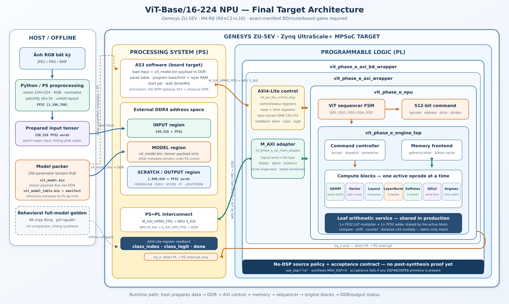

# ViT NPU architecture — M4-R8 overlay

> Current child: `ARRAY_ROWS=8`, `ARRAY_COLS=2`, `PE_LANES=16`, IP version
> `0x00010005`, scalar 32-bit/single-outstanding AXI and 108 KiB A+bias cache.
> The diagram below is an inherited structural view. Any embedded statements
> about BD/build/board status are historical; current R8 status and gates are
> authoritative only in `../../README_SERVER.md` and
> `../M4_R8_REUSE_CONTRACT.md`.

