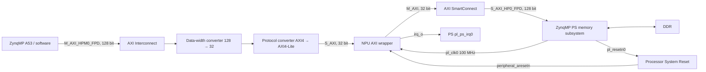
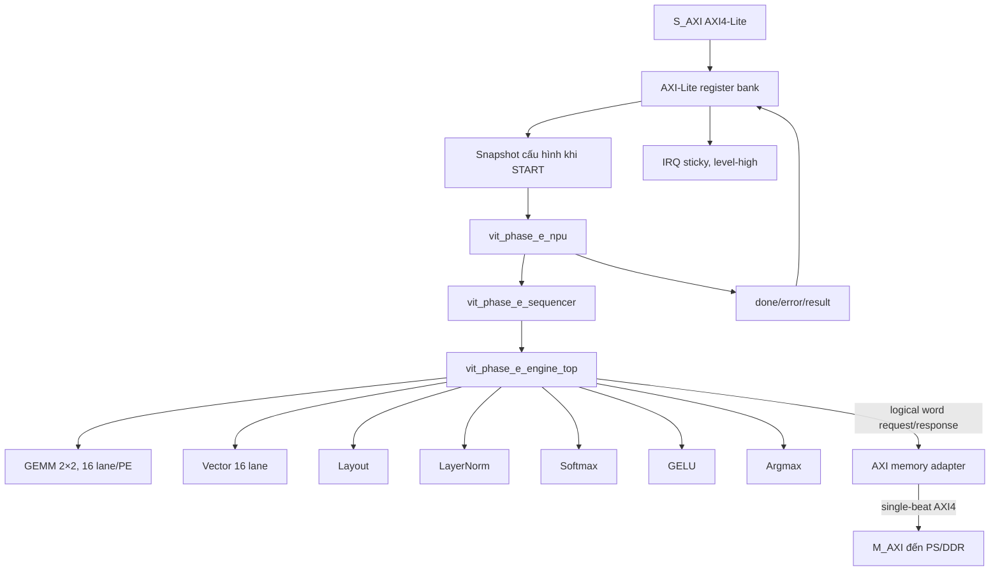

# BÁO CÁO NPU BỌC AXI NGÀY 27/11

## Thông tin tài liệu

| Thuộc tính | Nội dung |
|---|---|
| Tên báo cáo | Báo cáo NPU bọc AXI ngày 27/11 |
| Phạm vi mã nguồn | `/home/qh/Downloads/vit_modelsim_standalone` |
| Project Vivado được khảo sát | `/home/qh/Vivado_project/ViT_googlebase/ViT_googlebase/ViT_googlebase.xpr` |
| FPGA/board đích | AMD/Xilinx Zynq UltraScale+ MPSoC `xczu5ev-sfvc784-1-e`, Digilent Genesys ZU-5EV |
| Bộ công cụ | Vivado/Vitis 2022.2 |
| Ngôn ngữ báo cáo | Tiếng Việt |
| Loại báo cáo | Thiết kế, tích hợp, kiểm chứng, hiện trạng và hướng tối ưu |

> **Lưu ý về ngày:** tiêu đề và tên file dùng “27/11” đúng theo yêu cầu. Các
> artifact có timestamp được kiểm tra trong workspace chủ yếu thuộc giai đoạn
> 23–27/07/2026; báo cáo giữ nguyên ngày thực tế của artifact để bảo toàn khả
> năng truy vết.

---

## 1. Tóm tắt điều hành

Đến thời điểm lập báo cáo, NPU ViT đã đi từ mô hình tham chiếu chạy bằng
ModelSim sang một cấu trúc RTL có thể đưa vào đường tổng hợp phần cứng:

1. Luồng ViT tham chiếu đã từng chạy đủ **249 lệnh**, tạo đủ checkpoint và cho
   kết quả phân lớp đúng với golden.
2. NPU đã có **sequencer, engine phần cứng, các compute engine, giao tiếp bộ nhớ
   logic, AXI4 master truy cập DDR và AXI4-Lite slave điều khiển**.
3. Wrapper AXI đã được đưa vào một Block Design ZynqMP hoàn chỉnh:
   PS điều khiển NPU qua `M_AXI_HPM0_FPD`, NPU truy cập không gian nhớ PS/DDR qua
   `S_AXI_HP0_FPD`, và ngắt `irq_o` được nối vào `pl_ps_irq0`.
4. Block Design được lưu ở trạng thái `validated: true`, dùng clock PL 100 MHz,
   reset đồng bộ qua `proc_sys_reset`, và vùng thanh ghi điều khiển được gán tại
   `0xA0000000`, kích thước 4 KiB.
5. Các regression hiện tại ở mức khối cho AXI memory adapter, engine-memory,
   engine-AXI và full AXI wrapper đều PASS.
6. Kiến trúc hiện tại là một mốc **correctness-first**, chưa phải kiến trúc NPU
   hiệu năng cao: mỗi word FP32 tạo một AXI beat, chỉ có một transaction
   outstanding, chưa burst, chưa DMA, chưa tile cache và chưa tái sử dụng dữ
   liệu trong BRAM/URAM.
7. Datapath Phase-E hiện dùng nhiều phép toán FP32 tổ hợp sâu. Với cấu hình mặc
   định `2 × 2` PE và `16` lane/PE, riêng GEMM đã nhân bản 64 bộ nhân FP32 tổ
   hợp cùng nhiều cây cộng FP32. Đây là ứng viên chính gây vượt tài nguyên và
   khó đóng timing.
8. Người thực hiện cho biết Vivado đã synthesis, chạy một phần implementation
   và thấy tài nguyên lớn hơn khả năng FPGA. Tuy nhiên project hiện lưu trên đĩa
   **không còn utilization report, timing report, DCP hoặc log của lần chạy top
   hiện tại**, nên báo cáo không gán số LUT/FF/DSP cụ thể cho kết quả đó.

### 1.1. Ma trận trạng thái tổng quát

| Hạng mục | Trạng thái | Kết luận ngắn |
|---|---|---|
| ModelSim full ViT tham chiếu | **PASS lịch sử** | 249 lệnh/checkpoint; class 879 |
| Model package và input package | **PASS** | 200 file tham số; bit-compare 0 mismatch |
| Tool/board definition | **PASS** | Vivado 2022.2; đúng ZU-5EV |
| PS-only bitstream và XSA | **PASS** | Chứng minh tool flow và preset PS |
| FP32 primitive P3 OOC | **PASS/locked** | MUL + streaming accumulator, 200 MHz OOC |
| AXI-Lite register bank | **PASS unit test** | 84 checks, 0 failure |
| Phase-E hardware RTL closure | **Có** | Filelist synth không chứa behavioral engine |
| Phase-E AXI regressions | **PASS mức khối** | Adapter, engine-memory, engine-AXI, wrapper |
| Vivado Block Design tích hợp NPU | **PASS validation** | Topology, clock, reset, IRQ, address map đã có |
| Full integrated synthesis hiện tại | **Người thực hiện báo PASS; artifact chưa đủ** | Không có report/DCP hiện hành để xác nhận độc lập |
| Partial implementation hiện tại | **Người thực hiện báo đã chạy; artifact chưa đủ** | Không có implementation log/report hiện hành |
| Resource vượt device | **Quan sát của người thực hiện** | Chưa có report lưu lại để trích số chính xác |
| Full 249-command synth RTL qua DDR | **Chưa kiểm chứng** | Regression hiện tại chỉ dùng các job nhỏ |
| Timing closure full top | **Chưa kiểm chứng** | Không có timing report của top hiện tại |
| Bitstream NPU AXI | **Chưa có bằng chứng** | Không tìm thấy `.bit/.bin/.pdi` |
| Chạy thật A53 + DDR + IRQ trên board | **Chưa kiểm chứng** | Chưa có JTAG/UART/Hello World và inference board |

---

## 2. Phương pháp và mức độ tin cậy của báo cáo

### 2.1. Nguồn bằng chứng

Báo cáo được tổng hợp từ bốn nhóm nguồn:

- mã RTL, testbench, filelist và tài liệu trong
  `vit_modelsim_standalone`;
- baseline/log/report đã lưu trong các thư mục `baseline/`, `docs/` và
  `results/`;
- project Vivado nằm ngoài repo tại
  `/home/qh/Vivado_project/ViT_googlebase/ViT_googlebase`;
- các regression read-only được tái chạy khi lập báo cáo, với binary/log tạm
  đặt trong `/tmp`, không sửa mã nguồn.

### 2.2. Quy ước đánh giá

| Nhãn | Ý nghĩa |
|---|---|
| **XÁC NHẬN** | Có mã nguồn, log, report hoặc output lưu trên đĩa hỗ trợ trực tiếp |
| **PASS LỊCH SỬ** | Đúng với snapshot/baseline cũ, nhưng source hiện tại có thể đã thay đổi |
| **QUAN SÁT CỦA NGƯỜI THỰC HIỆN** | Được báo lại từ phiên Vivado nhưng artifact tương ứng chưa được lưu |
| **SUY LUẬN KỸ THUẬT** | Kết luận dựa trên cấu trúc RTL/kiến trúc, chưa phải số đo post-route |
| **CHƯA KIỂM CHỨNG** | Chưa có bằng chứng đủ mạnh để kết luận PASS |

### 2.3. Giới hạn truy vết lịch sử

Repository đang ở branch `genesys-zu5ev` nhưng chưa có commit Git; toàn bộ
working tree là untracked. Vì vậy:

- không thể dùng `git log` để dựng timeline;
- không thể dùng commit hash để xác định chính xác source của từng lần chạy;
- timeline trong báo cáo dựa trên nội dung baseline, log và timestamp;
- các lần chạy quan trọng về sau nên được gắn commit hash, manifest source và
  checksum report.

Tài liệu
[VIT_MODELSIM_STANDALONE_DETAILED_REPORT.md](../VIT_MODELSIM_STANDALONE_DETAILED_REPORT.md)
là báo cáo có trước hardware backend hiện tại. Các kết luận cũ rằng dự án mới
chỉ có behavioral backend không còn đúng cho source ngày nay, vì
`vit_phase_e_engine_top.sv`, các SFU synth và AXI wrapper đã được thêm sau đó.

---

## 3. Quan hệ giữa thư mục mã nguồn và thư mục Vivado

### 3.1. Có cần chuyển project Vivado vào repo này không?

**Không bắt buộc.** Project Vivado hiện đã tham chiếu trực tiếp tới mã RTL trong
`vit_modelsim_standalone`. Ví dụ file `.xpr` chứa các đường dẫn dạng:

```text
$PPRDIR/../../../Downloads/vit_modelsim_standalone/vit_phase_e_pkg.sv
$PPRDIR/../../../Downloads/vit_modelsim_standalone/vit_phase_e_axi_wrapper.sv
$PPRDIR/../../../Downloads/vit_modelsim_standalone/vit_phase_e_axi_bd_wrapper.v
```

Như vậy, khi mở project Vivado, các source production vẫn là file nằm trong
repo này; Vivado không cần một bản copy RTL riêng.

### 3.2. Vai trò của hai thư mục

| Thư mục | Vai trò | Nên xem là nguồn chính? |
|---|---|---|
| `vit_modelsim_standalone/` | RTL, testbench, docs, script, baseline, model package | **Có** |
| `ViT_googlebase/` | `.xpr`, Block Design, output products, run directories | Project tích hợp/derived artifact |
| `ViT_googlebase.gen/` | HDL wrapper, IP metadata, generated sources | Không chỉnh tay |
| `ViT_googlebase.runs/` | Log/checkpoint/report synthesis và implementation | Artifact tạm; cần export kết quả quan trọng |
| `ViT_googlebase.ip_user_files/` | File generated/cache của IP | Không phải source logic chính |

### 3.3. Rủi ro của cấu trúc hiện tại

Đường dẫn `$PPRDIR/../../../Downloads/...` phụ thuộc vị trí tương đối. Nếu chỉ
di chuyển một trong hai thư mục, Vivado có thể báo missing source. Vì vậy:

- chưa nên di chuyển project chỉ để lập báo cáo;
- nếu muốn gom project vào repo, nên làm bằng một commit riêng và sửa source
  path có kiểm soát;
- tốt hơn là tạo Tcl script tái tạo project từ filelist và Block Design thay vì
  phụ thuộc hoàn toàn vào `.xpr`/generated directory;
- không nên đưa toàn bộ `.gen`, `.runs`, `.cache` vào source repository;
- nên export các report cần bảo tồn về một thư mục baseline có tên run rõ ràng.

### 3.4. Source top hiện hành

Trong `.xpr` hiện tại:

- synthesis source top là `vit_system_wrapper`;
- simulation top là `tb_vit_phase_e`;
- macro `VIT_PURE_SV_BEHAVIORAL` chỉ được bật cho simulation;
- `vit_fp32_math_ref_pkg.sv`,
  `vit_phase_e_behavioral_engine_top.sv` và `tb_vit_phase_e.sv` được
  `AutoDisabled` trong source set synthesis.

Điều này cho thấy ranh giới behavioral/synth đã được thiết lập đúng trong cấu
hình project hiện hành, dù run directory chính còn lưu artifact cũ.

---

## 4. Lịch sử phát triển đã truy vết

### 4.1. P0 — baseline chức năng ModelSim

Baseline ModelSim ngày 23/07 chạy với:

```text
TEST_ID=24
CASE_ID=2
CHECKPOINT_INJECT=0
MAJOR_ONLY=1
```

Kết quả đã lưu:

- compile: 0 error, 7 warning;
- simulation: 0 error, 0 warning;
- 249 command;
- 249 checkpoint;
- 101 lần nạp tham số;
- 1.958 cycle sequencer;
- thời gian mô phỏng khoảng 3 phút 37 giây;
- simulated time 19.630 ns;
- class index `879` (`0x0000036F`);
- max logit `0x414887B7`, xấp xỉ `12,5331`;
- confidence `0x3F65FFEA`, xấp xỉ `0,89843619`.

Bằng chứng chính:

- [T002_MODELSIM_REPRODUCTION.md](../baseline/modelsim/T002_MODELSIM_REPRODUCTION.md)
- [T003_FULL_FLOW_RESULT.md](../baseline/modelsim/T003_FULL_FLOW_RESULT.md)
- [T003_MODELSIM_TRANSCRIPT.log](../baseline/modelsim/T003_MODELSIM_TRANSCRIPT.log)
- [T005_EXPECTED_OUTPUTS.md](../baseline/modelsim/T005_EXPECTED_OUTPUTS.md)

Đây là **behavioral reference**, không phải datapath synth chạy qua AXI/DDR.

### 4.2. P1 — toolchain, board và PS-only

Các mốc đã xác nhận:

- Vivado, Vitis và XSCT khóa ở phiên bản 2022.2;
- board part `digilentinc.com:gzu_5ev:part0:1.1`;
- FPGA part `xczu5ev-sfvc784-1-e`;
- project PS-only đã synthesis, implementation và tạo bitstream;
- XSA đã được export;
- platform A53 standalone đã được tạo.

PS-only dùng 0 LUT, 0 FF, 0 BRAM, 0 URAM và 0 DSP của PL. Mốc này chứng minh
tool flow, board preset và hard PS; nó **không** chứng minh NPU.

Bằng chứng:

- [T007_XILINX_VERSION.md](../baseline/toolchain/T007_XILINX_VERSION.md)
- [T008_T009_GENESYS_BOARD.md](../baseline/toolchain/T008_T009_GENESYS_BOARD.md)
- [T011_PS_ONLY_RESULT.md](../baseline/vivado/T011_PS_ONLY_RESULT.md)
- [T012_XSA_VITIS_PLATFORM_RESULT.md](../baseline/vivado/T012_XSA_VITIS_PLATFORM_RESULT.md)

Board runtime vẫn chưa hoàn tất vì chưa có bằng chứng JTAG/UART/Hello World,
được ghi tại
[T013_BOARD_CONNECTION_AND_HELLO_WORLD.md](../docs/T013_BOARD_CONNECTION_AND_HELLO_WORLD.md).

### 4.3. P2 — đóng gói model và input

Model package v1 đã được kiểm tra:

- 200/200 file tham số;
- 86.567.656 word nguồn;
- 8 word zero-padding;
- tổng 86.567.664 word lưu;
- 346.270.656 byte model;
- input 150.528 word, tương đương 602.112 byte;
- bit-compare: 0 mismatch;
- verifier: 17/17 checks PASS.

Bằng chứng:

- [T015_T024_MODEL_PACKAGE_RESULT.md](../baseline/model_package/T015_T024_MODEL_PACKAGE_RESULT.md)
- [T015_T024_VERIFICATION_REPORT.json](../baseline/model_package/T015_T024_VERIFICATION_REPORT.json)
- [T024_HASH_MANIFEST.json](../baseline/model_package/T024_HASH_MANIFEST.json)
- [VIT_MODEL_PACKAGE_FORMAT_V1.md](../docs/VIT_MODEL_PACKAGE_FORMAT_V1.md)

### 4.4. P3 — primitive FP32

Ba candidate đã được chạy OOC ở 200 MHz. Quyết định P3 khóa phương án:

```text
Xilinx FP multiplier
    +
streaming fixed accumulator

InputMSB  = 22
InputLSB  = -149
AccumMSB  = 34
rate      = 1
```

Candidate được chọn có kết quả routed:

- 1.824 LUT;
- 2.503 FF;
- 6 DSP;
- WNS `+2,368 ns` ở period 5 ns;
- TNS `0`.

Các test special value exact-bit PASS, latency quan sát:

- multiplier: 11 cycle;
- FMA: 22 cycle;
- accumulator: 32 cycle.

Bằng chứng:

- [T028_T031_COMPARISON.md](../baseline/vivado/P3_FP32/T028_T031_COMPARISON.md)
- [T025_T030_P3_FP32_XSIM_RESULT.md](../baseline/vivado/P3_FP32/T025_T030_P3_FP32_XSIM_RESULT.md)
- [T029_P3_FP32_SPECIAL_VALUES_RESULT.md](../baseline/vivado/P3_FP32/T029_P3_FP32_SPECIAL_VALUES_RESULT.md)
- [FP32_RANGE_ANALYSIS.md](../baseline/p3_fp32/FP32_RANGE_ANALYSIS.md)

### 4.5. P4 — AXI-Lite control

Register bank AXI-Lite đã PASS Icarus, Verilator và self-check:

- 84 checks;
- 0 failure.

Block Design control-only đã validate với:

- PS HPM master;
- AXI control slave;
- 100 MHz;
- reset;
- IRQ;
- base `0xA0000000`;
- aperture 4 KiB.

Tuy nhiên log build P4 hiện dừng ở trạng thái chờ synthesis; không có report
route/timing hay bitstream P4 được lưu. Do đó P4 control plane có unit-test và
BD validation, nhưng chưa có bằng chứng bitstream/board.

### 4.6. GEMM local 1 × 1

Project và behavioral XSim của GEMM local 1 × 1 PASS:

- project creation PASS;
- behavioral XSim PASS;
- `cycles=1467`;
- `C_words=21`.

Chưa có bộ report đầy đủ chứng minh top 1 × 1 đã synth/route. Log chỉ cho thấy
một IP accumulator con đã synthesis; không được dùng điều đó để kết luận full
top đã route.

### 4.7. Phase-E hardware và AXI wrapper

Giai đoạn tiếp theo bổ sung:

- hardware execution engine không chứa array model/input/scratch lớn;
- logical-memory interface;
- các engine synth cho GEMM, vector, layout, LayerNorm, Softmax, GELU, Argmax;
- AXI4 memory adapter;
- AXI4-Lite control plane mở rộng;
- full AXI integration wrapper;
- Verilog shim cho Vivado Block Design Module Reference;
- testbench adapter, engine-memory, engine-AXI và wrapper.

Đường synth hiện tại được mô tả bởi
[vit_phase_e_axi_wrapper_synth.f](../filelists/vit_phase_e_axi_wrapper_synth.f).

---

## 5. Đặc tả bài toán ViT mà NPU đang thực hiện

### 5.1. Kích thước cố định

Các hằng số trong
[vit_phase_e_pkg.sv](../vit_phase_e_pkg.sv) xác định cấu hình ViT-Base:

| Tham số | Giá trị |
|---|---:|
| Số patch | 196 |
| Số token, kể cả CLS | 197 |
| Hidden size | 768 |
| Số attention head | 12 |
| Kích thước mỗi head | 64 |
| Intermediate size | 3.072 |
| Số class | 1.000 |
| Số encoder layer | 12 |
| Số word patch input | 150.528 |
| Số word hidden state | 151.296 |
| Số word attention score toàn bộ head | 465.708 |
| Số word FC1 activation | 605.184 |

### 5.2. Các phase

| Phase | Chức năng sequencer |
|---|---|
| `E01` | Chạy 4 lệnh embedding |
| `E02` | Chạy encoder layer 0 |
| `E03` | Chạy dải layer từ `first_layer` đến `last_layer` |
| `E04` | Chạy final section |
| `E05` | Chạy embedding, 12 encoder layer và final section |

Với E05 có class softmax:

```text
4 embedding commands
+ 12 layers × 20 commands/layer
+ 5 final commands
= 249 commands
```

Đây chính là số lệnh đã thấy trong baseline full behavioral.

### 5.3. Hai mươi bước của một encoder layer

| Bước | Tác vụ |
|---:|---|
| 0 | LayerNorm 1 |
| 1 | Q GEMM |
| 2 | Split Q theo head |
| 3 | K GEMM |
| 4 | Split K theo head |
| 5 | V GEMM |
| 6 | Split V theo head |
| 7 | Transpose K |
| 8 | Q × Kᵀ GEMM |
| 9 | Scale và mask |
| 10 | Softmax attention |
| 11 | Probability × V GEMM |
| 12 | Merge các head |
| 13 | Output projection GEMM |
| 14 | Attention residual add |
| 15 | LayerNorm 2 |
| 16 | FC1 GEMM |
| 17 | GELU |
| 18 | FC2 GEMM |
| 19 | MLP residual add |

### 5.4. Descriptor

Mỗi lệnh là một descriptor đúng 16 word, tương đương 512 bit:

| Word | Nội dung |
|---:|---|
| W0 | Header: opcode, subop, flags, tag |
| W1 | Route: tensor ID và memory space |
| W2 | `src0_base` |
| W3 | `src1_base` |
| W4 | `src2_base` |
| W5 | `dst_base` |
| W6–W9 | `dim0..dim3` |
| W10–W14 | `stride0..stride4` |
| W15 | Immediate/scalar |

Opcode synth hiện có:

- NOP;
- GEMM;
- VECTOR;
- LAYOUT;
- LAYERNORM;
- SOFTMAX;
- GELU;
- ARGMAX;
- END.

Toàn bộ địa chỉ trong descriptor là **địa chỉ word FP32**, không phải địa chỉ
byte.

---

## 6. Kiến trúc hệ thống sau khi bọc AXI

### 6.1. Sơ đồ mức hệ thống



### 6.2. Sơ đồ bên trong wrapper



### 6.3. Hierarchy synth production

```text
vit_system_wrapper                    generated BD wrapper
└── vit_system
    └── vit_phase_e_axi_bd_wrapper    Verilog shim, không có state
        └── vit_phase_e_axi_wrapper
            ├── vit_axi_lite_control_regs
            ├── vit_phase_e_npu
            │   ├── vit_phase_e_sequencer
            │   └── vit_phase_e_engine_top
            │       ├── vit_gemm_tree_array
            │       │   └── 4 × vit_tree_pe_fp32
            │       ├── vit_vector_engine_fp32
            │       ├── vit_layout_engine
            │       ├── vit_layernorm_engine_fp32
            │       ├── vit_softmax_engine_fp32
            │       ├── vit_gelu_engine_fp32
            │       └── vit_argmax_engine_fp32
            └── vit_phase_e_axi_mem_adapter
```

### 6.4. Vì sao có Verilog shim?

Core `vit_phase_e_axi_wrapper` là SystemVerilog. Trong flow đang dùng, Vivado
2022.2 không chấp nhận module SystemVerilog đó trực tiếp làm top Module
Reference của IP Integrator. File
[vit_phase_e_axi_bd_wrapper.v](../vit_phase_e_axi_bd_wrapper.v) là một lớp
Verilog mỏng, nối thẳng port vào core, không chứa state hay datapath.

---

## 7. Ranh giới behavioral và synthesizable

### 7.1. File production trong synth closure

Filelist
[vit_phase_e_axi_wrapper_synth.f](../filelists/vit_phase_e_axi_wrapper_synth.f)
đưa vào:

1. `vit_phase_e_pkg.sv`;
2. `vit_fp32_pkg.sv`;
3. tree PE và GEMM array;
4. vector/layout/LayerNorm/Softmax/GELU/Argmax;
5. sequencer;
6. hardware engine;
7. NPU;
8. AXI-Lite control register bank;
9. AXI memory adapter;
10. AXI wrapper;
11. Verilog BD shim.

### 7.2. File chỉ dành cho simulation

Không được đưa các file sau vào synthesis:

- `vit_fp32_math_ref_pkg.sv`;
- `vit_phase_e_behavioral_engine_top.sv`;
- `tb_vit_phase_e.sv`;
- macro `VIT_PURE_SV_BEHAVIORAL`.

Guard script
[check_synth_filelists.py](../tools/check_synth_filelists.py) hiện PASS và xác
nhận các SFU synth không phụ thuộc simulation math package.

### 7.3. Ý nghĩa

Việc behavioral XSim/ModelSim PASS không tự động chứng minh hardware datapath
PASS. Hai luồng có vai trò khác nhau:

| Luồng | Mục tiêu |
|---|---|
| Behavioral | Golden/reference, full-model correctness, checkpoint |
| Synth RTL | Khả năng ánh xạ phần cứng, giao tiếp AXI, timing/resource |
| Board | Tính đúng của software-driver, DDR, cache, interrupt và phần cứng thật |

---

## 8. Hardware execution engine

### 8.1. Thay đổi quan trọng

Hardware engine không còn ba array model/input/scratch cỡ lớn được khai báo
trong RTL. Thay vào đó, engine phát giao dịch theo contract:

```text
mem_req_valid / mem_req_ready
mem_req_write
mem_req_space
mem_req_word_address
mem_req_write_data / strobe

mem_rsp_valid / mem_rsp_ready
mem_rsp_read_data
mem_rsp_error
```

Chỉ có một request logical outstanding.

### 8.2. Trình tự xử lý một native request

Engine bảo đảm thứ tự:

1. gather tuần tự toàn bộ word operand của native request;
2. pulse `data_valid` cho compute engine;
3. chờ kết quả đã đăng ký;
4. scatter tuần tự mọi word kết quả;
5. chờ B response của word ghi cuối;
6. mới pulse `result_ready` và cho phép command hoàn tất.

Ưu điểm của trình tự này:

- lệnh in-place không đọc qua dữ liệu chưa commit;
- `cmd_done` không thể xuất hiện trước response ghi DDR cuối cùng;
- AXI error được đưa về command error;
- một lỗi memory chặn compute/write tiếp theo để tránh dùng dữ liệu hỏng.

### 8.3. FSM chính

| State | Chức năng |
|---|---|
| `IDLE` | Nhận descriptor |
| `WAIT_PARAMETER` | Chờ provider nếu lệnh cần tham số |
| `LAUNCH` | Pulse start cho engine được chọn |
| `EXECUTE` | Gather, compute và scatter |
| `REPORT` | Xuất `cmd_done/cmd_error`, trở về idle |

Memory frontend có FSM riêng cho read-select, read-request, read-response,
read-deliver, write-select, write-request, write-response và write-deliver.

### 8.4. Bảo vệ overflow địa chỉ

Các biểu thức `base + stride × index` được mở rộng lên 96 bit. Nếu kết quả
không nằm trong 32-bit logical word address:

- engine báo lỗi;
- địa chỉ không bị truncate;
- không phát request sai sang đầu buffer;
- ghi vượt biên không thể làm hỏng một vùng DDR khác do wrap-around.

---

## 9. Các compute engine hiện tại

### 9.1. GEMM

Cấu hình mặc định:

| Tham số | Giá trị |
|---|---:|
| `ARRAY_ROWS` | 2 |
| `ARRAY_COLS` | 2 |
| `PE_LANES` | 16 |
| Số PE | 4 |

Mỗi PE:

- 16 bộ nhân FP32;
- cây 15 bộ cộng FP32;
- 1 bộ cộng accumulator;
- thêm 1 phép cộng bias khi enable.

Array dùng dataflow output-stationary ở phạm vi một output tile `2 × 2`.
Mỗi K-chunk gồm 16 phần tử. Tail ở M/N/K được mask.

### 9.2. Vector

Engine vector có 16 lane, dùng cho:

- vector add;
- scale/mask;
- các thao tác vector được sequencer phát.

### 9.3. Layout

Engine layout xử lý copy/reindex/transpose theo stride descriptor. Phiên bản
hiện tại ưu tiên tính đúng và xử lý tuần tự.

### 9.4. LayerNorm

LayerNorm thực hiện nhiều pass:

1. tích lũy mean;
2. tích lũy variance;
3. normalize, scale gamma và cộng beta.

Đây là cấu trúc đúng về thuật toán nhưng tăng số lần truy cập dữ liệu nếu không
có local buffer.

### 9.5. Softmax

Softmax thực hiện:

1. tìm max;
2. tính exponential và tổng;
3. normalize.

Với scalar DDR path, mỗi pass có thể đọc lại cùng row. Hàm exponential/reciprocal
hiện là logic RTL tổng hợp thay vì một SFU pipeline dùng Xilinx FP IP.

### 9.6. GELU

GELU nhận vector lane nhưng điều khiển tính toán theo hướng correctness-first.
Hàm xấp xỉ polynomial/nonlinear hiện tạo logic tổ hợp đáng kể.

### 9.7. Argmax

Argmax quét logits và trả:

- class index;
- class logit;
- lỗi nếu gặp điều kiện non-finite không hợp lệ.

---

## 10. Mô hình bộ nhớ

### 10.1. Ba memory space

| Memory space | Nội dung | PL được đọc | PL được ghi |
|---|---|---:|---:|
| MODEL/PARAM | Weight, bias, gamma, beta, constant | Có | Không |
| INPUT | Prepared patch input | Có | Không |
| SCRATCH | Activation trung gian và output | Có | Có |

Software A53 chịu trách nhiệm nạp MODEL và INPUT vào DDR trước khi START.

### 10.2. Chuyển địa chỉ

Adapter là điểm duy nhất đổi word address thành byte address:

```text
physical_byte_address
    = region_physical_base
    + (logical_word_address << 2)
```

Adapter kiểm tra:

- memory space hợp lệ;
- read/write permission;
- word address nhỏ hơn limit;
- base alignment;
- overflow phép cộng 64-bit;
- địa chỉ có nằm trong `AXI_ADDR_WIDTH=40`;
- `RRESP/BRESP`;
- `RID/BID`;
- `RLAST`.

Request lỗi local được trả về engine mà không phát transaction AXI.

### 10.3. Kích thước package

| Vùng | Số word |
|---|---:|
| MODEL | 86.567.664 (`0x0528EAF0`) |
| INPUT | 150.528 |
| SCRATCH | `0x001E6000` |

Quy đổi:

- MODEL: 346.270.656 byte, xấp xỉ 330,23 MiB;
- INPUT: 602.112 byte;
- SCRATCH: 1.990.656 word = 7.962.624 byte, xấp xỉ 7,59 MiB.

Adapter chỉ bắt buộc base aligned 4 byte để bảo đảm một FP32 word không lệch.
Định dạng model package khuyến nghị software cấp base aligned 64 byte để thuận
lợi cho burst/cache ở phiên bản sau.

### 10.4. Scratch map

| Vùng | Word offset |
|---|---:|
| `HIDDEN_A` | `0x00000000` |
| `HIDDEN_B` | `0x00025000` |
| `LINEAR_TMP` | `0x0004A000` |
| `Q_HEAD` | `0x0006F000` |
| `K_HEAD` | `0x00094000` |
| `V_HEAD` | `0x000B9000` |
| `SCORE_PROB` | `0x000DE000` |
| `FC1` | `0x00150000` |
| `LOGITS` | `0x001E4000` |
| `CLASS_PROB` | `0x001E5000` |
| Kết thúc scratch | `0x001E6000` |

`CLASS_PROB` tách khỏi `LOGITS` để optional class Softmax không phá logits dùng
cho debug/argmax.

---

## 11. Giao tiếp AXI

### 11.1. AXI4-Lite slave control

| Thuộc tính | Giá trị |
|---|---|
| Protocol | AXI4-Lite |
| Data width | 32 bit |
| Address width | 12 bit |
| Burst | Không |
| Read outstanding | 1 |
| Write outstanding | 1 |
| Aperture ở PS | `0xA0000000` / 4 KiB |

AW và W được buffer độc lập, nên AW có thể đến trước W hoặc ngược lại. Access
không aligned hoặc không thuộc register map trả `SLVERR`.

### 11.2. AXI4 master memory

| Thuộc tính | Giá trị |
|---|---|
| Protocol | AXI4 |
| Data width | 32 bit |
| Address width | 40 bit |
| ID width | 1 |
| `ARLEN/AWLEN` | 0 |
| Max burst metadata | 1 beat |
| Read outstanding | 1 |
| Write outstanding | 1 |

Mặc dù interface là AXI4, implementation hiện tại vẫn phát single-beat. Đường
write xử lý AW và W độc lập, sau đó chờ B response. Đường read phát AR rồi chờ R
response.

### 11.3. Clock/reset

Toàn bộ wrapper dùng một clock domain:

- `aclk = pl_clk0 = 100 MHz`;
- `aresetn` active-low;
- `pl_resetn0` đi vào `proc_sys_reset`;
- `peripheral_aresetn` cấp cho NPU, AXI Interconnect và SmartConnect.

Một clock domain giúp giảm rủi ro CDC ở mốc đầu tiên, nhưng không chứng minh
logic FP32 tổ hợp đáp ứng period 10 ns.

### 11.4. IRQ

`irq_o`:

- active level-high;
- nối vào `pl_ps_irq0`;
- được tạo từ `IRQ_STATUS & IRQ_ENABLE`;
- event done/error là sticky;
- `IRQ_STATUS` dùng RW1C;
- event mới thắng nếu đồng thời xảy ra với clear.

---

## 12. AXI-Lite register map

### 12.1. Bảng thanh ghi

| Offset | Tên | Access | Chức năng |
|---:|---|---|---|
| `0x000` | `IP_ID` | RO | `0x5649544E`, ASCII “VITN” |
| `0x004` | `IP_VERSION` | RO | `0x00010000`, v1.0 |
| `0x008` | `CONTROL` | WO pulse | START/reset/abort/clear error |
| `0x00C` | `STATUS` | RO | idle/busy/done/error/IRQ/wait |
| `0x010` | `IRQ_ENABLE` | RW | Enable nguồn ngắt |
| `0x014` | `IRQ_STATUS` | RW1C | Trạng thái ngắt sticky |
| `0x018` | `ERROR_CODE` | RO | Mã lỗi |
| `0x01C` | `ERROR_INFO` | RO | Section/layer/step hoặc thông tin lỗi |
| `0x020` | `MODEL_BASE_LO` | RW | Base model bits 31:0 |
| `0x024` | `MODEL_BASE_HI` | RW | Base model bits 63:32 |
| `0x028` | `INPUT_BASE_LO` | RW | Base input bits 31:0 |
| `0x02C` | `INPUT_BASE_HI` | RW | Base input bits 63:32 |
| `0x030` | `SCRATCH_BASE_LO` | RW | Base scratch bits 31:0 |
| `0x034` | `SCRATCH_BASE_HI` | RW | Base scratch bits 63:32 |
| `0x038` | `MODEL_WORDS` | RW | Limit model |
| `0x03C` | `INPUT_WORDS` | RW | Limit input |
| `0x040` | `SCRATCH_WORDS` | RW | Limit scratch |
| `0x044` | `EXECUTION_MODE` | RW/reserved | Dành cho mở rộng |
| `0x080..0x09C` | `GLOBAL_PARAM[0..7]` | RW | 8 model word offsets global |
| `0x0A0` | `JOB_CONFIG` | RW | Phase/layer/options/tag |
| `0x0A4` | `JOB_PATCH_A_BASE` | RW | Input word offset |
| `0x180` | `CLASS_INDEX` | RO | Class kết quả |
| `0x184` | `CLASS_LOGIT` | RO | Logit kết quả |
| `0x400..0x6FC` | `LAYER_PARAM[12][16]` | RW | 192 model word offsets |

### 12.2. CONTROL

| Bit | Tên | Hành vi |
|---:|---|---|
| 0 | START | Pulse một cycle |
| 1 | SOFT_RESET | Chỉ chấp nhận an toàn khi idle |
| 2 | ABORT | Hiện chưa hỗ trợ hủy transaction đã được AXI chấp nhận |
| 3 | CLEAR_ERROR | Clear error sticky |

Wrapper có hai lỗi cục bộ:

| Mã | Ý nghĩa |
|---:|---|
| `0x80000001` | START khi đang busy |
| `0x80000002` | ABORT không được hỗ trợ |

ABORT không được giả vờ thành công vì adapter không thể hủy an toàn một AXI
transaction mà DDR đã chấp nhận.

### 12.3. STATUS

| Bit | Ý nghĩa |
|---:|---|
| 0 | IDLE |
| 1 | BUSY |
| 2 | DONE sticky |
| 3 | ERROR sticky |
| 4 | IRQ đang active |
| 5 | Đang chờ operand/parameter |

### 12.4. JOB_CONFIG

| Bits | Field |
|---:|---|
| `[2:0]` | `phase` |
| `[6:3]` | `first_layer` |
| `[10:7]` | `last_layer` |
| `[11]` | `class_softmax_enable` |
| `[12]` | `checkpoint_enable` |
| `[20:13]` | `job_tag` |

### 12.5. Global parameter table

Với `slot = 0..7`:

```text
register offset = 0x080 + slot × 4
```

| Slot | Field | Đơn vị |
|---:|---|---|
| 0 | `patch_weight_base` | MODEL word offset |
| 1 | `patch_bias_base` | MODEL word offset |
| 2 | `cls_base` | MODEL word offset |
| 3 | `position_base` | MODEL word offset |
| 4 | `final_ln_gamma_base` | MODEL word offset |
| 5 | `final_ln_beta_base` | MODEL word offset |
| 6 | `classifier_weight_base` | MODEL word offset |
| 7 | `classifier_bias_base` | MODEL word offset |

### 12.6. Layer parameter table

Địa chỉ thanh ghi:

```text
register offset = 0x400 + layer × 0x40 + slot × 4
layer = 0..11
slot  = 0..15
```

| Slot | Field |
|---:|---|
| 0 | `ln1_gamma_base` |
| 1 | `ln1_beta_base` |
| 2 | `q_weight_base` |
| 3 | `q_bias_base` |
| 4 | `k_weight_base` |
| 5 | `k_bias_base` |
| 6 | `v_weight_base` |
| 7 | `v_bias_base` |
| 8 | `o_weight_base` |
| 9 | `o_bias_base` |
| 10 | `ln2_gamma_base` |
| 11 | `ln2_beta_base` |
| 12 | `fc1_weight_base` |
| 13 | `fc1_bias_base` |
| 14 | `fc2_weight_base` |
| 15 | `fc2_bias_base` |

Các field đều là MODEL word offset. Linear weight phải được pack ở layout phần
cứng `[K,N]`, không phải layout PyTorch `[N,K]`.

### 12.7. Snapshot khi START

Khi START hợp lệ, wrapper snapshot:

- ba base address;
- ba word limit;
- job config;
- patch input base;
- tám global parameter offsets;
- 12 × 16 layer parameter offsets.

Do đó software không nên thay config trong lúc BUSY. Các thay đổi sau START
không được dùng cho job đang chạy.

---

## 13. Trình tự software dự kiến

Một driver A53 nên thực hiện:

1. allocate các vùng DDR cho model, input và scratch;
2. bảo đảm alignment và phạm vi địa chỉ phù hợp 40-bit master;
3. copy model package vào MODEL DDR;
4. copy prepared patch input vào INPUT DDR;
5. zero/initialize SCRATCH theo yêu cầu;
6. thực hiện cache flush/maintenance nếu vùng nhớ cacheable;
7. ghi `MODEL_BASE`, `INPUT_BASE`, `SCRATCH_BASE`;
8. ghi `MODEL_WORDS`, `INPUT_WORDS`, `SCRATCH_WORDS`;
9. ghi 8 global offsets;
10. ghi 12 × 16 layer offsets;
11. ghi `JOB_PATCH_A_BASE`;
12. ghi `JOB_CONFIG`;
13. clear error và IRQ cũ;
14. enable IRQ hoặc chọn polling;
15. ghi `CONTROL.START=1`;
16. chờ IRQ hoặc `STATUS.DONE/ERROR`;
17. đọc `ERROR_CODE/ERROR_INFO` nếu lỗi;
18. đọc `CLASS_INDEX/CLASS_LOGIT` khi done;
19. RW1C `IRQ_STATUS`.

Các bước chưa được kiểm chứng trên board:

- mapping địa chỉ vật lý DDR từ software;
- cache coherency/cache maintenance;
- driver interrupt;
- timeout/recovery;
- chạy một job E05 thật;
- đối chiếu output DDR với golden.

---

## 14. Block Design Vivado hiện tại

### 14.1. Thành phần

Block Design `vit_system` chứa:

- `zynq_ultra_ps_e_0`;
- `vit_phase_e_axi_bd_wrapper_0`;
- `ps8_0_axi_periph`;
- auto data-width converter;
- auto protocol converter;
- `axi_smc`;
- `rst_ps8_0_100M`.

### 14.2. Control path

```text
PS M_AXI_HPM0_FPD, AXI4 128 bit
    → AXI Interconnect
    → data-width converter 128 → 32 bit
    → protocol converter AXI4 → AXI4-Lite
    → NPU S_AXI 32 bit
```

### 14.3. Memory path

```text
NPU M_AXI, AXI4 32 bit/40-bit address
    → SmartConnect
    → PS S_AXI_HP0_FPD, 128 bit
    → PS/DDR address space
```

Width mismatch được SmartConnect/interconnect xử lý, nhưng NPU vẫn chỉ yêu cầu
32 bit mỗi beat. Vì vậy port HP 128 bit chưa được khai thác hiệu quả.

### 14.4. Address map

Control:

| Segment | Base | Range |
|---|---:|---:|
| NPU AXI-Lite | `0xA0000000` | 4 KiB |

Các vùng NPU master nhìn thấy:

| Vùng | Offset | Range |
|---|---:|---:|
| DDR low | `0x0000000000` | 2 GiB |
| DDR high | `0x0800000000` | 32 GiB aperture |
| QSPI | `0x00C0000000` | 512 MiB |
| PCIe low | `0x00E0000000` | 256 MiB |
| OCM | `0x00FF000000` | 16 MiB |

Software phải chọn base MODEL/INPUT/SCRATCH thật sự nằm trong vùng DDR hợp lệ
và không overlap.

### 14.5. Trạng thái generation

Đã xác nhận:

- BD có cờ `validated: true`;
- output products đã được tạo;
- `vit_system_wrapper.v` đã được tạo;
- `.xpr` top hiện tại là `vit_system_wrapper`;
- BD mở lại thành công trong Vivado.

---

## 15. Kết quả kiểm chứng

### 15.1. Baseline lưu trữ

| Test | Kết quả | Phạm vi |
|---|---|---|
| T003 full ModelSim | PASS lịch sử | Full behavioral 249 commands |
| Baseline output/hash | PASS | Class/logit/confidence và checkpoint |
| Model package T015–T024 | PASS | Pack, ABI, hash, bit comparison |
| PS-only T011 | PASS | Synth/impl/bitstream |
| XSA/A53 platform T012 | PASS | Offline platform |
| P3 FP32 XSim | PASS | Main functional/II |
| P3 special values | PASS | Exact-bit special cases |
| AXI-Lite control T033 | PASS | 84 checks |
| P4 BD validation | PASS | Control-only topology |
| GEMM 1 × 1 behavioral | PASS | Small local GEMM |

### 15.2. Regression hiện tại được tái chạy

Các binary/log tạm được đặt trong `/tmp`, không sửa workspace:

| Regression | Kết quả |
|---|---|
| `tb_vit_phase_e_axi_mem_adapter` | PASS, 173 checks |
| `tb_vit_phase_e_engine_memory` | PASS, 1.545 checks, 66 transactions |
| `tb_vit_phase_e_engine_axi` | PASS, 33 checks, 34 reads, 17 writes |
| `tb_vit_phase_e_axi_wrapper` | PASS, 18 checks |
| LayerNorm small unit test | PASS |
| Softmax small unit test | PASS |
| GELU small unit test | PASS |
| Synth filelist guard | PASS, 5 filelists |
| Engine integration compile | Exit 0 |

Icarus có thể in nhiều cảnh báo:

```text
constant selects in always_* processes are not currently supported
```

Đây là hạn chế sensitivity-list của Icarus đối với construct SystemVerilog,
không phải test failure.

### 15.3. Coverage thật sự của regression AXI

#### AXI memory adapter

Đã cover:

- stall/backpressure;
- AW trước W và W trước AW;
- `RRESP/BRESP` error;
- `RLAST` sai;
- invalid memory space;
- bounds;
- alignment;
- AXI address-width overflow;
- reset.

#### Engine logical-memory

Chủ yếu cover:

- VECTOR_ADD;
- ARGMAX;
- read/write path;
- address overflow.

#### Engine + AXI

Chạy một VECTOR_ADD dài 17 phần tử, kiểm:

- read DDR model/scratch;
- write DDR scratch;
- chờ B response cuối.

#### Full wrapper

Kiểm:

- read/write hai đầu register window;
- START;
- phase 0 cố ý gây lỗi;
- IRQ;
- clear IRQ/error.

### 15.4. Điều regression chưa chứng minh

Các PASS trên **không** tương đương:

- full 249-command ViT chạy qua AXI/DDR;
- full-model numerical equivalence của synth RTL;
- tất cả 12 layer parameter table được dùng đúng;
- burst/throughput;
- timing closure;
- implementation;
- bitstream;
- board inference.

### 15.5. Source drift của behavioral baseline

`tools/check_baseline_outputs.py` hiện vẫn PASS output golden. Tuy nhiên kiểm tra
checksum source theo `T002_SOURCE_SHA256.txt` cho thấy:

- 6 file: OK;
- `vit_phase_e_npu.sv`: FAILED;
- `tb_vit_phase_e.sv`: FAILED.

Vì source đã thay đổi sau transcript ngày 23/07:

- baseline full behavioral vẫn hợp lệ với snapshot lịch sử;
- chưa có immutable transcript chứng minh source cuối hiện tại đã chạy lại đủ
  full flow;
- nên tạo baseline mới sau khi khóa Phase-E AXI source.

---

## 16. Hiện trạng synthesis và implementation của project tích hợp

### 16.1. Điều project hiện tại xác nhận

Project:

```text
/home/qh/Vivado_project/ViT_googlebase/ViT_googlebase/ViT_googlebase.xpr
```

Xác nhận được:

- Vivado 2022.2;
- đúng board/part;
- top `.xpr` hiện là `vit_system_wrapper`;
- BD đã validate;
- wrapper/output products đã generate;
- source synth trỏ tới RTL trong repo này;
- behavioral source được tách khỏi synthesis source set.

### 16.2. Artifact run bị stale/không đầy đủ

`ViT_googlebase.runs/synth_1/runme.log` còn lưu lần chạy cũ:

- top là `vit_phase_e_npu`, không phải `vit_system_wrapper`;
- behavioral engine bị đưa vào nhầm;
- run thất bại ở lỗi `dynamic range not supported`.

Sau đó `.xpr` đã được sửa sang top/closure đúng, nhưng run directory chính không
chứa một bộ artifact mới hoàn chỉnh.

Các OOC child run của BD:

- đã được launch;
- log dừng gần bước load part;
- còn `.stop.rst`;
- không có dòng completion.

`impl_1`:

- có script/metadata;
- không có `runme.log`;
- không có DCP;
- không có utilization report;
- không có timing report;
- không có bitstream.

Khi rà soát project hiện tại không tìm thấy:

- `.dcp`;
- `.rpt`;
- `.bit`;
- `.bin`;
- `.pdi`;
- `.xsa`.

### 16.3. Cách diễn đạt kết quả hiện tại

Do người thực hiện trực tiếp quan sát Vivado, báo cáo ghi:

> **Theo quan sát của người thực hiện, integrated design đã synthesis, đã chạy
> một phần implementation và utilization lớn hơn tài nguyên device. Bộ artifact
> tương ứng chưa được lưu trong project được kiểm tra, nên chưa thể xác nhận số
> resource, step implementation cuối cùng, timing hoặc DRC một cách độc lập.**

Không được lấy log synth cũ thất bại để phủ định quan sát mới; đồng thời cũng
không được dùng quan sát GUI để bịa số LUT/FF/DSP.

### 16.4. Rủi ro RAM của máy host

Máy chạy Vivado có khoảng 8.065 MB RAM. Phiên mở project/BD đã đạt peak khoảng
7,2 GB và chỉ còn khoảng 166 MB RAM vật lý. Sáu OOC run từng được launch song
song.

Baseline PS-only trước đó ghi nhận:

- lần chạy nhiều job bị `systemd-oomd` ngắt;
- chạy lại với 1 job và tối đa 2 Vivado threads thì thành công.

Vì current logs không có dòng OOM rõ ràng, chỉ có thể kết luận:

- memory pressure là rủi ro rất cao;
- có khả năng các OOC run bị stop/reset do thiếu RAM;
- không nên launch nhiều synth job song song trên host này.

---

## 17. Ngân sách tài nguyên của ZU-5EV

Capacity được lấy từ routed PS-only report trên đúng part:

| Resource | Available |
|---|---:|
| CLB LUT | 117.120 |
| CLB register | 234.240 |
| LUT có khả năng LUTRAM | 57.600 |
| Block RAM tile | 144 |
| RAMB18 | 288 |
| URAM | 64 |
| DSP | 1.248 |
| Bonded IOB | 252 |
| PLL | 8 |
| MMCM | 4 |

### 17.1. P3 primitive OOC

| Candidate | LUT | FF | DSP | BRAM/URAM | WNS @ 200 MHz | TNS |
|---|---:|---:|---:|---:|---:|---:|
| FMA feedback | 787 | 1.493 | 4 | 0 | +3,110 ns | 0 |
| MUL + tuned accumulator | 1.824 | 2.503 | 6 | 0 | +2,368 ns | 0 |
| Interleaved FMA | 1.215 | 2.575 | 4 | 0 | +2,259 ns | 0 |

Đây là số của **primitive OOC**, không phải số current integrated NPU.

### 17.2. Cảnh báo scale đã biết từ P3

Nếu nhân tuyến tính candidate đã chọn lên 8 × 8:

```text
64 × 1.824 LUT = 116.736 LUT
```

So với 117.120 LUT available:

```text
116.736 / 117.120 = 99,67%
```

Chỉ còn 384 LUT cho:

- control;
- AXI;
- buffer;
- sequencer;
- LayerNorm;
- Softmax;
- GELU;
- Argmax;
- routing overhead.

Do đó 8 × 8 đã được loại ngay từ P3; kế hoạch hợp lý là 1 × 1 → 2 × 2 → 4 × 4
và đo tại mỗi mốc.

### 17.3. Điểm lệch giữa P3 và current NPU

P3 đã khóa Xilinx FP multiplier + streaming accumulator. Tuy nhiên current
Phase-E closure không instantiate các Xilinx FP IP đó. Current
`vit_tree_pe_fp32` gọi các function `fp32_mul`/`fp32_add` trong
`vit_fp32_pkg.sv`.

Vì vậy:

- không thể dùng số 1.824 LUT/PE để dự đoán chính xác current NPU;
- current NPU có thể dùng nhiều LUT hơn hoặc có timing sâu hơn;
- P3 timing 200 MHz chỉ chứng minh primitive OOC;
- việc tích hợp primitive locked vào datapath Phase-E vẫn chưa hoàn tất.

---

## 18. Phân tích nguyên nhân tài nguyên vượt khả năng FPGA

### 18.1. Nhân bản FP32 tổ hợp trong GEMM

Với top mặc định:

```text
2 rows × 2 cols = 4 PE
4 PE × 16 multiplier/PE = 64 FP32 multiplier
4 PE × 15 tree adder/PE = 60 FP32 tree adder
4 PE × 1 accumulator adder = 4 FP32 accumulator adder
```

Chưa tính:

- bias add;
- vector lanes;
- LayerNorm;
- Softmax;
- GELU;
- Argmax;
- control/address logic.

Các function FP32 thực hiện unpack, normalize, shift, round và special-case
trong logic tổ hợp. Nhân bản cấu trúc này làm LUT tăng mạnh và tạo đường logic
sâu.

### 18.2. SFU nonlinear là logic RTL

Softmax/GELU/LayerNorm có:

- exponential approximation;
- reciprocal/division;
- square-root hoặc reciprocal-square-root;
- polynomial;
- nhiều phép FP32 cộng/nhân.

Khi các hàm này được viết như combinational function thay vì pipeline/chia sẻ
IP, synth có thể tạo một lượng logic lớn. Một số điểm cụ thể trong source:

- FP add có vòng normalize phụ thuộc nối tiếp;
- Softmax exponential dùng chuỗi Horner bậc 8;
- reciprocal trong GELU unroll bốn bước Newton–Raphson;
- LayerNorm có phép chia integer runtime để tạo hệ số theo hidden size;
- GELU tuy xử lý một lane/cycle nhưng special-function của lane đó vẫn là một
  đường tổ hợp sâu.

### 18.3. Toán địa chỉ tổng quát

Hardware engine hỗ trợ descriptor runtime bằng:

- multiplication stride × index;
- division/modulo để tách row/column/lane;
- biểu thức địa chỉ mở rộng 96 bit.

Một số phép có divisor hằng và có thể được tối ưu, nhưng các biểu thức tổng quát
vẫn có thể tạo logic đáng kể. Cần xem hierarchical utilization để biết block
nào thật sự chiếm tài nguyên.

### 18.4. Các block chưa được time-multiplex đủ mạnh

Mục tiêu correctness-first khiến nhiều chức năng cùng tồn tại trong top:

- GEMM array;
- vector;
- LayerNorm;
- Softmax;
- GELU;
- Argmax.

Nếu không share multiplier/adder hoặc chỉ enable bằng control mà không loại
logic, toàn bộ phần cứng vẫn tiêu thụ resource cùng lúc.

Thực tế cả bảy compute engine đều được instantiate đồng thời trong
`vit_phase_e_engine_top`; sequencer chỉ bảo đảm command chạy tuần tự chứ không
làm phần cứng của opcode không hoạt động biến mất khỏi netlist.

### 18.5. Không có bằng chứng hierarchical utilization hiện hành

Các nguyên nhân trên là **suy luận kỹ thuật mạnh từ RTL**, không thay thế report
post-synthesis. Việc đầu tiên ở vòng tiếp theo phải là export:

```tcl
report_utilization -hierarchical
report_timing_summary
report_drc
```

Khi đó mới xác định được tỷ lệ LUT thực tế giữa:

- `u_gemm`;
- `u_layernorm`;
- `u_softmax`;
- `u_gelu`;
- AXI/control;
- address-generation logic.

---

## 19. Phân tích nút thắt hiệu năng

### 19.1. Một word FP32 = một AXI transaction

Adapter hiện:

- data width 32 bit;
- `ARLEN/AWLEN=0`;
- one outstanding;
- chờ response trước request tiếp theo.

Mỗi word phải đi qua nhiều handshake. Port HP 128 bit không được dùng hết băng
thông.

### 19.2. Không có tile reuse

Trong GEMM, engine gather A và B cho từng output tile. Khi chuyển tile:

- cùng A có thể bị đọc lại cho nhóm output column khác;
- cùng B có thể bị đọc lại cho nhóm row khác;
- bias được lấy lại ở cuối K reduction;
- không có BRAM/URAM cache giữ tile.

Với array `2 × 2`, số single-word AXI transaction chính của một GEMM có thể
ước lượng trực tiếp từ schedule hiện tại:

```text
A/B reads =
    B × K × (M × ceil(N/2) + ceil(M/2) × N)

bias reads =
    bias_enable ? B × ceil(M/2) × N : 0

writes =
    B × M × N
```

Đây là hệ quả của việc A/B được gather lại cho từng output tile. Áp dụng kích
thước descriptor hiện tại:

| GEMM | Word transaction xấp xỉ |
|---|---:|
| Embedding | 115.831.296 |
| Mỗi Q/K/V/O projection | 116.717.568 |
| FC1 mỗi layer | 466.870.272 |
| FC2 mỗi layer | 466.188.288 |
| QK mỗi layer | 30.422.316 |
| PV mỗi layer | 30.032.256 |
| Tổng GEMM của một encoder | 1.460.383.404 |
| 12 encoder | 17.524.600.848 |
| E05, gồm embedding và classifier | khoảng **17,64 tỷ** |

Đây là ước lượng từ RTL, chưa gồm traffic của LayerNorm, Softmax, GELU, layout
và residual vector. Ngay cả giả định không thực tế là 1 word/cycle ở 100 MHz,
17,64 tỷ word đã cần hơn 176 giây. FSM scalar thật còn tốn nhiều cycle cho
request/address/response, nên latency sẽ cao hơn đáng kể.

### 19.3. Multi-pass operator

LayerNorm và Softmax cần nhiều pass. Không có local buffer nghĩa là dữ liệu có
thể bị đọc DDR nhiều lần. Latency AXI trở thành phần chi phối.

### 19.4. Clock chưa được chứng minh

BD đặt 100 MHz, nhưng:

- FP32 logic tổ hợp sâu;
- current full-top timing report không tồn tại;
- partial implementation không có artifact;
- chưa thể kết luận design đạt 100 MHz.

### 19.5. Kết luận hiệu năng

AXI wrapper hiện chứng minh **khả năng nối và contract**, không chứng minh một
NPU có throughput tốt. Đây là mốc tích hợp đúng hướng, nhưng cần đổi data
movement và compute microarchitecture trước khi chạy full model.

---

## 20. Rủi ro và khoảng trống còn lại

| ID | Rủi ro/khoảng trống | Mức | Bằng chứng/ảnh hưởng | Hành động |
|---|---|---|---|---|
| R1 | Current full top có thể over-utilized | Rất cao | Quan sát của người thực hiện; RTL nhân bản FP32 lớn | Export hierarchical utilization; giảm array/SFU |
| R2 | Timing 100 MHz chưa đóng | Rất cao | Không có timing report; combinational FP32 sâu | Pipeline và dùng locked FP IP |
| R3 | Scalar AXI quá chậm | Rất cao | 1 beat/word, 1 outstanding | Burst 128 bit, DMA, nhiều outstanding |
| R4 | Không có local tile reuse | Rất cao | A/B bị đọc lại | BRAM/URAM banking, ping-pong |
| R5 | P3 primitive chưa tích hợp | Cao | Current closure chỉ dùng pure RTL FP32 | Thay tree PE bằng wrapper P3 |
| R6 | Full synth RTL numerical equivalence chưa có | Cao | AXI tests chỉ job nhỏ | Chạy small deterministic suite rồi full E05 |
| R7 | Project run artifact stale | Cao | Top/log cũ, không DCP/report | Clean run có kiểm soát, export artifact |
| R8 | Host thiếu RAM | Cao | Peak ~7,2/8,1 GB; OOM lịch sử | 1 job, 2 threads tối đa |
| R9 | Software/DDR/cache chưa verify | Cao | Chưa board runtime | Driver + DDR loopback + cache tests |
| R10 | IRQ trên board chưa verify | Trung bình-cao | Chỉ unit/BD | A53 interrupt smoke test |
| R11 | Source không có commit | Cao | Không tái lập snapshot | Git commit + manifest/checksum |
| R12 | Baseline behavioral source drift | Trung bình | 2 checksum source fail | Rerun và khóa baseline mới |
| R13 | Abort không hỗ trợ | Trung bình | Không thể hủy AXI đã accept | Driver timeout/reset policy |
| R14 | Address overlap/software error | Cao | Ba vùng do software cấu hình | Allocator + validation + guard |

### 20.1. Các giới hạn chức năng cần được ghi nhận

- `EXECUTION_MODE` hiện chỉ lưu/readback, chưa chọn datapath.
- Checkpoint metadata được sequencer tạo nhưng wrapper đang tie
  `checkpoint_ready=1`; metadata không được expose cho software.
- Không có descriptor FIFO để software phát lệnh 512-bit tùy ý; software hiện
  cấu hình job ở mức phase và parameter table.
- Không có timeout/watchdog trong AXI adapter. Nếu DDR/AXI không trả response,
  BUSY có thể giữ vô hạn.
- ABORT chưa hỗ trợ; recovery cần policy reset/timeout ở driver.
- `CLASS_INDEX/CLASS_LOGIT` giữ giá trị cũ cho đến Argmax mới hoặc reset;
  software phải dùng DONE/IRQ để xác định valid.
- FP32 helper hiện không phải implementation IEEE-754 đầy đủ: subnormal bị
  flush-to-zero và các special function là approximation có contract giới hạn.
- Không có cache-coherency logic ở PL; software phải quản lý cache cho các vùng
  DDR.

---

## 21. Kế hoạch tối ưu đề xuất

### 21.1. Bước 0 — bảo toàn bằng chứng hiện trạng

Trước khi sửa datapath:

1. tạo Git commit cho source hiện tại;
2. lưu `.xpr`, `.bd` và Tcl recreate script;
3. chạy synth với 1 job;
4. export:
   - utilization flat;
   - utilization hierarchical;
   - timing summary;
   - DRC;
   - methodology;
   - run status;
   - synth DCP nếu tạo được;
5. ghi part, Vivado version, top, commit hash và command vào manifest;
6. nếu over-utilized, lưu report trước khi hủy run.

Mục tiêu: biến nhận định “vượt tài nguyên” thành số liệu có thể so sánh.

### 21.2. Bước 1 — co compute về baseline nhỏ

Đặt:

```text
ARRAY_ROWS = 1
ARRAY_COLS = 1
PE_LANES   = 1 hoặc cấu hình nhỏ đã kiểm chứng
```

Sau đó OOC synth từng block. Mục tiêu là có một top fit và timing-clean trước
khi tăng parallelism.

### 21.3. Bước 2 — tích hợp primitive P3 đã khóa

Thay đường:

```text
pure RTL fp32_mul/fp32_add tree
```

bằng:

```text
Xilinx FP multiplier
    → streaming/tuned accumulator
```

Cần xử lý:

- valid/ready;
- latency cố định;
- clear accumulator;
- K-tail;
- bias;
- round/special value;
- backpressure;
- exact-bit hoặc tolerance contract.

### 21.4. Bước 3 — OOC budget từng engine

Đặt budget ví dụ:

| Nhóm | Budget ban đầu |
|---|---|
| Tổng LUT trước full integration | ≤ 70–75% |
| Tổng BRAM/URAM | ≤ 70–75% |
| Tổng DSP | ≤ 70–75% |
| WNS mỗi OOC block | ≥ 0 với margin |
| Full top trước route | Nên còn ≥ 20% headroom |

Không tăng array nếu control/SFU/buffer chưa có headroom.

### 21.5. Bước 4 — nâng cấp AXI data path

Ưu tiên:

1. gom 4 FP32 word thành beat 128 bit;
2. burst read/write;
3. nhiều outstanding transaction;
4. burst coalescer cho địa chỉ liên tục;
5. DMA descriptor hoặc data mover;
6. counter đo byte/cycle/stall.

AXI4-Lite control giữ 32 bit; chỉ nâng data plane.

### 21.6. Bước 5 — tile buffer và reuse

Thiết kế:

- BRAM/URAM ping-pong cho A;
- BRAM/URAM ping-pong cho B;
- local accumulator/output tile;
- prefetch tile kế tiếp trong khi compute tile hiện tại;
- output-stationary hoặc weight-stationary scheduler;
- banking để cấp đủ lane/cycle.

Mục tiêu là mỗi tile A/B được đọc từ DDR một lần rồi tái sử dụng nhiều lần.

### 21.7. Bước 6 — tối ưu SFU

- time-multiplex multiplier/adder cho LayerNorm, Softmax, GELU;
- dùng Xilinx FP IP pipeline;
- dùng LUT/piecewise approximation có error bound;
- giữ local row buffer cho multi-pass;
- không instantiate 16 bản nonlinear logic nếu throughput không yêu cầu.

### 21.8. Bước 7 — verification theo tầng

Thứ tự:

1. unit engine;
2. engine-memory;
3. engine-AXI với random stall/error;
4. one-command numerical test;
5. one encoder step;
6. one encoder layer;
7. E01/E02/E03/E04;
8. E05 full synth RTL;
9. Vivado post-synth simulation nếu cần;
10. board DDR loopback;
11. board one-command;
12. board full inference.

### 21.9. Bước 8 — software và board

Tạo driver:

- `vitn_init`;
- `vitn_load_model`;
- `vitn_load_input`;
- `vitn_config_job`;
- `vitn_start`;
- `vitn_wait_irq`;
- `vitn_get_result`;
- `vitn_clear_irq`;
- timeout/error decode;
- cache maintenance.

Board test tăng dần:

1. read IP ID/version;
2. RW register;
3. IRQ-on-intentional-error;
4. PL master DDR read/write;
5. vector add;
6. GEMM nhỏ;
7. one layer;
8. full inference.

---

## 22. Tiêu chí hoàn thành cho phase kế tiếp

Phase kế tiếp chỉ nên được coi là hoàn tất khi có đủ:

### 22.1. Build

- synthesis complete;
- implementation complete;
- route complete;
- bitstream complete;
- không error/critical warning chưa được giải thích;
- DRC được review.

### 22.2. Resource

- utilization report và hierarchical report được lưu;
- không resource nào vượt 100%;
- có headroom đã thống nhất;
- DSP/BRAM/URAM được dùng đúng định hướng, không đẩy phần lớn FP32 sang LUT ngoài
  dự kiến.

### 22.3. Timing

- WNS ≥ 0;
- TNS = 0;
- không unconstrained path quan trọng;
- clock 100 MHz hoặc target mới được ghi rõ.

### 22.4. Chức năng

- full current-source behavioral baseline được rerun;
- checksum/manifest mới;
- synth RTL small-job numerical suite PASS;
- AXI random stall/error suite PASS;
- ít nhất một valid job chạy end-to-end qua DDR.

### 22.5. Board

- A53 đọc được `IP_ID=0x5649544E`;
- IRQ hoạt động;
- PL master đọc/ghi DDR đúng;
- cache policy được chứng minh;
- class/logit board khớp golden trong tolerance.

---

## 23. Lệnh tái lập các kiểm tra mức RTL

Chạy từ:

```bash
cd /home/qh/Downloads/vit_modelsim_standalone
```

### 23.1. Kiểm tra synth filelist

```bash
python3 tools/check_synth_filelists.py
```

### 23.2. AXI memory adapter

```bash
iverilog -g2012 -s tb_vit_phase_e_axi_mem_adapter \
  -o /tmp/vit_axi_adapter.vvp \
  -f filelists/vit_phase_e_axi_mem_adapter_iverilog.f
vvp /tmp/vit_axi_adapter.vvp
```

Expected:

```text
VIT_PHASE_E_AXI_MEM_ADAPTER_TEST_PASS checks=173
```

### 23.3. Engine logical-memory

```bash
iverilog -g2012 -s tb_vit_phase_e_engine_memory \
  -o /tmp/vit_engine_memory.vvp \
  -f filelists/vit_phase_e_engine_memory_iverilog.f
vvp /tmp/vit_engine_memory.vvp
```

Expected:

```text
PASS ... checks=1545 transactions=66
```

### 23.4. Engine + AXI

```bash
iverilog -g2012 -s tb_vit_phase_e_engine_axi \
  -o /tmp/vit_engine_axi.vvp \
  -f filelists/vit_phase_e_engine_axi_iverilog.f
vvp /tmp/vit_engine_axi.vvp
```

Expected:

```text
VIT_PHASE_E_ENGINE_AXI_TEST_PASS checks=33 reads=34 writes=17
```

### 23.5. Full AXI wrapper

```bash
iverilog -g2012 -s tb_vit_phase_e_axi_wrapper \
  -o /tmp/vit_axi_wrapper.vvp \
  -f filelists/vit_phase_e_axi_wrapper_iverilog.f
vvp /tmp/vit_axi_wrapper.vvp
```

Expected:

```text
VIT_PHASE_E_AXI_WRAPPER_TEST_PASS checks=18
```

### 23.6. Kiểm tra baseline output

```bash
.venv/bin/python tools/check_baseline_outputs.py
```

Lưu ý: output PASS không thay thế việc rerun full simulator sau source drift.

---

## 24. Tcl cần dùng để lưu report Vivado

Sau một synthesis thành công:

```tcl
open_run synth_1
report_utilization \
  -file report/full_npu_synth_utilization.rpt
report_utilization -hierarchical \
  -file report/full_npu_synth_utilization_hierarchical.rpt
report_timing_summary \
  -file report/full_npu_synth_timing_summary.rpt
report_drc \
  -file report/full_npu_synth_drc.rpt
```

Sau place/route:

```tcl
open_run impl_1
report_utilization \
  -file report/full_npu_route_utilization.rpt
report_utilization -hierarchical \
  -file report/full_npu_route_utilization_hierarchical.rpt
report_timing_summary \
  -file report/full_npu_route_timing_summary.rpt
report_drc \
  -file report/full_npu_route_drc.rpt
report_route_status \
  -file report/full_npu_route_status.rpt
```

Nên kèm:

```tcl
version
get_property PART [current_project]
get_property top [current_fileset]
report_property [get_runs synth_1]
report_property [get_runs impl_1]
```

Với máy hiện tại, nên giới hạn tài nguyên:

```tcl
set_param general.maxThreads 2
launch_runs synth_1 -jobs 1
```

Không launch sáu OOC run song song trên host 8 GB nếu chưa kiểm soát memory.

---

## 25. Danh mục artifact quan trọng

### 25.1. Kiến trúc/RTL

- [vit_phase_e_pkg.sv](../vit_phase_e_pkg.sv)
- [vit_phase_e_sequencer.sv](../vit_phase_e_sequencer.sv)
- [vit_phase_e_engine_top.sv](../vit_phase_e_engine_top.sv)
- [vit_phase_e_npu.sv](../vit_phase_e_npu.sv)
- [vit_phase_e_axi_mem_adapter.sv](../vit_phase_e_axi_mem_adapter.sv)
- [vit_phase_e_axi_wrapper.sv](../vit_phase_e_axi_wrapper.sv)
- [vit_phase_e_axi_bd_wrapper.v](../vit_phase_e_axi_bd_wrapper.v)
- [vit_tree_pe_fp32.sv](../vit_tree_pe_fp32.sv)
- [vit_gemm_tree_array.sv](../vit_gemm_tree_array.sv)
- [vit_fp32_pkg.sv](../vit_fp32_pkg.sv)
- [vit_axi_lite_control_regs.sv](../hw/control/vit_axi_lite_control_regs.sv)

### 25.2. Filelist/testbench

- [vit_phase_e_axi_wrapper_synth.f](../filelists/vit_phase_e_axi_wrapper_synth.f)
- [tb_vit_phase_e_axi_mem_adapter.sv](../sim/axi/tb_vit_phase_e_axi_mem_adapter.sv)
- [tb_vit_phase_e_engine_memory.sv](../sim/axi/tb_vit_phase_e_engine_memory.sv)
- [tb_vit_phase_e_engine_axi.sv](../sim/axi/tb_vit_phase_e_engine_axi.sv)
- [tb_vit_phase_e_axi_wrapper.sv](../sim/axi/tb_vit_phase_e_axi_wrapper.sv)

### 25.3. Tài liệu

- [PHASE_E_AXI_WRAPPER.md](../docs/PHASE_E_AXI_WRAPPER.md)
- [HW_FP32_V1.md](../docs/HW_FP32_V1.md)
- [VIT_MODEL_PACKAGE_FORMAT_V1.md](../docs/VIT_MODEL_PACKAGE_FORMAT_V1.md)
- [P4_AXI_CONTROL_VIVADO_FLOW.md](../docs/P4_AXI_CONTROL_VIVADO_FLOW.md)

### 25.4. Baseline

- [T003_FULL_FLOW_RESULT.md](../baseline/modelsim/T003_FULL_FLOW_RESULT.md)
- [T015_T024_MODEL_PACKAGE_RESULT.md](../baseline/model_package/T015_T024_MODEL_PACKAGE_RESULT.md)
- [T011_PS_ONLY_RESULT.md](../baseline/vivado/T011_PS_ONLY_RESULT.md)
- [T012_XSA_VITIS_PLATFORM_RESULT.md](../baseline/vivado/T012_XSA_VITIS_PLATFORM_RESULT.md)
- [T028_T031_COMPARISON.md](../baseline/vivado/P3_FP32/T028_T031_COMPARISON.md)
- [T033_AXI_LITE_CONTROL_RESULT.md](../baseline/control/T033_AXI_LITE_CONTROL_RESULT.md)

### 25.5. Artifact Vivado bên ngoài repo

```text
/home/qh/Vivado_project/ViT_googlebase/ViT_googlebase/ViT_googlebase.xpr
/home/qh/Vivado_project/ViT_googlebase/ViT_googlebase/
    ViT_googlebase.srcs/sources_1/bd/vit_system/vit_system.bd
/home/qh/Vivado_project/ViT_googlebase/ViT_googlebase/
    ViT_googlebase.gen/sources_1/bd/vit_system/hdl/vit_system_wrapper.v
```

---

## 26. Bảng truy vết bằng chứng

Các dòng dưới đây là vị trí nguồn tại thời điểm lập báo cáo. Nếu source được
sửa, line number có thể dịch chuyển; tên file và nội dung logic vẫn là khóa
truy vết chính.

### 26.1. RTL và contract

| Nội dung được dùng trong báo cáo | File và dòng |
|---|---|
| Kích thước ViT và word count | `vit_phase_e_pkg.sv:8-23` |
| Scratch base map | `vit_phase_e_pkg.sv:28-41` |
| Opcode/memory space/tensor ID | `vit_phase_e_pkg.sv:50-112` |
| Descriptor 16 word/512 bit | `vit_phase_e_pkg.sv:119-193` |
| 4/20/4–5 command count | `vit_phase_e_pkg.sv:195-221` |
| Phase job/global/layer structs | `vit_phase_e_pkg.sv:223-266` |
| Chọn E01–E05 và kiểm layer range | `vit_phase_e_sequencer.sv:794-852` |
| Advance qua embedding/encoder/final | `vit_phase_e_sequencer.sv:891-956` |
| Wrapper parameter 2×2, 16 lane | `vit_phase_e_axi_wrapper.sv:21-27` |
| Metadata S_AXI/M_AXI | `vit_phase_e_axi_wrapper.sv:29-167` |
| Snapshot/decode job và table | `vit_phase_e_axi_wrapper.sv:272-399` |
| Busy/reset/error policy | `vit_phase_e_axi_wrapper.sv:404-443` |
| Instance control/NPU/adapter | `vit_phase_e_axi_wrapper.sv:447-624` |
| AXI-Lite offsets | `hw/control/vit_axi_lite_control_regs.sv:83-113` |
| WSTRB theo byte | `hw/control/vit_axi_lite_control_regs.sv:130-143` |
| STATUS/AXI-Lite handshake | `hw/control/vit_axi_lite_control_regs.sv:257-283` |
| Register write/read và SLVERR | `hw/control/vit_axi_lite_control_regs.sv:330-483` |
| Word-to-byte address contract | `vit_phase_e_axi_mem_adapter.sv:3-12` |
| Adapter validation | `vit_phase_e_axi_mem_adapter.sv:129-187` |
| Single-beat AXI và response check | `vit_phase_e_axi_mem_adapter.sv:189-326` |
| Engine gather/compute/scatter contract | `vit_phase_e_engine_top.sv:3-19` |
| Engine word count/FSM | `vit_phase_e_engine_top.sv:80-105` |
| Address generation | `vit_phase_e_engine_top.sv:388-650` |
| Memory FSM | `vit_phase_e_engine_top.sv:719-933` |
| Bảy compute engine | `vit_phase_e_engine_top.sv:935-1109` |
| Cấu trúc 16 MUL + 15 ADD mỗi PE | `vit_tree_pe_fp32.sv:19-77` |
| Array 2-D instantiate PE | `vit_gemm_tree_array.sv:168-196` |
| Synth file closure | `filelists/vit_phase_e_axi_wrapper_synth.f:1-17` |

### 26.2. Verification và baseline

| Kết luận | Artifact và dòng |
|---|---|
| ModelSim contract | `baseline/modelsim/T002_MODELSIM_REPRODUCTION.md:59-77` |
| 249 lệnh, class/logit/confidence | `baseline/modelsim/T003_FULL_FLOW_RESULT.md:39-58` |
| Golden/tolerance | `baseline/modelsim/T005_EXPECTED_OUTPUTS.md:7-34` |
| Tool 2022.2 | `baseline/toolchain/T007_XILINX_VERSION.md:5-14` |
| Board/part đúng | `baseline/toolchain/T008_T009_GENESYS_BOARD.md:29-52` |
| PS-only build PASS | `baseline/vivado/T011_PS_ONLY_RESULT.md:7-21` |
| XSA/A53 platform PASS | `baseline/vivado/T012_XSA_VITIS_PLATFORM_RESULT.md:6-48` |
| Board runtime chưa có | `docs/T013_BOARD_CONNECTION_AND_HELLO_WORLD.md:61-66` |
| Model package 0 mismatch | `baseline/model_package/T015_T024_MODEL_PACKAGE_RESULT.md:6-24` |
| P3 primitive/resource decision | `baseline/vivado/P3_FP32/T028_T031_COMPARISON.md:296-397` |
| AXI-Lite 84 checks | `baseline/control/T033_AXI_LITE_CONTROL_RESULT.md:3-11` |
| P4 BD control map | `baseline/vivado/P4_CONTROL/T032_T036_P4_CONTROL_BD_SUMMARY.txt:1-13` |
| P4 build chưa hoàn tất | `baseline/vivado/P4_CONTROL/T039_P4_BUILD_VIVADO.log:30-40` |
| Adapter test coverage | `sim/axi/tb_vit_phase_e_axi_mem_adapter.sv:438-647` |
| Engine-memory coverage | `sim/axi/tb_vit_phase_e_engine_memory.sv:631-779` |
| Engine-AXI coverage | `sim/axi/tb_vit_phase_e_engine_axi.sv:325-409` |
| Wrapper coverage | `sim/axi/tb_vit_phase_e_axi_wrapper.sv:166-224` |

### 26.3. Vivado project bên ngoài repo

| Kết luận | Artifact và dòng |
|---|---|
| Board part và source references | `ViT_googlebase.xpr:45,92-204` |
| Top synth hiện tại | `ViT_googlebase.xpr:261-265` |
| Behavioral source AutoDisabled | `ViT_googlebase.xpr:243-257` |
| Macro chỉ trong simulation | `ViT_googlebase.xpr:277-289` |
| BD validated/device | `vit_system.bd:3-11` |
| Cell list | `vit_system.bd:13-24` |
| NPU S_AXI metadata | `vit_system.bd:36-100` |
| NPU M_AXI metadata | `vit_system.bd:245-316` |
| PS/AXI topology | `vit_system.bd:4020-4042` |
| Clock/reset/IRQ nets | `vit_system.bd:4046-4079` |
| Memory address map | `vit_system.bd:4082-4114` |
| Control address map | `vit_system.bd:4116-4124` |
| Run cũ sai top/thất bại | `ViT_googlebase.runs/synth_1/runme.log:11-49` |

Đường dẫn gốc cho hai file cuối:

```text
/home/qh/Vivado_project/ViT_googlebase/ViT_googlebase/ViT_googlebase.xpr
/home/qh/Vivado_project/ViT_googlebase/ViT_googlebase/
    ViT_googlebase.srcs/sources_1/bd/vit_system/vit_system.bd
```

---

## 27. Kết luận cuối

Giai đoạn hiện tại đã đạt một mốc tích hợp quan trọng: NPU không còn chỉ là mô
hình behavioral. Đã có hardware engine, sequencer, memory contract, AXI4-Lite
control, AXI4 DDR master, interrupt và Block Design ZynqMP hợp lệ. Các
regression mức khối cho thấy contract AXI và luồng điều khiển cơ bản đang hoạt
động đúng.

Tuy nhiên, chưa thể gọi đây là một accelerator hoàn thiện:

- chưa có bộ artifact xác nhận full integrated synthesis/implementation hiện
  tại;
- chưa có số utilization/timing hiện hành có thể truy vết;
- chưa có full 249-command synth RTL qua DDR;
- chưa có bitstream NPU;
- chưa có driver/IRQ/DDR/inference trên board;
- kiến trúc scalar AXI và pure combinational FP32 hiện không phù hợp cho full
  ViT hiệu năng thực dụng.

Nhận định “resource lớn hơn device” phù hợp với cấu trúc RTL và quan sát của
người thực hiện, nhưng bước kỹ thuật tiếp theo phải là lưu hierarchical
utilization report để định lượng. Sau đó cần tích hợp primitive P3 đã khóa, giảm
parallelism ban đầu, pipeline/share SFU, và thay scalar AXI bằng burst + tile
buffer BRAM/URAM.

Tóm lại:

> **AXI integration đã hình thành và đã được kiểm tra tốt ở mức contract; nút
> thắt hiện tại đã chuyển từ “chưa có đường phần cứng” sang “microarchitecture
> chưa fit/chưa đủ nhanh và thiếu artifact closure”.**
