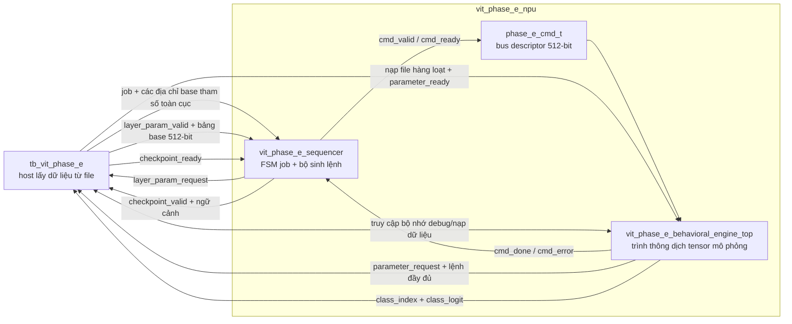
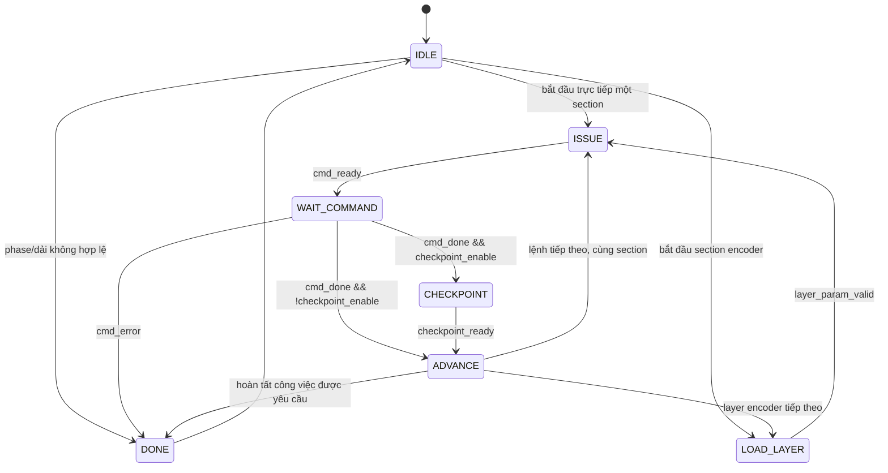
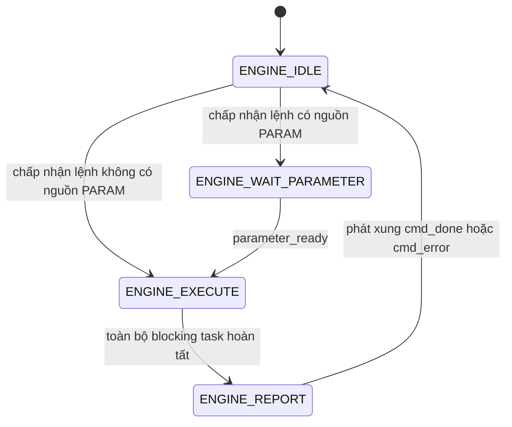
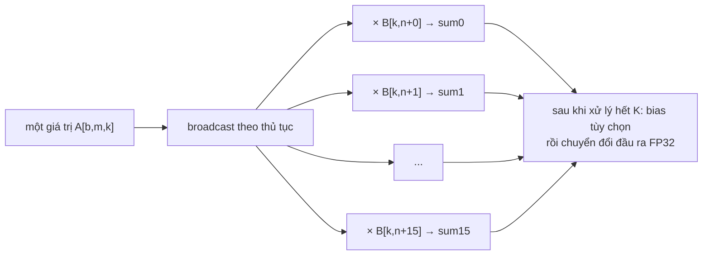

# Báo cáo kiến trúc triển khai VIT_MODELSIM_STANDALONE

## Mục đích và phạm vi

Báo cáo này trình bày cách triển khai hiện tại của gói
`VIT_MODELSIM_STANDALONE`. Nội dung tập trung vào bộ điều khiển, ISA của
descriptor lệnh, engine thực thi hành vi, microkernel GEMM, tổ chức bộ nhớ, giao
thức host/testbench và đặc tính số học.

Báo cáo chủ ý **không** lặp lại thuật toán ViT hoặc suy ra số lượng lệnh trong
một lần inference đầy đủ. Chủ đề quan trọng ở đây là cách codebase này biểu diễn
và thực thi workload đã biết đó.

Kết luận kiến trúc cốt lõi là:

> Gói này là một mô hình chức năng được tuần tự hóa bằng lệnh và lấy dữ liệu từ
> file. Sequencer cùng hợp đồng descriptor 512-bit của nó có hình thức giống RTL
> có thể tổng hợp, nhưng backend thực thi đi kèm chỉ là trình thông dịch tensor
> dành cho mô phỏng. Nó không phải là mảng PE chính xác theo chu kỳ, mảng systolic
> hay datapath FP32 có thể tổng hợp.

Chính mã nguồn cũng nêu rõ ranh giới này trong
[`vit_phase_e_behavioral_engine_top.sv`](./vit_phase_e_behavioral_engine_top.sv#L3-L14)
và [`vit_fp32_math_ref_pkg.sv`](./vit_fp32_math_ref_pkg.sv#L3-L14).

### Mục lục báo cáo

1. Cây mã nguồn và trách nhiệm của từng file
2. Tổ chức top-level và ranh giới backend có thể thay thế
3. Tổ chức bộ nhớ chính xác
4. ISA descriptor lệnh 512-bit đầy đủ
5. Ngữ nghĩa descriptor theo từng opcode
6. FSM sequencer và các giao thức
7. FSM engine và ý nghĩa thời gian
8. Cách đánh địa chỉ GEMM và microkernel
9. Các khối thực thi khác
10. Số học FP32/tham chiếu
11. Host testbench và hành vi nạp dữ liệu
12. Hợp đồng file/dữ liệu
13. Hành vi biên dịch/chạy
14. Các khoảng trống về xử lý lỗi và kiểm tra hợp lệ
15. Ranh giới tổng hợp
16–18. Điểm mạnh, điểm yếu và yêu cầu đối với RTL thực
19. Các bảng tham chiếu rút gọn
20. Đánh giá cuối cùng

---

## 1. Cây mã nguồn và trách nhiệm của từng file

| Đường dẫn | Vai trò |
|---|---|
| `vit_phase_e_pkg.sv` | Các hằng số kiến trúc, bản đồ bộ nhớ, enum, định dạng lệnh packed, các cấu trúc job/cấu hình và các hàm hỗ trợ. |
| `vit_phase_e_sequencer.sv` | Bộ sinh lệnh mô hình được nối cứng và FSM sequencer bảy trạng thái. Mỗi lần nó phát ra một descriptor 512-bit ổn định. |
| `vit_phase_e_behavioral_engine_top.sv` | Trình thông dịch lệnh chỉ dành cho mô phỏng, ba bộ nhớ raw, ba mảng shadow kiểu `real`, FSM engine, task GEMM và các task tensor khác. |
| `vit_fp32_math_ref_pkg.sv` | Các hàm hỗ trợ tham chiếu cho chuyển đổi FP32/`shortreal` và các hàm đặc biệt, chỉ dành cho mô phỏng. |
| `vit_phase_e_npu.sv` | Wrapper tích hợp, kết nối sequencer với engine hành vi hoặc với một engine RTL trong tương lai. |
| `tb_vit_phase_e.sv` | Mô hình host lấy dữ liệu từ file: khởi chạy job, nạp hàng loạt input/parameter, cung cấp địa chỉ theo layer, tiếp nhận checkpoint, xuất kết quả và chọn bài kiểm thử. |
| `vit_phase_e_pure_sv.f` | Danh sách file theo thứ tự biên dịch. |
| `run_modelsim.do` | Script ModelSim tự xác định vị trí để biên dịch/elaborate/chạy backend SystemVerilog thuần. |
| `parameters/` | 200 file tham số mô hình, mỗi dòng văn bản chứa một word FP32 32-bit. |
| `preprocessing/prepare_image.py` | Tạo tensor input đã chuẩn bị mà mô hình RTL tiêu thụ. |
| `preprocessed/embedding_input_patch_A_f32.hex` | Payload của không gian INPUT: 150,528 word FP32 raw. |
| `results/` | Các checkpoint, transcript, kết quả vô hướng và `prediction.txt` được tạo ra. Đây là dữ liệu đầu ra, không phải mã nguồn thiết kế. |

200 file tham số gồm 4 file embedding, 192 file encoder (16 file mỗi layer) và
4 file hậu encoder. Tổng payload của chúng là 86,567,656 word FP32. Ở dạng FP32
nhị phân, kích thước là 346,270,624 byte (330.229 MiB); khi mỗi word được lưu
bằng tám chữ số hex cộng với ký tự xuống dòng, các file chiếm khoảng 743 MiB.

Các thư mục và file được tạo ra như `.venv/`, `work/`, `build/`, `vsim.wlf`,
các file project ModelSim và transcript không thuộc kiến trúc NPU.

---

## 2. Tổ chức top-level



Wrapper khởi tạo sequencer và engine trong
[`vit_phase_e_npu.sv`](./vit_phase_e_npu.sv#L83-L154). Đầu ra `busy` của nó là
phép OR giữa trạng thái busy của sequencer và trạng thái busy của engine.

Có hai giao diện riêng biệt liên quan đến tham số:

1. **Giao diện bảng tham số layer:** trước mỗi layer encoder, sequencer yêu cầu
   một cấu trúc 512-bit chứa 16 địa chỉ base. Testbench hiện tại trả về các địa
   chỉ staging MAIN/AUX cố định.
2. **Giao diện nạp toán hạng:** sau khi một lệnh riêng lẻ được chấp nhận, engine
   yêu cầu host đưa chính xác các file mà lệnh đó cần vào bộ nhớ tham số. Yêu cầu
   này mang theo toàn bộ lệnh đã được chốt.

### 2.1 Ranh giới backend có thể thay thế

Wrapper lựa chọn engine tại thời điểm biên dịch:

```systemverilog
`ifdef VIT_PURE_SV_BEHAVIORAL
    vit_phase_e_behavioral_engine_top
`else
    vit_phase_e_engine_top
`endif
```

Xem [`vit_phase_e_npu.sv`](./vit_phase_e_npu.sv#L117-L126). Script chạy định nghĩa
`VIT_PURE_SV_BEHAVIORAL`, vì vậy flow đi kèm luôn sử dụng engine hành vi. Folder
này không chứa module tên `vit_phase_e_engine_top`. Do đó, việc bỏ define không
tạo ra một bản build có thể tổng hợp; nó tạo lỗi không phân giải được module trừ
khi có một engine RTL bên ngoài được cung cấp.

Các tham số `ARRAY_ROWS`, `ARRAY_COLS`, `PE_LANES` và `VECTOR_LANES` được chuyển
tiếp qua wrapper, nhưng engine hành vi không hề tham chiếu tới chúng sau phần khai
báo. Thay đổi các tham số này không ảnh hưởng đến phép tính, độ trễ mô phỏng hoặc
cấu trúc.

---

## 3. Kiến trúc bộ nhớ

### 3.1 Quy ước địa chỉ

Mọi địa chỉ trong lệnh đều là **địa chỉ word FP32**, không phải địa chỉ byte
([`vit_phase_e_pkg.sv`](./vit_phase_e_pkg.sv#L3-L5)). Ví dụ, địa chỉ `10` chọn
word 32-bit thứ mười một; offset byte tương đương của nó là `40`.

### 3.2 Ba không gian địa chỉ kiến trúc

Engine cung cấp ba không gian logic thông qua ISA:

| ID không gian | Tên | Số word mặc định | Số byte raw | Mục đích |
|---:|---|---:|---:|---|
| 1 | SCRATCH | 1,990,656 (`0x1E6000`) | 7,962,624 (7.594 MiB) | Tất cả tensor trung gian và tensor đầu ra. |
| 2 | PARAM | 2,363,392 (`0x241000`) | 9,453,568 (9.016 MiB) | Weight/hằng số được staging cho một lệnh, cộng với bias/beta. |
| 3 | INPUT | 150,528 (`0x24C00`) | 602,112 (0.574 MiB) | Tensor input đã được chuẩn bị. |
| 0 | NONE | 0 | 0 | Không có toán hạng; thao tác đọc tổng quát trả về `0.0`. |

Tổng cộng ba mảng raw có 4,504,576 word, tương ứng 17.184 MiB payload 32-bit
danh định.

### 3.3 Bộ nhớ raw và bộ nhớ shadow kiểu `real`

Mỗi bộ nhớ kiến trúc được triển khai thành hai bản:

```systemverilog
logic [31:0] scratch_memory[];
logic [31:0] input_memory[];
logic [31:0] parameter_memory[];

real scratch_value[];
real input_value[];
real parameter_value[];
```

Phần khai báo và cấp phát động nằm trong
[`vit_phase_e_behavioral_engine_top.sv`](./vit_phase_e_behavioral_engine_top.sv#L60-L97).

Các mảng raw bảo toàn chính xác các word binary32 IEEE-754 được dùng bởi file,
checkpoint, cổng debug và kết quả cuối. Các mảng `real` lưu đệm những giá trị đã
giải mã để trình thông dịch không phải thực thi `$bitstoshortreal` trong từng
phép MAC.

Giả sử một `real` SystemVerilog chiếm 8 byte, payload shadow có kích thước danh
định 34.367 MiB; vì vậy tổng payload raw và shadow vào khoảng 51.551 MiB. Mức sử
dụng bộ nhớ thực tế của simulator cao hơn do `logic` có bốn trạng thái và các
mảng động có overhead triển khai.

Thao tác `$readmemh` hàng loạt chỉ ghi vào các mảng raw. Sau đó, testbench phải
gọi `sync_input_region`, `sync_parameter_region` hoặc `sync_scratch_region` để
cập nhật vùng shadow tương ứng
([`vit_phase_e_behavioral_engine_top.sv`](./vit_phase_e_behavioral_engine_top.sv#L99-L139)).
Nếu thay đổi một mảng raw theo đường dẫn phân cấp mà không đồng bộ, các phép toán
sẽ đọc những giá trị shadow cũ.

Các cổng ghi một word thông thường và `write_scratch_real()` cập nhật đồng thời
cả bản raw lẫn bản shadow. Reset không xóa nội dung bộ nhớ; reset chỉ xóa các thanh
ghi điều khiển/kết quả.

### 3.4 Bản đồ địa chỉ scratch

Scratch là một mảng phẳng duy nhất với mười vùng logic, không phải mười RAM được
mô hình hóa độc lập. Tất cả địa chỉ base đều được căn chỉnh theo biên 4,096 word.

| Vùng logic | Base | Word sử dụng cuối | Số word sử dụng | Số byte sử dụng | Phần đệm slot trước base tiếp theo |
|---|---:|---:|---:|---:|---:|
| `HIDDEN_A` | `0x000000` | `0x024EFF` | 151,296 | 605,184 | 256 word |
| `HIDDEN_B` | `0x025000` | `0x049EFF` | 151,296 | 605,184 | 256 word |
| `LINEAR_TMP` | `0x04A000` | `0x06EEFF` | 151,296 | 605,184 | 256 word |
| `Q_HEAD` | `0x06F000` | `0x093EFF` | 151,296 | 605,184 | 256 word |
| `K_HEAD` | `0x094000` | `0x0B8EFF` | 151,296 | 605,184 | 256 word |
| `V_HEAD` | `0x0B9000` | `0x0DDEFF` | 151,296 | 605,184 | 256 word |
| `SCORE_PROB` | `0x0DE000` | `0x14FB2B` | 465,708 | 1,862,832 | 1,236 word |
| `FC1` | `0x150000` | `0x1E3BFF` | 605,184 | 2,420,736 | 1,024 word |
| `LOGITS` | `0x1E4000` | `0x1E43E7` | 1,000 | 4,000 | 3,096 word |
| `CLASS_PROB` | `0x1E5000` | `0x1E53E7` | 1,000 | 4,000 | 3,096 word tới `0x1E6000` |

Các định nghĩa nằm trong
[`vit_phase_e_pkg.sv`](./vit_phase_e_pkg.sv#L28-L41). Việc căn chỉnh giúp đơn
giản hóa giải mã base cố định và để lại không gian bảo vệ/phần đệm, nhưng engine
hành vi không mô hình hóa các bank RAM, phân xử hoặc xung đột bank.

`HIDDEN_A` và `HIDDEN_B` triển khai vùng lưu trữ ping-pong/residual bền vững.
`LINEAR_TMP`, ba vùng head, vùng lưu score/probability và `FC1` được tái sử dụng
qua nhiều lệnh và layer. `LOGITS` và `CLASS_PROB` có các slot riêng để quá trình
tạo xác suất tùy chọn không ghi đè logits.

Mười vùng sử dụng 1,980,668 trong tổng số 1,990,656 word. Tổng phần đệm căn chỉnh
là 9,988 word (39,952 byte), đạt mức sử dụng 99.498% dung lượng scratch.

### 3.5 Bản đồ staging tham số

Bộ nhớ tham số cũng là một mảng phẳng duy nhất, được chia logic thành:

| Cửa sổ | Base | Kết thúc | Dung lượng | Kích thước raw |
|---|---:|---:|---:|---:|
| MAIN | `0x000000` | `0x23FFFF` | 2,359,296 word | 9.000 MiB |
| AUX | `0x240000` | `0x240FFF` | 4,096 word | 16 KiB |

MAIN vừa khít với ma trận lớn nhất được một lệnh sử dụng. AUX chứa vừa vector
bias/beta lớn nhất. Toàn bộ mô hình **không thường trú** trong bộ nhớ tham số của
engine. Thay vào đó, host ghi đè MAIN và AUX trước mỗi lệnh phụ thuộc tham số.
Đây là lý do một payload mô hình nhị phân 330 MiB có thể được thực thi bằng bộ
nhớ tham số mô hình hóa chỉ 9.016 MiB.

Tất cả các trường trong bảng tham số layer hiện tại đều trỏ tới MAIN hoặc AUX
([`tb_vit_phase_e.sv`](./tb_vit_phase_e.sv#L867-L889)). Vì vậy, trong cấu hình
standalone này, bảng mô tả vai trò chứ không mô tả các địa chỉ thường trú duy nhất.

### 3.6 Bộ đệm staging của testbench

Khi có `VIT_PURE_SV_BEHAVIORAL`, testbench còn sở hữu một bộ đệm `logic [31:0]`
tĩnh gồm 2,359,296 word (9 MiB), được định cỡ để nạp file lớn nhất
([`tb_vit_phase_e.sv`](./tb_vit_phase_e.sv#L21-L28)). Trước `$readmemh`, nó điền
X vào vùng được yêu cầu. Sau khi nạp, nó quét mọi giá trị X còn lại để một file
HEX ngắn hoặc sai định dạng không thể âm thầm kế thừa dữ liệu từ tensor trước đó.

### 3.7 Những thành phần không được mô hình hóa

Hệ thống bộ nhớ không mô hình hóa:

- số lượng bank SRAM/BRAM;
- số lượng cổng đọc/ghi phục vụ phép toán;
- độ trễ đọc đồng bộ;
- độ rộng bus hoặc giao thức burst;
- phân xử, hazard hoặc băng thông;
- engine DMA hoặc cache;
- register file cục bộ của PE;
- SRAM partial-sum;
- chuyển miền clock.

Các task số học đánh chỉ số trực tiếp vào mảng động. Do đó, mã nguồn hiện tại
định nghĩa một bản đồ địa chỉ và hợp đồng dữ liệu, chứ không phải một vi kiến trúc
bộ nhớ vật lý.

---

## 4. ISA descriptor lệnh

### 4.1 Descriptor thay vì tập lệnh thông thường

“ISA” là một descriptor thực thi có độ rộng cố định, được truyền trên dây. Không
có RAM lệnh, khối fetch, program counter, register file, lệnh rẽ nhánh hay
pipeline giải mã lệnh. Về bản chất, sequencer là microcode được nối cứng: giá trị
section/layer/step hiện tại chọn một hàm dựng tổ hợp, và hàm dựng đó điều khiển
một descriptor hoàn chỉnh.

Mỗi thời điểm chỉ có thể tồn tại một lệnh chưa hoàn tất. Giao thức truyền là:

```text
chấp nhận yêu cầu: cmd_valid && cmd_ready
phản hồi thành công: cmd_done
phản hồi thất bại:   cmd_error
```

Không có tag phản hồi hoặc tín hiệu response-ready.

### 4.2 Bố cục đầy đủ gồm 16 word

`phase_e_cmd_t` là một cấu trúc packed 512-bit. Header là word có trọng số thấp
nhất, còn `immediate` là word có trọng số cao nhất
([`vit_phase_e_pkg.sv`](./vit_phase_e_pkg.sv#L144-L174)).

| Word | Bit trong descriptor | Trường | Ý nghĩa tổng quát |
|---:|---:|---|---|
| W0 | `[31:0]` | `header` | Opcode, sub-opcode, flag, tag, ngữ cảnh. |
| W1 | `[63:32]` | `route` | Không gian bộ nhớ và ID tensor của nguồn/đích. |
| W2 | `[95:64]` | `src0_base` | Base word FP32 của nguồn 0. |
| W3 | `[127:96]` | `src1_base` | Base word FP32 của nguồn 1. |
| W4 | `[159:128]` | `src2_base` | Base word FP32 của nguồn 2. |
| W5 | `[191:160]` | `dst_base` | Base word FP32 của đích. |
| W6 | `[223:192]` | `dim0` | Chiều có ý nghĩa riêng theo opcode. |
| W7 | `[255:224]` | `dim1` | Chiều có ý nghĩa riêng theo opcode. |
| W8 | `[287:256]` | `dim2` | Chiều có ý nghĩa riêng theo opcode. |
| W9 | `[319:288]` | `dim3` | Chiều có ý nghĩa riêng theo opcode. |
| W10 | `[351:320]` | `stride0` | Stride nguồn/batch có ý nghĩa riêng theo opcode. |
| W11 | `[383:352]` | `stride1` | Stride nguồn/hàng có ý nghĩa riêng theo opcode. |
| W12 | `[415:384]` | `stride2` | Stride nguồn/batch có ý nghĩa riêng theo opcode. |
| W13 | `[447:416]` | `stride3` | Stride nguồn/hàng có ý nghĩa riêng theo opcode. |
| W14 | `[479:448]` | `stride4` | Stride batch đích có ý nghĩa riêng theo opcode. |
| W15 | `[511:480]` | `immediate` | Hằng số FP32 hoặc stride hàng C dạng số nguyên. |

Hàm hỗ trợ `phase_e_cmd_word()` trả về chính xác dạng tuần tự hóa này
([`vit_phase_e_pkg.sv`](./vit_phase_e_pkg.sv#L275-L300)).

### 4.3 Bố cục bit của header W0

```text
31                 24 23              16 15               8 7        4 3        0
+--------------------+------------------+-------------------+----------+----------+
| reserved/ngữ cảnh  | tag              | flags             | subop    | opcode   |
+--------------------+------------------+-------------------+----------+----------+
```

Phép đóng gói tương đương:

```text
W0 = (reserved << 24) | (tag << 16) | (flags << 8) |
     (subop << 4) | opcode
```

### 4.4 Bố cục bit route W1

```text
31      24 23 22 21 20 19 18 17 16 15 12 11 8 7 4 3 0
+---------+-----+-----+-----+-----+-----+----+---+---+
|reserved | đích|src2 |src1 |src0 |dstID|s2ID|s1ID|s0ID|
|         |space|space|space|space|     |    |    |    |
+---------+-----+-----+-----+-----+-----+----+---+---+
```

Các trường chính xác:

| Bit | Trường |
|---:|---|
| `[31:24]` | reserved/ngữ cảnh của route |
| `[23:22]` | không gian bộ nhớ đích |
| `[21:20]` | không gian bộ nhớ nguồn 2 |
| `[19:18]` | không gian bộ nhớ nguồn 1 |
| `[17:16]` | không gian bộ nhớ nguồn 0 |
| `[15:12]` | ID tensor đích |
| `[11:8]` | ID tensor nguồn 2 |
| `[7:4]` | ID tensor nguồn 1 |
| `[3:0]` | ID tensor nguồn 0 |

ID tensor là metadata phục vụ truy vết và sinh route mặc định. Không gian bộ nhớ
và địa chỉ base mới là thông tin có thẩm quyền đối với quá trình thực thi
([`vit_phase_e_pkg.sv`](./vit_phase_e_pkg.sv#L92-L112)).

### 4.5 Mã hóa opcode

| Giá trị | Opcode | Mức hỗ trợ của engine hành vi |
|---:|---|---|
| 0 | `NOP` | Chưa triển khai; dispatcher báo lỗi nếu opcode này được thực thi. |
| 1 | `GEMM` | Đã triển khai. |
| 2 | `VECTOR` | Đã triển khai cho hai sub-operation. |
| 3 | `LAYOUT` | Đã triển khai. |
| 4 | `LAYERNORM` | Đã triển khai. |
| 5 | `SOFTMAX` | Đã triển khai. |
| 6 | `GELU` | Đã triển khai. |
| 7 | `ARGMAX` | Đã triển khai. |
| 8 | `END` | Không được triển khai hoặc phát ra. Việc hoàn thành job dùng tín hiệu `done` của sequencer. |

Các định nghĩa opcode nằm trong
[`vit_phase_e_pkg.sv`](./vit_phase_e_pkg.sv#L66-L76), còn dispatcher thực tế nằm
trong [`vit_phase_e_behavioral_engine_top.sv`](./vit_phase_e_behavioral_engine_top.sv#L565-L582).

### 4.6 Mã hóa sub-opcode

| Giá trị | Sub-operation | Công dụng |
|---:|---|---|
| 0 | `NONE` | GEMM, LayerNorm, Softmax, GELU, Argmax. |
| 1 | `VECTOR_ADD` | Phép cộng hai nguồn theo từng phần tử. |
| 2 | `VECTOR_SCALE_MASK` | Phép nhân vô hướng và mask cộng tùy chọn. |
| 3 | `LAYOUT_COPY` | Metadata được phát cho lệnh layout; executor không kiểm tra trường này. |

### 4.7 Byte flag

| Bit | Mask | Ý nghĩa dự kiến | Tác động hành vi thực tế |
|---:|---:|---|---|
| 0 | `0x01` | Cho phép bias | GEMM cộng `src2[n]`. |
| 1 | `0x02` | Cho phép mask | `VECTOR_SCALE_MASK` cộng `src1[i]` sau phép scale. |
| 2 | `0x04` | In-place | Chỉ là metadata; engine bỏ qua. Việc alias được quyết định bởi địa chỉ. |
| 3 | `0x08` | Checkpoint | Chỉ là metadata trong engine; sequencer đi vào trạng thái CHECKPOINT theo cơ chế riêng. |
| 7:4 | — | Dự phòng | Không có hành vi được định nghĩa. |

Sequencer hiện tại không đặt `MASK_ENABLE`; descriptor scale-mask của nó chỉ thực
hiện phép scale.

### 4.8 Mã hóa không gian bộ nhớ

| Giá trị | Không gian | Mảng backing trong engine |
|---:|---|---|
| 0 | `NONE` | Không có mảng; thao tác đọc tổng quát trả về zero. |
| 1 | `SCRATCH` | `scratch_value[]` / `scratch_memory[]` |
| 2 | `PARAM` | `parameter_value[]` / `parameter_memory[]` |
| 3 | `INPUT` | `input_value[]` / `input_memory[]` |

### 4.9 Mã hóa ID tensor

| ID | Tên tensor | Không gian bộ nhớ mặc định |
|---:|---|---|
| 0 | `NONE` | NONE |
| 1 | `PATCH_A` | INPUT |
| 2 | `CLS` | PARAM |
| 3 | `POSITION` | PARAM |
| 4 | `HIDDEN_A` | SCRATCH |
| 5 | `HIDDEN_B` | SCRATCH |
| 6 | `LINEAR_TMP` | SCRATCH |
| 7 | `Q_HEAD` | SCRATCH |
| 8 | `K_HEAD` | SCRATCH |
| 9 | `V_HEAD` | SCRATCH |
| 10 | `SCORE_PROB` | SCRATCH |
| 11 | `FC1` | SCRATCH |
| 12 | `LOGITS` | SCRATCH |
| 13 | `CLASS_PROB` | SCRATCH |
| 14 | `WEIGHT` | PARAM |
| 15 | `BIAS` | PARAM |

Cả mười sáu giá trị 4-bit đều đã được cấp phát. Muốn mở rộng không gian tên
tensor, cần tái sử dụng một ID hoặc thay đổi định dạng route.

`make_route()` suy ra mọi không gian route từ các ánh xạ tensor mặc định này. Vì
vậy, dù định dạng coi ID tensor là metadata, sequencer hiện tại không thể phát
một tensor logic từ không gian không mặc định nếu không thay đổi code dựng lệnh.
Mỗi hàm dựng trước hết xóa toàn bộ descriptor về zero, nên các word và trường
không sử dụng đều có giá trị xác định.

### 4.10 Mã hóa ngữ cảnh reserved

Sau khi dựng từng descriptor, sequencer ghi:

```systemverilog
generated_cmd.header.reserved = {section, current_layer, 2'b00};
generated_cmd.route.reserved  = {3'd0, current_step};
```

Xem [`vit_phase_e_sequencer.sv`](./vit_phase_e_sequencer.sv#L770-L774).

Kết quả là:

```text
W0[31:30] = section
W0[29:26] = layer
W0[25:24] = 0
W1[31:29] = 0
W1[28:24] = step
```

Mặc dù được đặt tên là reserved, các bit này vẫn có vai trò vận hành: testbench
giải mã chúng để chọn tên file tham số
([`tb_vit_phase_e.sv`](./tb_vit_phase_e.sv#L471-L485)). Điều này tạo ra sự liên
kết chặt giữa ngữ cảnh microprogram của sequencer và bộ nạp lấy dữ liệu từ file.

### 4.11 Tag

Tag của mỗi lệnh là:

```text
active_job.job_tag + command_ordinal
```

Phép cộng quay vòng theo modulo 256. Ordinal chỉ tăng trong ADVANCE, sau một phản
hồi engine thành công và sau mọi checkpoint được yêu cầu. Bản thân engine không
sử dụng tag; tag tồn tại để truy vết và đối chiếu từ bên ngoài.

---

## 5. Ngữ nghĩa ISA theo từng opcode

### 5.1 Descriptor GEMM

| Word | Ý nghĩa |
|---:|---|
| W2 | Base A |
| W3 | Base B |
| W4 | Base bias |
| W5 | Base C |
| W6 | Số lượng batch |
| W7 | M |
| W8 | K |
| W9 | N |
| W10 | Stride batch của A |
| W11 | Stride hàng của A |
| W12 | Stride batch của B |
| W13 | Stride hàng của B |
| W14 | Stride batch của C |
| W15 | Stride hàng của C ở dạng số nguyên |

Đối với GEMM, W15 **không** phải immediate FP32 dù tên trường là như vậy. Cách
đánh địa chỉ và thực thi đầy đủ được phân tích trong Mục 8.

### 5.2 Descriptor VECTOR

| Word | Ý nghĩa |
|---:|---|
| W2 | Base nguồn A |
| W3 | Base nguồn B hoặc mask cộng |
| W5 | Base đích |
| W6 | Tổng số phần tử phẳng |
| W15 | Scalar được mã hóa dưới dạng các bit FP32 |

`VECTOR_ADD` tính `dst[i] = A[i] + B[i]`.

`VECTOR_SCALE_MASK` tính `dst[i] = A[i] * scalar`, sau đó chỉ cộng `B[i]` khi
bit flag 1 được đặt.

Không có stride vector, chiều broadcasting, chế độ bão hòa hoặc trường kiểu dữ
liệu.

### 5.3 Descriptor LAYOUT

| Word | Ý nghĩa |
|---:|---|
| W2 | Base nguồn |
| W5 | Base đích |
| W6–W8 | Các chiều logic nguồn/đầu ra D0, D1, D2 |
| W10–W12 | Các stride nguồn S0, S1, S2 |

Ánh xạ địa chỉ là:

```text
nguồn = src0_base + i0*S0 + i1*S1 + i2*S2
đích  = dst_base + (i0*D1 + i1)*D2 + i2
```

Layout nguồn có thể lập trình; đích luôn được đóng gói liên tục. Stride nguồn bằng
zero có thể biểu diễn broadcast hoặc slice cố định. Không có stride đích.

### 5.4 Descriptor LAYERNORM

| Word | Ý nghĩa |
|---:|---|
| W2 | Base activation |
| W3 | Base gamma |
| W4 | Base beta |
| W5 | Base đích |
| W6 | Số hàng/token |
| W7 | Số channel mỗi hàng |
| W15 | Epsilon được mã hóa dưới dạng các bit FP32 |

Các hàng, gamma, beta và đích mặc định là liên tục. Hàm dựng hiện tại hardcode
các chiều và epsilon thay vì nhận chúng dưới dạng đối số tổng quát.

### 5.5 Descriptor SOFTMAX

| Word | Ý nghĩa |
|---:|---|
| W2 | Base nguồn |
| W5 | Base đích |
| W6 | Số hàng |
| W7 | Độ dài hàng |

Các hàng mặc định là liên tục. Không có bộ chọn trục hoặc stride hàng.

### 5.6 Descriptor GELU

| Word | Ý nghĩa |
|---:|---|
| W2 | Base nguồn |
| W5 | Base đích |
| W6 | Tổng số phần tử phẳng |

### 5.7 Descriptor ARGMAX

| Word | Ý nghĩa |
|---:|---|
| W2 | Base nguồn |
| W6 | Tổng số phần tử phẳng |

ARGMAX không có đích bộ nhớ. Engine trả về `class_index` và `class_logit` trên
các đầu ra sideband.

---

## 6. FSM sequencer ViT

### 6.1 Các record job và cấu hình

`phase_e_job_t` là một yêu cầu packed 53-bit, được lấy mẫu cùng handshake job:

```text
bits [31:0]   patch_a_base
bits [39:32]  job_tag
bit  [40]     checkpoint_enable
bit  [41]     class_softmax_enable
bits [45:42]  last_layer
bits [49:46]  first_layer
bits [52:50]  phase
```

`phase_e_global_params_t` chứa tám địa chỉ base 32-bit (256 bit) và được chốt một
lần cùng với job. `phase_e_layer_params_t` chứa mười sáu địa chỉ base 32-bit
(512 bit) và được chốt riêng trước mỗi layer encoder. Các định nghĩa record nằm
trong [`vit_phase_e_pkg.sv`](./vit_phase_e_pkg.sv#L223-L266).

Mã hóa phase của job là:

| Giá trị | Phase | Phạm vi của bộ điều khiển |
|---:|---|---|
| 0 | `NONE` | Không hợp lệ/không có job |
| 1 | `E01` | Chỉ section embedding |
| 2 | `E02` | Chỉ layer encoder 0 |
| 3 | `E03` | Dải layer encoder được yêu cầu, tính cả hai đầu |
| 4 | `E04` | Chỉ section cuối |
| 5 | `E05` | Chuỗi section đầy đủ được tích hợp sẵn |

Mã hóa section, cũng được mang trong ngữ cảnh lệnh, là `EMBEDDING=0`,
`ENCODER=1`, `FINAL=2` và `NONE=3`.

### 6.2 Mã hóa và luồng FSM

Các trạng thái sequencer được khai báo dưới dạng enum 3-bit trong
[`vit_phase_e_sequencer.sv`](./vit_phase_e_sequencer.sv#L62-L70).

Các giá trị enum ngầm định là `IDLE=0`, `LOAD_LAYER=1`, `ISSUE=2`,
`WAIT_COMMAND=3`, `CHECKPOINT=4`, `ADVANCE=5` và `DONE=6`; mã hóa 7 là bất hợp
lệ và đi tới nhánh lỗi mặc định.



### 6.3 Các thanh ghi trạng thái

Bộ điều khiển lưu:

- `active_job`: các trường job đã được chốt;
- `active_global_params`: bảng địa chỉ base toàn cục đã được chốt;
- `active_layer_params`: 16 địa chỉ base của layer hiện tại;
- `section`: embedding, encoder, final hoặc none;
- `current_layer`: chỉ số layer 4-bit;
- `current_step`: bước 5-bit bên trong section/layer;
- `command_ordinal`: offset tag 8-bit;
- mã lỗi và ngữ cảnh lỗi.

`generated_cmd` là logic tổ hợp từ các giá trị đã đăng ký này. Do đó, khi
sequencer vẫn ở ISSUE với `cmd_ready=0`, toàn bộ lệnh 512-bit vẫn ổn định.

### 6.4 Các đầu ra kiểu Moore

| Đầu ra | Điều kiện assert |
|---|---|
| `job_ready` | `state == IDLE` |
| `busy` | `state != IDLE` |
| `done` | `state == DONE` |
| `layer_param_request` | `state == LOAD_LAYER` |
| `cmd_valid` | `state == ISSUE` |
| `checkpoint_valid` | `state == CHECKPOINT` |

Các phép gán đầu ra nằm trong
[`vit_phase_e_sequencer.sv`](./vit_phase_e_sequencer.sv#L331-L346).

### 6.5 Hành vi trạng thái

| Trạng thái | Hành vi | Điều kiện thoát |
|---|---|---|
| `IDLE` | Phát `job_ready`; chốt job/tham số toàn cục; chọn section ban đầu. | `job_valid`; chuyển tới ISSUE, LOAD_LAYER hoặc lỗi/DONE. |
| `LOAD_LAYER` | Giữ chỉ số layer và yêu cầu bảng địa chỉ tham số 512-bit của layer đó. | Chốt `layer_param_data` khi `layer_param_valid`. |
| `ISSUE` | Assert `cmd_valid` và giữ descriptor ổn định. | `cmd_ready`. |
| `WAIT_COMMAND` | Chờ mà không phát lệnh mới. | `cmd_error` hoặc `cmd_done`. |
| `CHECKPOINT` | Trình bày ngữ cảnh lệnh đã hoàn tất và áp dụng backpressure lên quá trình tuần tự hóa. | `checkpoint_ready`. |
| `ADVANCE` | Tăng ordinal và cập nhật step/layer/section. | Chuyển trạng thái có đăng ký vô điều kiện tới trạng thái tiếp theo. |
| `DONE` | Assert `done` trong một chu kỳ; `busy` vẫn ở mức cao và `job_ready` ở mức thấp. | Trở về IDLE vô điều kiện. |

### 6.6 Xử lý phase của job

Phase của job chọn section mà bộ điều khiển đi vào và quyết định có yêu cầu bảng
layer trước hay không. E03 kiểm tra `first_layer <= last_layer` và
`last_layer < 12`. E02 ép layer về 0, còn E05 ép dùng toàn bộ dải tích hợp sẵn,
bất kể các trường dải trong job. Logic trạng thái nằm trong
[`vit_phase_e_sequencer.sv`](./vit_phase_e_sequencer.sv#L793-L853).

Báo cáo này lược bỏ thuật toán ViT theo từng bước vốn đã biết. Ở cấp triển khai,
điểm quan trọng là microprogram là một khối tổ hợp lớn
`case(section) / case(current_step)`; không có bộ nhớ lệnh có thể lập trình.

### 6.7 Giao thức bảng layer

`layer_param_request` và `layer_param_index` tiếp tục được assert/giữ ổn định
trong LOAD_LAYER cho tới khi có `layer_param_valid`. Khi valid đến, toàn bộ bảng
base layer 512-bit được chốt và tái sử dụng cho mọi lệnh trong layer đó. Không có
tag yêu cầu, lỗi từ phía provider, timeout hoặc hủy yêu cầu.

### 6.8 Giao thức lệnh

ISSUE chỉ kiểm tra `cmd_ready`; phản hồi lệnh được lấy mẫu sau đó trong
WAIT_COMMAND. Điều này yêu cầu engine trả về tín hiệu hoàn tất ít nhất một chu kỳ
sau khi chấp nhận lệnh. Phản hồi `cmd_done` tổ hợp hoặc trong cùng chu kỳ sẽ bị bỏ
lỡ và có thể làm sequencer deadlock.

`cmd_error` có độ ưu tiên cao hơn nếu cả hai tín hiệu phản hồi cùng ở mức cao.
Một lệnh thất bại không tạo checkpoint.

Không có tag phản hồi. Một phản hồi phải thuộc về lệnh chưa hoàn tất duy nhất, và
provider không được để tín hiệu hoàn tất cũ tiếp tục assert sang lệnh kế tiếp.

### 6.9 Giao thức checkpoint

Khi `active_job.checkpoint_enable` là true, mọi lệnh thành công đều đi qua
CHECKPOINT. Section, layer, step, tag, opcode và tensor đích giữ ổn định cho tới
khi có `checkpoint_ready`. Backpressure checkpoint chủ ý đóng băng toàn bộ trạng
thái tuần tự hóa.

Flag `CHECKPOINT` của lệnh không điều khiển chuyển trạng thái này; FSM kiểm tra
riêng trường job đã được chốt.

### 6.10 Hoàn tất và lỗi

Các mã lỗi là:

| Giá trị | Mã | Nguyên nhân |
|---:|---|---|
| 0 | `NONE` | Không có lỗi. |
| 1 | `BAD_PHASE` | Phase được yêu cầu không hợp lệ hoặc section/trạng thái nội bộ bất hợp lệ. |
| 2 | `BAD_LAYER` | Dải layer E03 không hợp lệ. |
| 3 | `COMMAND` | Engine trả về `cmd_error`. |

`done` được assert trong DONE cho cả trường hợp thành công lẫn thất bại. Khối
tiêu thụ phải kiểm tra `error`; chỉ riêng `done` không có nghĩa là thành công.
`done` là xung kéo dài một trạng thái, trong khi các thanh ghi lỗi giữ nguyên qua
khoảng idle tiếp theo và chỉ được xóa khi reset hoặc khi chấp nhận một job mới.

### 6.11 Hệ quả về timing của sequencer

- Job bắt đầu trực tiếp một section trải qua một chuyển tiếp có đăng ký giữa lúc
  chấp nhận job và lúc phát lệnh.
- Công việc encoder trước hết dành ít nhất một chu kỳ trong LOAD_LAYER.
- ISSUE tiêu tốn ít nhất một chu kỳ.
- ADVANCE luôn tiêu tốn một chu kỳ riêng.
- Khi bật checkpoint, quá trình thực thi bổ sung handshake CHECKPOINT vào mọi lệnh.
- Không có timeout trên bất kỳ handshake nào.
- Chính xác một lệnh ở trạng thái chưa hoàn tất; việc nạp tham số, thực thi,
  checkpoint và lệnh tiếp theo không bao giờ chồng lấp.

### 6.12 Các quan sát tinh tế về sequencer

1. Package định nghĩa các hằng số đếm số lệnh cuối, nhưng quá trình tiến triển ở
   section final dùng trực tiếp các giá trị step literal `3` và `4`; chúng có thể
   mất đồng bộ nếu tập lệnh thay đổi.
2. Số hàng Softmax `2364` được hardcode thay vì viết dưới dạng
   `VIT_HEAD_COUNT * VIT_TOKEN_COUNT`.
3. NOP và END chiếm không gian opcode nhưng không tham gia quá trình thực thi
   bình thường.
4. E05 không reset `current_layer` khi chuyển từ layer 11 sang FINAL. Vì vậy,
   descriptor final mã hóa layer 11 trong ngữ cảnh reserved, trong khi job chỉ
   chạy final bằng E04 mã hóa layer 0. Bộ nạp hiện tại bỏ qua ngữ cảnh layer của
   final, còn layer checkpoint công khai không thuộc encoder bị ép thành `4'hf`,
   nên điều này không làm hỏng flow đi kèm.
5. `phase_e_tensor_scratch_base()` trả về zero cho cả ID tensor không được hỗ trợ
   lẫn `HIDDEN_A` hợp lệ; không thể chỉ dựa vào zero để coi đó là sentinel lỗi.
6. Ngoài thời gian `cmd_valid`, bus lệnh tổ hợp không có ý nghĩa về mặt kiến trúc.

---

## 7. FSM engine hành vi

Bốn trạng thái được khai báo trong
[`vit_phase_e_behavioral_engine_top.sv`](./vit_phase_e_behavioral_engine_top.sv#L75-L86).

Các giá trị ngầm định của chúng là `ENGINE_IDLE=0`,
`ENGINE_WAIT_PARAMETER=1`, `ENGINE_EXECUTE=2` và `ENGINE_REPORT=3`; các mã hóa
3-bit còn lại là bất hợp lệ.



### 7.1 Đầu ra theo trạng thái

| Đầu ra | Điều kiện |
|---|---|
| `cmd_ready` | `ENGINE_IDLE` |
| `busy` | Bất kỳ trạng thái nào khác IDLE |
| `parameter_request` | `ENGINE_WAIT_PARAMETER` |
| `parameter_command` | Luôn là `active_cmd` đã được chốt |

Xem [`vit_phase_e_behavioral_engine_top.sv`](./vit_phase_e_behavioral_engine_top.sv#L587-L590).

### 7.2 Phép kiểm tra phụ thuộc tham số

Một lệnh được phân loại là cần nạp tham số nếu không gian route của **bất kỳ**
nguồn nào bằng PARAM:

```text
src0_space == PARAM || src1_space == PARAM || src2_space == PARAM
```

Đây là phép kiểm tra trường route, không phải kiểm tra hợp lệ có nhận biết opcode.
Nó không kiểm tra opcode có thực sự sử dụng nguồn đó hay không và cũng không kiểm
tra không gian đích.

### 7.3 Trình tự cạnh clock danh định

Đối với lệnh không có tham số:

```text
E0: IDLE lấy mẫu cmd_valid, chốt descriptor, chuyển sang EXECUTE
E1: toàn bộ task tensor thực thi trong một blocking call, chuyển sang REPORT
E2: phát xung cmd_done/cmd_error, trở về IDLE
```

Đối với lệnh có tham số, WAIT_PARAMETER được chèn sau E0 và duy trì cho tới khi
`parameter_ready` được lấy mẫu.

Vì các phản hồi được đăng ký bằng phép gán nonblocking, sequencer quan sát chúng
theo ngữ nghĩa cạnh kế tiếp thông thường, thay vì ngay trên cùng cạnh mà engine
tạo ra chúng.

### 7.4 Thực thi nguyên tử theo thời gian mô phỏng

`execute_command(active_cmd)` chạy bên trong một process có clock
([`vit_phase_e_behavioral_engine_top.sv`](./vit_phase_e_behavioral_engine_top.sv#L627-L655)).
Các task thực thi không chứa điều khiển sự kiện hoặc delay. Một lệnh chứa hàng
triệu hoặc hàng tỷ phép toán trên host có thể tốn thời gian thực đáng kể, nhưng
thời gian mô phỏng không tăng trong khi task chạy.

Các hệ quả:

- kích thước tensor không tạo ra độ trễ chu kỳ mô phỏng tương ứng;
- không thể đo throughput, mức sử dụng PE, băng thông bộ nhớ hoặc độ lấp đầy
  pipeline;
- reset không thể được lấy mẫu giữa một task dài;
- số chu kỳ ModelSim được báo cáo đo các handshake controller/host, không đo chu
  kỳ số học;
- một trạng thái EXECUTE không có nghĩa phần cứng có thể xử lý tensor trong một
  chu kỳ clock; đây là một mức trừu tượng chức năng.

### 7.5 Báo cáo kết quả

`cmd_done` và `cmd_error` là các xung một chu kỳ được tạo trong ENGINE_REPORT.
ARGMAX đặt `class_result_valid` khi thực thi kết thúc; do timing trạng thái/thanh
ghi, tín hiệu valid sideband này thường xuất hiện trước xung `cmd_done` sau đó,
thay vì trùng với nó.

Reset là đồng bộ. Nó xóa trạng thái, các xung handshake và thanh ghi kết quả
class, nhưng không khởi tạo hoặc xóa bất kỳ mảng bộ nhớ nào.

---

## 8. Tác vụ GEMM: kiến trúc chi tiết

### 8.1 Đặc tả toán học/địa chỉ chính xác

Với các trường descriptor `batch=dim0`, `M=dim1`, `K=dim2` và `N=dim3`,
tác vụ thực thi:

```text
A_addr(b,m,k) = src0_base + b*stride0 + m*stride1 + k
B_addr(b,k,n) = src1_base + b*stride2 + k*stride3 + n
C_addr(b,m,n) = dst_base  + b*stride4 + m*immediate + n
bias_addr(n)  = src2_base + n
```

và:

```text
C[b,m,n] = fp32_round(
    sum(k=0..K-1, A[b,m,k] * B[b,k,n])
    + (BIAS_ENABLE ? bias[n] : 0)
)
```

Do đó, descriptor giả định rằng:

- chiều K của A được lưu liên tục;
- chiều N của B được lưu liên tục;
- chiều N của C được lưu liên tục;
- bias là một vector N phần tử được broadcast qua batch và M;
- W15 là stride hàng C dạng số nguyên;
- phép chuyển vị được biểu diễn bằng layout khi lưu trữ hoặc bằng một lệnh
  LAYOUT đứng trước.

Không có trường stride A-K, B-N hay C-N, bit chuyển vị, stride cho bias
theo batch, bộ chọn kiểu dữ liệu, bộ chọn độ rộng accumulator, trường
chế độ làm tròn, fusion hàm kích hoạt hay chế độ thưa.

### 8.2 Microkernel 1x16 về mặt khái niệm

Phần thực thi bên trong sử dụng mười sáu accumulator `real` có tên:



Xét ở mức thuật toán, cấu trúc này giống một microkernel 1×16 kiểu
output-stationary: mười sáu tổng riêng phần đầu ra được giữ cục bộ trong khi
thực hiện phép reduction theo K, và một activation được tái sử dụng cho mười
sáu cột B liền kề.

Tuy nhiên, đây là một macro chứa mười sáu câu lệnh SystemVerilog tuần tự,
không phải mười sáu bộ nhân/bộ cộng được instantiate. Mã nguồn không tạo
ra cũng như không định thời các lane phần cứng. Độ rộng khối là hằng `16`;
nó không sử dụng `PE_LANES`.

### 8.3 Cấu trúc vòng lặp lồng nhau chính xác

Macro và task nằm trong
[`vit_phase_e_behavioral_engine_top.sv`](./vit_phase_e_behavioral_engine_top.sv#L203-L343).
Mã giả tương đương là:

```text
full_columns = floor(N / 16) * 16

for b in 0 .. batch-1:
    b_batch_base = B0 + b*B_batch_stride

    for m in 0 .. M-1:
        a_row_base = A0 + b*A_batch_stride + m*A_row_stride

        for n0 in 0,16,32,...,full_columns-16:
            sum0..sum15 = 0.0

            for k in 0 .. K-1:
                activation = A[a_row_base+k]
                weight_row = b_batch_base + k*B_row_stride + n0

                sum0  += activation * B[weight_row+0]
                sum1  += activation * B[weight_row+1]
                ...
                sum15 += activation * B[weight_row+15]

            if BIAS_ENABLE:
                sum0..sum15 += bias[n0+0 .. n0+15]

            ghi mười sáu đầu ra tại C0 + b*C_batch_stride + m*C_row_stride + n0

        for n in full_columns .. N-1:
            sum = reduction K vô hướng
            tùy chọn cộng bias[n]
            ghi một đầu ra
```

### 8.4 Truy cập và tái sử dụng dữ liệu

Trong một khối 16 cột và một lần lặp K:

- A thực hiện một lần đọc mảng shadow;
- activation được lưu trong biến cục bộ `real activation`;
- B thực hiện mười sáu lần đọc mảng shadow liền kề;
- mười sáu tổng cục bộ được cập nhật;
- không tổng riêng phần nào được ghi vào scratch trước khi hoàn tất toàn bộ
  phép reduction theo K.

Cách này cải thiện tính cục bộ trong ModelSim và giảm số lần tra cứu lặp lại
trên A so với vòng lặp `m,n,k` hoàn toàn vô hướng. Truy cập B liên tục theo N;
đó là lý do các file trọng số được lưu theo dạng `[K,N]` và có tên kết thúc
bằng `_weight_B_f32.hex`.

Dù vậy, A vẫn bị đọc lại cho mỗi tile 16 cột. Không có tile M hay tile K,
cache activation, buffer trọng số, DMA, prefetch hoặc double buffering.

### 8.5 Xử lý phần dư

Các cột không chia hết cho 16 sử dụng một vòng lặp vô hướng riêng. Ví dụ về
hành vi kết quả với các kích thước được dùng trong tập descriptor này:

| N | Các khối 16 cột | Phần dư vô hướng |
|---:|---:|---:|
| 64 | 4 | 0 |
| 197 | 12 | 5 |
| 768 | 48 | 0 |
| 1,000 | 62 | 8 |
| 3,072 | 192 | 0 |

Phần dư này hoạt động đúng chức năng, nhưng vẫn không mô hình hóa việc
mask lane hay các chu kỳ bổ sung.

### 8.6 Các tuyến bộ nhớ A/B được hỗ trợ

Vòng lặp trọng yếu chỉ hỗ trợ đúng ba tổ hợp nguồn:

| A (`src0_space`) | B (`src1_space`) | Hỗ trợ |
|---|---|---|
| INPUT | PARAM | Có |
| SCRATCH | PARAM | Có |
| SCRATCH | SCRATCH | Có |
| Mọi cặp khác | — | Lỗi |

Bias được lấy thông qua `read_value()` dùng chung và về danh nghĩa có thể đến từ
INPUT, PARAM hoặc SCRATCH. Đích luôn được ghi vào scratch. Bộ thực thi bỏ qua
`route.dst_space`.

### 8.7 Hành vi số học

Đầu vào và trọng số ban đầu là các word FP32, nhưng vòng lặp trọng yếu thao tác
trên các giá trị shadow `real`. Không có bước làm tròn FP32 tường minh sau mỗi
phép nhân hoặc phép cộng. Chỉ đầu ra cuối cùng đã hoàn tất mới được chuyển qua
`write_scratch_real()`; hàm này gán sang `shortreal` và lưu các bit FP32 thu được
([`vit_phase_e_behavioral_engine_top.sv`](./vit_phase_e_behavioral_engine_top.sv#L185-L200)).

Vì vậy, mô hình số học xấp xỉ là:

```text
toán hạng FP32
→ reduction nhân/cộng bằng host real gần giống double theo thứ tự K tăng dần
→ bias tùy chọn trong real
→ một lần làm tròn FP32 cuối cùng cho mỗi đầu ra
```

Đây không phải mô hình phép nhân FP32 cộng phép cộng FP32, mô hình fused-MAC FP32,
tree reduction, MAC BF16/FP16, datapath số học dấu phẩy tĩnh hay accumulator phần cứng
rộng hơn được lựa chọn. Kết quả có thể khác với bất kỳ kiến trúc nào trong số đó,
dù thứ tự K là xác định.

### 8.8 Những thành phần GEMM không có

Mô hình không có:

- mảng 2×2, mặc dù giá trị mặc định là `ARRAY_ROWS=2`, `ARRAY_COLS=2`;
- vector MAC 16 lane có tham số, mặc dù `PE_LANES=16`;
- luồng dữ liệu systolic;
- các stage pipeline, bit valid hoặc quá trình fill/drain;
- bộ điều khiển chia tile K/M/N;
- SRAM cục bộ, xung đột bank hay băng thông;
- bộ nhớ tổng riêng phần;
- độ trễ bộ nhân/bộ cộng;
- chia sẻ tài nguyên từ chu kỳ này sang chu kỳ khác;
- bộ đếm hiệu năng gắn với các phép toán.

Tác vụ GEMM rất phù hợp để kiểm tra kích thước descriptor, layout, địa chỉ base,
stride, lựa chọn tham số và giá trị tensor cuối. Nó không thể xác lập kiến trúc GEMM
vật lý, diện tích, Fmax, độ trễ, thông lượng hay băng thông bộ nhớ.

### 8.9 Hạn chế về aliasing và kiểm tra hợp lệ của GEMM

- Không có cơ chế bảo vệ khi vùng đích chồng lấp với A hoặc B. Các lần ghi sớm
  có thể làm hỏng giá trị mà các hàng/khối sau còn cần.
- Các lần đọc A và B trong vòng lặp trọng yếu truy cập trực tiếp mảng shadow,
  bỏ qua kiểm tra giới hạn của `read_value()`.
- Phép toán địa chỉ sử dụng các biến cục bộ `integer` 32 bit và không kiểm tra tràn.
- Tổ hợp route không hợp lệ được phát hiện bên trong vòng lặp hàng; kích thước bằng
  không có thể bỏ qua bước kiểm tra.
- Giới hạn bias chỉ được kiểm tra thông qua thao tác đọc dùng chung, và một lỗi đọc
  không nhất thiết chuyển thành `cmd_error`.

---

## 9. Các khối thực thi khác

Mọi phép toán không phải GEMM cũng là các task chặn trên toàn tensor. Chúng không
mô hình hóa các khối vật lý độc lập, lane, độ sâu pipeline, cổng bộ nhớ hay độ trễ
số học. Việc dispatch dùng một `case` opcode đơn giản trong
[`vit_phase_e_behavioral_engine_top.sv`](./vit_phase_e_behavioral_engine_top.sv#L565-L582).

### 9.1 Các hàm hỗ trợ đọc bộ nhớ và ghi scratch dùng chung

`read_value(space,address)` chọn một trong ba shadow `real`. Với SCRATCH, PARAM và
INPUT, hàm kiểm tra địa chỉ số nguyên có dấu có nằm trong mảng đã cấu hình hay không.
Địa chỉ không hợp lệ phát `$error` và trả về `0.0`. `MEM_NONE` cũng trả về `0.0`,
nhưng không thông báo.

Hạn chế quan trọng: lần đọc không hợp lệ **không** đặt `execution_error`. Do đó,
một lệnh vẫn có thể báo `cmd_done` ngay cả sau khi `read_value()` đã in lỗi địa chỉ.

`write_scratch_real(address,value)`:

1. kiểm tra giới hạn scratch;
2. đặt `execution_error` khi lần ghi không hợp lệ;
3. chuyển `real` sang `shortreal` để thiết lập biên FP32;
4. ghi `scratch_memory` thô;
5. giải mã word đã làm tròn đó trở lại thành `scratch_value`.

Mọi đích bộ nhớ đã thực thi đều dùng hàm hỗ trợ chỉ ghi scratch này. Bộ thực thi
không tuân theo `route.dst_space`.

### 9.2 Khối VECTOR

Nguồn: [`vit_phase_e_behavioral_engine_top.sv`](./vit_phase_e_behavioral_engine_top.sv#L345-L386).

Task là một vòng lặp phẳng duy nhất trên `dim0`:

```text
for i = 0 .. length-1:
    operand_a = read(src0_space, src0_base+i)

    if VECTOR_ADD:
        result = operand_a + read(src1_space, src1_base+i)

    if VECTOR_SCALE_MASK:
        result = operand_a * fp32_to_real(immediate)
        if MASK_ENABLE:
            result += read(src1_space, src1_base+i)

    scratch[dst_base+i] = fp32_round(result)
```

Thuộc tính và hạn chế:

- không có stride nguồn hay đích;
- không có mô hình lane, mặc dù có `VECTOR_LANES`;
- phép toán số học diễn ra trong `real`, với một lần làm tròn FP32 cuối cùng;
- phép toán in-place chính xác theo từng phần tử là an toàn;
- chồng lấp một phần có dịch chuyển nhìn chung không an toàn;
- `IN_PLACE` không thay đổi quá trình thực thi;
- sub-op không được hỗ trợ sẽ đặt `execution_error`, gán kết quả `0.0` và ghi số
  không cho mỗi phần tử đã duyệt;
- nếu độ dài bằng không thì sub-op không hợp lệ không bao giờ được duyệt và có thể
  hoàn tất mà không bị phát hiện.

Cơ chế mask mang tính cộng dồn chứ không phải lựa chọn Boolean. Khi được bật,
nó thực thi mẫu `scaled_value + mask_value`.

### 9.3 Khối LAYOUT

Nguồn: [`vit_phase_e_behavioral_engine_top.sv`](./vit_phase_e_behavioral_engine_top.sv#L389-L413).

Task là một phép gather ba cấp có stride vào một đích dày đặc:

```text
for i0 in D0:
    for i1 in D1:
        for i2 in D2:
            source = src0_base + i0*S0 + i1*S1 + i2*S2
            dest   = dst_base + (i0*D1 + i1)*D2 + i2
            scratch[dest] = fp32_round(read(source_space, source))
```

Primitive duy nhất này có thể biểu diễn các phép sao chép thông thường, slice cố định,
broadcast, thay đổi layout và gather giống chuyển vị. Đây là phép biến đổi chỉ số bộ nhớ,
không phải vi kiến trúc crossbar hay engine chuyển vị.

Các nhận xét về phần thực thi:

- chỉ các stride nguồn có thể lập trình;
- đích luôn được đóng gói liên tục và luôn là scratch;
- sub-op `LAYOUT_COPY` không được kiểm tra;
- phép toán số học bỏ qua các ID tensor;
- phép biến đổi có nguồn/đích chồng lấp không được phân tích và có thể phá hủy
  dữ liệu chưa đọc;
- các giá trị hữu hạn bình thường được bảo toàn về mặt số học qua đường
  FP32→`real`→FP32, nhưng chi tiết payload NaN có thể không được giữ nguyên.

### 9.4 Khối LayerNorm

Nguồn: [`vit_phase_e_behavioral_engine_top.sv`](./vit_phase_e_behavioral_engine_top.sv#L416-L470).

Với mỗi hàng, khối thực hiện ba lượt tuần tự trên các kênh:

```text
lượt 1: cộng các giá trị và tính mean = sum/H
lượt 2: variance_sum += (x-mean)^2; variance = variance_sum/H
lượt 3: y = (x-mean) / sqrt(variance+epsilon) * gamma + beta
```

Hành vi chi tiết:

- `dim0` là số hàng và `dim1` là số kênh;
- stride hàng của đầu vào và đích ngầm định là `dim1`;
- variance là phương sai tổng thể (`/H`), không phải phương sai mẫu (`/(H-1)`);
- dạng bình phương đã trừ trung bình ổn định số tốt hơn `E[x^2]-mean^2`;
- tổng, trung bình, phương sai, căn bậc hai, nghịch đảo, chuẩn hóa và phép toán
  affine đều sử dụng `real`;
- chỉ mỗi kênh đầu ra cuối cùng được làm tròn sang FP32;
- epsilon được giải mã từ W15 FP32;
- sử dụng in-place với source=destination chính xác là an toàn vì các thống kê đã
  hoàn tất trước khi bắt đầu ghi đầu ra;
- số kênh bằng không không được kiểm tra hợp lệ.

Gamma và beta được đọc trực tiếp từ `parameter_value[]`, không thông qua
`read_value()`. Vì vậy, không gian bộ nhớ route của chúng trên thực tế được giả định
là PARAM, và địa chỉ không được kiểm tra giới hạn. Một descriptor sai định dạng cũng
có thể tránh `parameter_request` bằng các trường route không đúng trong khi task vẫn
truy cập PARAM.

Task gọi trực tiếp `$sqrt`. Nó không sử dụng `fp32_sqrt_ref()` hay
`fp32_rsqrt_ref()`.

### 9.5 Khối Softmax

Nguồn: [`vit_phase_e_behavioral_engine_top.sv`](./vit_phase_e_behavioral_engine_top.sv#L474-L517).

Với mỗi hàng dày đặc:

1. quét hàng để tìm giá trị lớn nhất;
2. tính `sum(exp(x-max))`;
3. tính lại `exp(x-max)` cho mỗi phần tử;
4. chia cho tổng và làm tròn mỗi xác suất sang FP32.

Thuộc tính:

- `dim0` là số hàng và `dim1` là độ dài hàng;
- nguồn và đích liên tục; mọi stride descriptor đều bị bỏ qua;
- phép trừ max giúp ổn định các giá trị hữu hạn;
- `$exp` được tính hai lần cho mỗi phần tử;
- giá trị lớn nhất, các hàm mũ, tổng và phép chia đều dùng `real`;
- phép toán in-place chính xác là an toàn vì max và mẫu số đã được tính xong
  trước khi bất kỳ phần tử nào trong hàng bị ghi đè;
- không có chính sách cho hàng rỗng, tổng bằng không, hàng có NaN hay vô cùng;
- khối gọi trực tiếp `$exp` thay vì `fp32_exp_ref()`.

Việc xử lý NaN phụ thuộc ngẫu nhiên vào phép so sánh `real` của host. NaN ở cột đầu
có xu hướng làm giá trị lớn nhất của hàng thành NaN. NaN xuất hiện sau đó không thỏa
`element > max` và trên thực tế bị bỏ qua khi chọn max. Hành vi này khác với
`fp32_max_ref()` của package, vốn lan truyền NaN một cách tường minh.

### 9.6 Khối GELU

Nguồn: [`vit_phase_e_behavioral_engine_top.sv`](./vit_phase_e_behavioral_engine_top.sv#L521-L538).

Với mỗi phần tử trong không gian phẳng, khối tính:

```text
0.5 * x * (1 + erf_AS(x * 0.70710678118654752440))
```

`erf_AS` là phép xấp xỉ đa thức Abramowitz và Stegun 7.1.26, được thực thi
bằng phép toán `real`. Sai số tuyệt đối erf cực đại theo tài liệu khoảng
`1.5e-7` ([`vit_fp32_math_ref_pkg.sv`](./vit_fp32_math_ref_pkg.sv#L183-L200)).

Engine gọi trực tiếp `erf_as_ref_real()` thay vì `fp32_gelu_ref()`. Do đó, các quy tắc
tường minh về NaN, vô cùng và số không có dấu của hàm thứ hai không định nghĩa hành vi
thực tế của engine. Chỉ kết quả cuối cùng được làm tròn sang FP32.

Phép toán in-place chính xác là an toàn; chồng lấp một phần có dịch chuyển không được
bảo đảm.

### 9.7 Khối ARGMAX

Nguồn: [`vit_phase_e_behavioral_engine_top.sv`](./vit_phase_e_behavioral_engine_top.sv#L540-L562).

Task khởi tạo phần tử chiến thắng từ phần tử số không và chỉ cập nhật khi
`candidate > best_value`.

Hệ quả:

- khi hòa, chỉ số nhỏ nhất được giữ lại;
- NaN tại phần tử số không có xu hướng tiếp tục chiến thắng vì các phép so sánh sau đó
  cho kết quả false;
- các NaN xuất hiện sau bị phép so sánh bỏ qua;
- `dim0=0` không bị từ chối và task vẫn đọc phần tử số không;
- chỉ số được đặt trong `class_index`;
- word FP32 thô chiến thắng được đặt trong `class_logit`;
- không có đích scratch nào được ghi.

Có một hạn chế về routing: các phép so sánh dùng `read_value(src0_space,...)`, nhưng
word logit trả về lại được lấy trực tiếp từ `scratch_memory`. Do đó, ARGMAX chỉ
hoàn toàn chính xác khi nguồn là scratch. Nguồn INPUT/PARAM có thể chọn một chỉ số
từ không gian được yêu cầu nhưng lại trả về các bit scratch không liên quan làm logit.

---

## 10. Biểu diễn FP32 và gói tham chiếu số học

### 10.1 Biên chuyển đổi

Các word thô được chuyển đổi theo chuỗi:

```text
mẫu bit 32 bit → $bitstoshortreal → gán sang real
kết quả real → gán sang shortreal → $shortrealtobits
```

Xem [`vit_fp32_math_ref_pkg.sv`](./vit_fp32_math_ref_pkg.sv#L43-L59).

Phép gán sang `shortreal` là điểm làm tròn binary32 tường minh. Giữa bước giải mã
đầu vào và chuyển đổi đầu ra, các task nhìn chung sử dụng phép toán `real` của trình mô phỏng.

Mô hình không có:

- cờ trạng thái/ngoại lệ dấu phẩy động;
- chế độ làm tròn có thể lựa chọn;
- chế độ denormal/flush-to-zero;
- chế độ bão hòa;
- hành vi payload NaN đặc thù cho target;
- quy tắc contraction FMA được chỉ định;
- đảm bảo tái lặp kết quả giữa các thư viện toán học của trình mô phỏng khác nhau.

### 10.2 Các hàm hỗ trợ sẵn có

Gói cung cấp các hàm tham chiếu cho:

- phát hiện NaN, vô cùng và số không;
- căn bậc hai;
- nghịch đảo căn bậc hai;
- nghịch đảo;
- nghịch đảo của số nguyên không dấu;
- hàm mũ;
- giá trị lớn nhất có lan truyền NaN;
- xấp xỉ erf;
- GELU theo kiểu erf chính xác.

Các hàm hỗ trợ trả về bit định nghĩa hành vi tường minh cho nhiều trường hợp số không,
vô cùng và NaN. Ví dụ, nghịch đảo căn bậc hai ánh xạ `+0` thành `+Inf`, `-0` thành
`-Inf` và `+Inf` thành `+0`.

### 10.3 Các hàm hỗ trợ engine thực sự sử dụng

Behavioral engine chỉ sử dụng trực tiếp:

- `fp32_ref_to_real()`;
- `fp32_ref_from_real()`;
- `erf_as_ref_real()`.

LayerNorm và Softmax bỏ qua các hàm hỗ trợ hướng bit và gọi trực tiếp `$sqrt`
và `$exp`. Do đó, không được giả định các chính sách giá trị đặc biệt trong
`fp32_sqrt_ref()`, `fp32_exp_ref()`, `fp32_max_ref()` và `fp32_gelu_ref()` chi phối
inference engine thực tế.

### 10.4 Ý nghĩa của việc xác minh số học

Mô hình xác minh hành vi ở cấp tensor theo phép toán tham chiếu của chính nó. Mô hình
không chứng minh tính đồng nhất bit với:

- một pipeline MAC FP32 cụ thể;
- một phần thực thi fused-FMA;
- một phép reduction dạng cây/song song;
- phần cứng BF16/FP16/dấu phẩy tĩnh;
- IP dấu phẩy động của nhà cung cấp;
- một phép xấp xỉ khác cho exp, nghịch đảo căn bậc hai hoặc erf.

Một phần thực thi RTL sản xuất cần có đặc tả số học tường minh và các dung sai độc lập
với mô hình tiện lợi dùng host-`real` này.

---

## 11. Testbench trong vai trò host, bộ nạp và bên tiêu thụ checkpoint

### 11.1 Testbench là một phần của hệ thống chức năng

NPU độc lập không thể tự chạy từ các file. Testbench cung cấp:

- metadata của job và tham số toàn cục;
- bảng địa chỉ base theo từng layer;
- dữ liệu đầu vào đã chuẩn bị;
- nội dung tham số just-in-time;
- backpressure và dump checkpoint;
- chèn checkpoint golden tùy chọn;
- kiểm tra hợp lệ kết quả cuối và các file đầu ra.

Điều này biến testbench thành mô hình host phần mềm/firmware, chứ không chỉ là
một bộ kiểm tra waveform thụ động.

### 11.2 Đường nạp khối

Với backend thuần SV, quá trình nạp đi theo chuỗi:

```text
file HEX
  → buffer staging tĩnh 2,359,296 word
  → kiểm tra tính đầy đủ bằng cách điền X
  → sao chép phân cấp vào mảng động thô của engine
  → chuyển đổi sync_*_region sang shadow real
```

Các task nạp input, scratch và parameter nằm trong
[`tb_vit_phase_e.sv`](./tb_vit_phase_e.sv#L208-L337).

NPU cũng bộc lộ các cổng ghi đồng bộ chậm, mỗi lần một word, cho INPUT, PARAM và
SCRATCH, cùng một cổng đọc scratch bất đồng bộ. Testbench đi kèm giữ tất cả tín hiệu
cho phép ghi ở mức thấp và sử dụng truy cập khối phân cấp, vì nạp từng word theo clock
sẽ chậm hơn nhiều.

### 11.3 Bảng tham số layer

Testbench đặt `layer_param_valid` bằng `layer_param_request` theo logic tổ hợp và trả về
ngay lập tức tất cả mười sáu địa chỉ role. Mọi role weight/gamma ánh xạ tới PARAM MAIN;
mọi role bias/beta ánh xạ tới AUX.

Cách này đáp ứng interface bảng trừu tượng của sequencer, nhưng đồng nghĩa bảng hiện tại
không phải là bản đồ địa chỉ mô hình thường trú. Một hệ thống tương lai có thể dùng cùng
interface này để cung cấp các địa chỉ duy nhất trong bộ nhớ tham số bên ngoài hoặc lớn hơn.

### 11.4 Nạp toán hạng just-in-time

Khi engine chuyển vào WAIT_PARAMETER, testbench:

1. giải mã section/layer/step từ các bit descriptor dành riêng;
2. ánh xạ ngữ cảnh đó tới tên file và số word chính xác;
3. nạp weight/gamma/hằng số chính khi cần;
4. nạp bias/beta phụ khi cần;
5. đồng bộ các mảng thô và shadow;
6. phát một xung `operand_load_ready`.

Phép ánh xạ nằm trong [`tb_vit_phase_e.sv`](./tb_vit_phase_e.sv#L416-L542).

`operand_request_seen` ngăn cùng một yêu cầu được giữ theo mức kích hoạt nhiều hơn
một lần. Latch chỉ xóa sau khi `operand_load_request` deassert.

Với lần chạy đầy đủ đi kèm, 101 yêu cầu nạp toán hạng nạp toàn bộ 200 file tham số
đúng một lần: một số yêu cầu nạp cặp MAIN/AUX, trong khi yêu cầu CLS và position
chỉ nạp MAIN.

Protocol này an toàn vì chỉ có một lệnh đang chờ xử lý và engine đã dừng đọc các
giá trị staging trước đó trước khi host ghi đè chúng.

### 11.5 Đường checkpoint

Với mỗi checkpoint, testbench sử dụng metadata để chọn địa chỉ base scratch và số word,
sau đó dump các word thô dưới dạng `%08X` viết hoa, mỗi dòng một word
([`tb_vit_phase_e.sv`](./tb_vit_phase_e.sv#L340-L369)).

`checkpoint_seen` cung cấp cơ chế xử lý một lần cho tín hiệu valid được giữ theo mức.
Testbench phát một xung `checkpoint_ready` sau khi xử lý file hoàn tất.

`MAJOR_ONLY=1` giảm số mảng được ghi xuống đĩa. Tùy chọn này không giảm số lệnh,
phép toán số học, số lần truy cập FSM checkpoint hay handshake.

`CHECKPOINT_INJECT=1` nạp lại một tensor golden sau khi dump tensor đã tính. Cách này
cô lập ranh giới lệnh để debug nhưng phá vỡ quá trình lan truyền số học end-to-end liên tục.
Script chạy standalone sử dụng đúng `CHECKPOINT_INJECT=0` cho một chuỗi liên tục thực sự.

### 11.6 Hành vi đầu ra

Trình xử lý checkpoint cuối ghi:

- các logit thô;
- chỉ số lớp;
- word logit lớn nhất;
- vector xác suất tùy chọn;
- độ tin cậy của lớp đã chọn;
- `prediction.txt`.

`prediction.txt` chỉ được tạo khi bước xác suất lớp tùy chọn được thực thi.
Một job cuối không có Softmax lớp vẫn có thể tạo các file checkpoint vô hướng cho
chỉ số lớp/logit, nhưng không đi vào đoạn mã tạo `prediction.txt`.

Script standalone không cung cấp lớp kỳ vọng hay độ tin cậy kỳ vọng. Script kiểm tra việc
controller hoàn tất, số lượng lệnh/checkpoint và sự hiện diện của kết quả, nhưng không
so sánh dự đoán của ảnh mới với một nhãn golden được hardcode. Mặc định, script cũng
không từ chối độ tin cậy NaN/Inf; phép kiểm tra giá trị hữu hạn nằm trong đường
độ tin cậy kỳ vọng tùy chọn.

Script không dọn `results/` trước khi chạy, vì vậy các file không được tạo lại bởi
cấu hình mới có thể đã cũ.

---

## 12. Định dạng file và đặc tả tiền xử lý

### 12.1 Định dạng word HEX

Các file input, parameter và checkpoint sử dụng một word 32 bit trên mỗi dòng:

```text
3F800000
BF000000
...
```

Mỗi dòng dữ liệu gồm tám chữ số thập lục phân và ký tự xuống dòng. `$readmemh` xem
mỗi dòng là một word số 32 bit. Địa chỉ tăng một word sau mỗi dòng.

### 12.2 Đặc tả đầu vào đã chuẩn bị

`prepare_image.py` tạo chính xác 150,528 word và kiểm tra hình dạng logic `[1,196,768]`.
Script chuyển sang FP32 little-endian, xem cùng các bit đó như các số nguyên 32 bit không dấu,
làm phẳng và ghi theo định dạng `%08X`
([`preprocessing/prepare_image.py`](./preprocessing/prepare_image.py#L42-L56)).

Thứ tự làm phẳng được script ghi lại là:

```text
patch_y, patch_x, channel, kernel_y, kernel_x
```

Chỉ `embedding_input_patch_A_f32.hex` được cung cấp cho bộ nhớ INPUT. Testbench
không đọc file PNG đã đổi kích thước, bản tóm tắt tiền xử lý hay dự đoán tham chiếu Python.

README nói rằng quá trình tiền xử lý chỉ ghi đè file HEX đầu vào, nhưng mã cũng ghi đè
`resized_224_rgb.png` và `preprocess_summary.txt`. Mã không cập nhật
`python_reference_prediction.txt`, vì vậy file chẩn đoán đó có thể mô tả một ảnh cũ hơn.

### 12.3 Đặc tả file tham số

Các ma trận tuyến tính đã được xuất dưới dạng toán hạng B theo thứ tự `[K,N]`, thay vì
cách lưu `[N,K]` thông thường của framework
([`vit_phase_e_pkg.sv`](./vit_phase_e_pkg.sv#L246-L248)). Cách này cho phép vòng lặp
trọng yếu của GEMM đọc mười sáu cột N liền kề cho mỗi K mà không cần chuyển vị
trọng số tức thời.

Bộ nạp giả định tên file và số word chính xác. Trước mỗi lần đọc, bộ nạp điền X
vào vùng staging, sau đó kiểm tra từng word được yêu cầu. Các dòng dư vượt quá
phạm vi yêu cầu không thuộc toán hạng được nạp.

### 12.4 Danh mục tham số

| Nhóm | Số file | Nội dung |
|---|---:|---|
| Embedding/phần đầu toàn cục | 4 | ma trận chiếu, bias chiếu, hằng số CLS, hằng số vị trí |
| Bộ mã hóa | 192 | 12 lớp × 16 file tham số |
| Hậu mã hóa | 4 | gamma/beta cuối và ma trận/bias phân loại |
| Tổng | 200 | 86,567,656 word FP32 |

Kích thước văn bản 779,108,904 byte tương ứng chính xác chín byte trên mỗi word logic. Kích thước
này lớn hơn payload nhị phân 330.229 MiB vì HEX ASCII dùng tám ký tự cộng LF cho mỗi
giá trị 32 bit.

---

## 13. Kiến trúc biên dịch và chạy

Thứ tự biên dịch là:

1. `vit_phase_e_pkg.sv`
2. `vit_fp32_math_ref_pkg.sv`
3. `vit_phase_e_sequencer.sv`
4. `vit_phase_e_behavioral_engine_top.sv`
5. `vit_phase_e_npu.sv`
6. `tb_vit_phase_e.sv`

Thứ tự này đảm bảo các kiểu/gói tồn tại trước các mô-đun nhập chúng.

`run_modelsim.do`:

- phân giải đường dẫn package tương đối so với script;
- chọn tường minh một file đầu vào đã chuẩn bị;
- tạo và ánh xạ `build/modelsim/work`;
- biên dịch với `VIT_PURE_SV_BEHAVIORAL`;
- thực hiện elaboration với độ phân giải trình mô phỏng 1 ps và khả năng quan sát `+acc`;
- chọn cấu hình kiểm thử đầy đủ gồm đầu vào đã chuẩn bị cùng xác suất;
- sử dụng quá trình thực thi liên tục (`CHECKPOINT_INJECT=0`);
- ghi các checkpoint chính và transcript trong `results/`;
- chạy cho đến `$finish`.

Xung nhịp testbench đảo trạng thái mỗi 5 ns, danh nghĩa là 100 MHz. Tần số này chỉ là
xung nhịp mô phỏng controller; các task tensor nguyên tử không tuân theo lịch tính toán
100 MHz.

Tại thời điểm kiểm toán này, transcript hiện có ghi:

```text
commands=249 checkpoints=249 parameter_loads=101 cycles=1958
```

Số chu kỳ phù hợp với hoạt động handshake/FSM, không phải với số phép MAC. Không
được chuyển đổi con số này thành thông lượng suy luận.

---

## 14. Xử lý lỗi và những khoảng trống trong kiểm tra hợp lệ

### 14.1 Các điều kiện có thể khiến engine phát sinh `cmd_error`

- thao tác ghi vào đích scratch vượt khỏi phạm vi đã cấu hình;
- cặp không gian bộ nhớ A/B của GEMM không được hỗ trợ;
- sub-opcode VECTOR không được hỗ trợ;
- opcode không được hỗ trợ, bao gồm NOP và END nếu chúng được thực thi.

### 14.2 Các điều kiện được báo lỗi nhưng vẫn có thể hoàn tất thành công

- thao tác đọc tổng quát vượt phạm vi sẽ phát `$error`, thay giá trị bằng `0.0`,
  nhưng không đặt `execution_error`;
- thao tác ghi debug không hợp lệ bị bỏ qua mà không có thông báo;
- thao tác đọc tổng quát từ `MEM_NONE` trả về giá trị 0;
- các kích thước sai định dạng, chẳng hạn độ dài hàng bằng 0, không bị từ chối;
- thao tác không hợp lệ bên trong vòng lặp có số lần lặp bằng 0 có thể thoát khỏi
  các bước kiểm tra.

### 14.3 Các điều kiện hoàn toàn chưa được kiểm tra hoặc chỉ được kiểm tra một phần

- giới hạn của shadow array A/B được GEMM truy cập trực tiếp;
- giới hạn của gamma/beta được LayerNorm truy cập trực tiếp;
- giới hạn của lần đọc raw scratch trực tiếp trong ARGMAX;
- tràn số học/địa chỉ trong các biến tạm `integer` có dấu;
- tính nhất quán giữa tensor ID, không gian định tuyến, địa chỉ base, kích thước và
  stride;
- không gian đích so với cách triển khai chỉ hỗ trợ scratch;
- sự chồng lấn nguồn/đích không an toàn;
- phạm vi của các task đồng bộ hàng loạt;
- lỗi từ bộ cung cấp tham số;
- timeout handshake hoặc hủy job;
- chính sách xử lý NaN/vô cực trong các task LayerNorm/Softmax thực tế.

### 14.4 Các giả định về giao thức

- tín hiệu hoàn tất phải đến sau khi command được chấp nhận, trong lúc sequencer
  đang ở WAIT_COMMAND;
- tín hiệu hoàn tất không có tag và phải thuộc về command đang chờ duy nhất;
- các bộ cung cấp không được đưa `cmd_done`, `cmd_error`, `layer_param_valid` cũ
  hoặc các xung ready còn sót sang transaction kế tiếp;
- bộ nhớ tham số không được ghi đè cho đến khi command trước đó đã ngừng đọc nó;
- callback checkpoint và loader được phép chặn simulator tại một sự kiện clock
  trong khi thực hiện I/O tệp.

---

## 15. Thành phần nào có thể tổng hợp và thành phần nào không

| Thành phần/ý tưởng | Trạng thái hiện tại |
|---|---|
| Các kiểu command dạng packed và hằng số | Khai báo theo phong cách có thể tổng hợp. |
| Các thanh ghi sequencer, logic tổ hợp sinh command và handshake | Phần lớn theo phong cách RTL có thể tổng hợp. |
| Wrapper tích hợp NPU | Theo phong cách có thể tổng hợp nếu được kết nối với engine và các bộ nhớ thực. |
| Các raw/shadow array động | Chỉ dùng cho mô phỏng. |
| Phép toán với `real` và `shortreal` | Không phải datapath RTL dùng cho sản phẩm thực tế. |
| Các task chặn xử lý toàn bộ tensor | Chỉ dùng cho mô phỏng và không chính xác theo chu kỳ. |
| `$sqrt`, `$exp`, erf tham chiếu | Chỉ dùng cho mô phỏng. |
| I/O tệp của testbench và truy cập mảng theo phân cấp | Chỉ dùng cho mô phỏng. |
| “16 accumulator” của GEMM hiện tại | Tối ưu hóa cho trình thông dịch chạy trên host, không phải các lane được instantiate. |
| `ARRAY_ROWS/COLS`, `PE_LANES`, `VECTOR_LANES` | Placeholder của giao diện; hiện chưa được sử dụng. |

Bản thân sequencer vẫn có thể cần được gia cố để dùng trong sản phẩm: assertion
giao diện, timeout, kiểm tra tính hợp lệ của command, gắn tag cho response, kích
thước có thể cấu hình và hợp đồng descriptor có quản lý phiên bản.

---

## 16. Điểm mạnh về kiến trúc

1. **Phân tách rõ ràng giữa điều khiển và thực thi.** Có thể giữ lại sequencer trong
   khi thay backend thực thi nằm sau một giao diện command ổn định.
2. **Descriptor cố định và tường minh.** Mỗi thao tác có địa chỉ base, kích thước,
   stride, metadata định tuyến và ngữ cảnh tracing xác định.
3. **Thứ tự từng command một.** Việc staging tham số và tái sử dụng scratch đơn
   giản, xác định vì không có sự chồng lấn hoặc sắp xếp lại.
4. **Dung lượng tham số đang hoạt động nhỏ.** Staging MAIN/AUX tránh phải cấp phát
   toàn bộ mô hình bên trong engine mô phỏng.
5. **Các điểm checkpoint xác định.** Mỗi descriptor thực thi thành công đều có thể
   được kiểm tra và tùy chọn thay thế bằng tensor golden.
6. **Ranh giới lưu trữ chính xác theo word.** Các giao diện input, parameter,
   scratch, checkpoint và output duy trì nhất quán từng word bit FP32.
7. **Primitive layout linh hoạt.** Một descriptor gather ba chiều gọn nhẹ xử lý
   được nhiều phép biến đổi layout mà không cần các opcode chuyên dụng.
8. **Layout của weight phù hợp với cách GEMM truy cập.** Các tệp `[K,N]` cung cấp
   các cột B liên tiếp cho microkernel 16 cột chạy trên host.

---

## 17. Điểm yếu về kiến trúc và các hệ quả sâu hơn

1. **Datapath nhìn thấy trong mã không phải datapath vật lý.** Nếu diễn giải 16
   biến accumulator như một accelerator 16 lane thì sẽ dẫn đến kết luận sai về
   diện tích, timing và throughput.
2. **Số chu kỳ chỉ phản ánh controller.** Từ góc nhìn clock của simulator, một
   GEMM rất lớn và một vector command nhỏ đều chỉ chiếm một sự kiện EXECUTE nguyên
   tử.
3. **Dung lượng bộ nhớ được xác định, nhưng băng thông bộ nhớ thì chưa.** Thiết kế
   kiểm tra được tính đúng đắn của địa chỉ nhưng không thể thể hiện áp lực lên port,
   xung đột bank hoặc tình trạng DMA bị stall.
4. **Số học được làm tròn tại output, không phải tại từng MAC.** Một accelerator
   FP32 thực có thể cho kết quả khác vì nó làm tròn hoặc hợp nhất phép toán tại
   những điểm khác nhau.
5. **Loader phụ thuộc vào ngữ cảnh.** Các trường “Reserved” tạo thành một software
   ABI không được tài liệu hóa giữa số thứ tự bước của sequencer và tên tệp.
6. **ISA chỉ tổng quát một phần.** Kích thước là 32-bit, nhưng một số constructor
   và task giả định layout dense cố định, đích scratch và vị trí tham số cụ thể.
7. **Các cờ metadata không phải cơ chế cưỡng chế.** `IN_PLACE` và `CHECKPOINT`
   không khiến engine hành xử khác đi; địa chỉ thực tế và thiết lập job của FSM mới
   quyết định điều đó.
8. **Chỉ có một command đang chờ giúp đơn giản hóa tính đúng đắn nhưng ngăn chặn
   sự chồng lấn.** Một accelerator dùng trong sản phẩm nhiều khả năng sẽ chồng lấn
   DMA tham số, tính toán và xử lý output, do đó cần buffer, tag và cơ chế kiểm soát
   hazard mà thiết kế hiện tại chưa có.
9. **Lan truyền lỗi chưa đầy đủ.** Một số truy cập sai in thông báo lỗi nhưng vẫn
   trả về trạng thái hoàn tất thành công, làm giảm hiệu quả của kiểm thử âm.
10. **Khả năng tham số hóa hiện chỉ mang tính hình thức.** Bốn tham số array/lane
    được công bố tạo ra hình dạng API cho tương lai nhưng hiện chưa làm kiến trúc
    co giãn theo tham số.

---

## 18. Những thành phần cần có ở một RTL engine thực nằm sau ISA này

Để thay `vit_phase_e_behavioral_engine_top` bằng một
`vit_phase_e_engine_top` có thể tổng hợp mà vẫn giữ nguyên hợp đồng với sequencer,
thiết kế tối thiểu sẽ cần:

1. **Chốt và kiểm tra tính hợp lệ của command**
   - bộ giải mã descriptor có thanh ghi;
   - kiểm tra giới hạn base/dimension/stride;
   - kiểm tra các route được hỗ trợ trước khi thực thi;
   - giao thức hoàn tất/báo lỗi chắc chắn.

2. **Phân hệ bộ nhớ vật lý**
   - các giao diện SRAM/BRAM/DRAM được định nghĩa rõ ràng;
   - tổ chức banking và phân bổ port;
   - độ trễ đọc và hành vi burst;
   - bộ sinh địa chỉ cho từng nguồn/đích;
   - DMA hoặc stream loader;
   - phân xử và xử lý hazard.

3. **Vi kiến trúc GEMM**
   - kích thước tile M/N/K đã chọn;
   - số lane multiplier/adder hoặc FMA vật lý;
   - định nghĩa độ chính xác và cách làm tròn của accumulator;
   - buffer activation/weight và double buffering;
   - vùng lưu partial sum;
   - valid/ready của pipeline và tail mask;
   - lịch thực thi cho các trường hợp INPUT/PARAM và SCRATCH/SCRATCH.

4. **Thực thi vector/layout**
   - số lane có thể tham số hóa;
   - căn chỉnh đọc/ghi và tail masking;
   - chính sách xử lý chồng lấn;
   - buffer cho transpose/layout hoặc streaming được điều khiển bằng địa chỉ.

5. **Thực thi các hàm đặc biệt**
   - cây reduction của LayerNorm và phần cứng tính nghịch đảo căn bậc hai;
   - các phép reduction tìm cực đại/tổng của Softmax, xấp xỉ exp, phép nghịch đảo
     và buffering;
   - phép xấp xỉ GELU và mục tiêu sai số;
   - reduction Argmax và chính sách xác định khi hòa/NaN.

6. **Đặc tả số học**
   - định dạng operand và accumulator;
   - cách làm tròn sau mỗi stage;
   - quyết định sử dụng FMA hay không dùng FMA;
   - hành vi đối với subnormal, NaN, vô cực, overflow và underflow;
   - dung sai kiểm chứng so với mô hình chức năng.

7. **Điều khiển có thể quan sát hiệu năng**
   - hành vi busy kéo dài nhiều chu kỳ;
   - backpressure từ các bộ nhớ và khối chức năng;
   - bộ đếm chu kỳ/thao tác/stall thực;
   - tùy chọn chồng lấn việc loading, thực thi và lưu lượng checkpoint/output.

Descriptor hiện tại là một hợp đồng khởi đầu hữu ích cho engine như vậy, nhưng tự
nó không quyết định bất kỳ lựa chọn thiết kế vật lý nào nói trên.

---

## 19. Các bảng tra cứu cô đọng

### 19.1 Số lượng đối tượng bộ nhớ trong lượt chạy pure-SV đi kèm

| Cách diễn giải | Số lượng | Các đối tượng |
|---|---:|---|
| Các không gian địa chỉ kiến trúc | 3 | INPUT, PARAM, SCRATCH |
| Các array động của engine | 6 | Ba raw array cộng với ba shadow array `real` |
| Các staging array tĩnh của testbench | 1 | `pure_sv_readmem_buffer` |
| Tổng số đối tượng array mô phỏng liên quan đến bộ nhớ | 7 | Sáu array của engine cộng với staging buffer |
| Các vùng cấp phát scratch logic | 10 | Các vùng hidden/temp/head/score/FC/logit/probability |

Payload danh nghĩa, bao gồm các raw array, shadow array `real` và staging buffer
của testbench, vào khoảng 60.551 MiB, không tính overhead của simulator.

### 19.2 Đường đi trạng thái của command

```text
Bộ sequencer:
ISSUE → WAIT_COMMAND → [CHECKPOINT] → ADVANCE → command kế tiếp

Engine, không có nguồn PARAM:
IDLE → EXECUTE → REPORT → IDLE

Engine, có nguồn PARAM:
IDLE → WAIT_PARAMETER → EXECUTE → REPORT → IDLE
```

### 19.3 Các phương trình địa chỉ GEMM

```text
A = src0_base + batch*stride0 + row*stride1 + k
B = src1_base + batch*stride2 + k*stride3 + column
C = dst_base  + batch*stride4 + row*immediate + column
bias = src2_base + column
```

### 19.4 Các word ISA

```text
W0  header       W4  src2_base    W8  dim2       W12 stride2
W1  route        W5  dst_base     W9  dim3       W13 stride3
W2  src0_base    W6  dim0         W10 stride0    W14 stride4
W3  src1_base    W7  dim1         W11 stride1    W15 immediate
```

---

## 20. Đánh giá cuối cùng

Cách hiểu phù hợp nhất về `VIT_MODELSIM_STANDALONE` là sự kết hợp của ba thành
phần:

1. một descriptor sequencer xử lý từng command một, được viết theo phong cách có
   thể tổng hợp;
2. một hợp đồng chính xác về địa chỉ word FP32 và parameter/scratch được hậu thuẫn
   bởi tệp;
3. một trình thông dịch tensor chức năng không thể tổng hợp, dùng để kiểm tra hợp
   đồng đó từ đầu đến cuối.

Giá trị lớn nhất của hệ thống là khả năng tích hợp chức năng: việc sinh command,
lựa chọn operand, các layout, địa chỉ bộ nhớ, trình tự thực thi, khả năng quan sát
checkpoint và sự lan truyền đầy đủ của dữ liệu inference đều được vận hành trong
một package ModelSim khép kín.

Hạn chế lớn nhất là không được nhầm tính song song thủ tục ở cấp mã nguồn với phần
cứng. Mười sáu accumulator của task GEMM là một microkernel thực thi trên host,
các task hàm đặc biệt là phép toán trên host, các array cho phép truy cập thủ tục
không giới hạn và toàn bộ công việc trên một tensor diễn ra nguyên tử theo thời
gian mô phỏng. Một datapath RTL thực vẫn là backend tương lai cần được thiết kế
phía sau ranh giới command và handshake hiện có.

Phần bên bạn đã xong. Mình đã kiểm tra:

- `HEAD` và `origin/main` cùng commit `94990bf`
- Working tree sạch
- Git LFS không còn gì chờ push
- Manifest mới: `9b1eed9c...eab5`
- Guide, bootstrap, runner, FSBL/PMUFW đều đã có trên GitHub

Chỉ còn chạy thực tế trên laptop bạn của bạn.

## Các file bảo AI bên kia đọc

Ưu tiên theo thứ tự:

1. `01_SOURCE_CODE_DAY_DU/HUONG_DAN_CHAY_M8_LAPTOP_MOI.md`
2. `01_SOURCE_CODE_DAY_DU/README_VI.md`
3. `01_SOURCE_CODE_DAY_DU/SOURCE_PACKAGE_STATUS.json`
4. `01_SOURCE_CODE_DAY_DU/board_runtime/README.md`
5. `01_SOURCE_CODE_DAY_DU/scripts/setup_m8_laptop.sh`

## Prompt gửi nguyên văn cho AI bên đó

```text
Tôi có repository https://github.com/qohwxv/Transformer.git và board
Genesys ZU-5EV. Máy đã cài đầy đủ Vivado/Vitis/XSCT 2023.2.

Trước khi làm gì, hãy đọc đầy đủ các file:

1. 01_SOURCE_CODE_DAY_DU/HUONG_DAN_CHAY_M8_LAPTOP_MOI.md
2. 01_SOURCE_CODE_DAY_DU/README_VI.md
3. 01_SOURCE_CODE_DAY_DU/SOURCE_PACKAGE_STATUS.json
4. 01_SOURCE_CODE_DAY_DU/board_runtime/README.md
5. 01_SOURCE_CODE_DAY_DU/scripts/setup_m8_laptop.sh

Mục tiêu là replay đúng BIT/XSA/FSBL/PMUFW/model M8 hiện có trên Genesys
ZU-5EV và chạy ảnh inputs/test1.png.

Không chạy lại synthesis/implementation vì artifact đã có.
Không sửa immutable, BIT, XSA, identity, boot receipt hoặc model.
Không bỏ qua checksum.
Không dùng JTAG trước khi host preflight PASS.
Không chạy hai XSCT/runner cùng điều khiển board.
Không ghi QSPI/SD/flash; chỉ volatile JTAG boot.
Dataset ILSVRC sẽ được tải riêng.

Hãy hướng dẫn và thực hiện theo từng gate:
Git LFS pull -> verify_content -> xác định toolchain 2023.2 ->
setup_m8_laptop.sh -> đọc JTAG serial -> host preflight ->
hw_server -> cold setup -> chạy ảnh umbrella.

Sau mỗi bước, kiểm tra marker PASS rồi mới sang bước kế tiếp.
Nếu một bước fail, dừng và phân tích log, không tự ý sửa hash hoặc rebuild RTL.


