# Báo cáo kiến trúc tổng thể NPU cho ViT-Base/Patch16-224

> Snapshot kiến trúc hiện tại, ngày 2026-07-19. Tài liệu này mô tả đúng RTL và
> môi trường kiểm thử đang có trong `compute_engine`; các khối đề xuất cho phiên
> bản triển khai thực tế được tách riêng và không được xem là đã hiện thực.

## 1. Kết luận kiến trúc

Hệ thống hiện tại là một **functional-reference NPU** có thể biểu diễn đường
đi từ ma trận patch đã chuẩn bị `patch_A[196,768]` qua embedding, 12 encoder
layer, final LayerNorm, classifier và argmax. Nó có đủ controller và đường dữ
liệu logic để phát 248 lệnh cho đường logits, hoặc 249 lệnh khi bật class
Softmax.

Ba kết luận quan trọng cần giữ đúng khi mô tả thiết kế:

1. Khối nhân ma trận hiện tại **không phải systolic array cổ điển**. Nó là mảng
   tile `2x2` output-stationary, broadcast trực tiếp vector A theo hàng và vector
   B theo cột. Không có dữ liệu dịch tuần tự từ PE sang PE.
2. `input_memory`, `parameter_memory` và `scratch_memory` là các mảng nhớ hành
   vi dùng cho mô phỏng. Chúng chưa phải SRAM/BRAM vật lý, chưa có banking,
   AXI, DMA, cache hay mô hình độ trễ bộ nhớ.
3. LayerNorm, Softmax và GELU đang dùng `real/shortreal` để làm chuẩn chức năng.
   Ba khối này chưa synthesis-ready. Vì vậy, kiến trúc hiện tại thích hợp để
   chứng minh sequencing, địa chỉ, layout và kết quả số học tham chiếu; chưa
   thích hợp để tuyên bố Fmax, tài nguyên hoặc khả năng triển khai FPGA/ASIC.

Ranh giới input chạy được hiện tại là:

```text
patch_A[196,768] đã được phần mềm patch extraction/im2col
    -> embedding
    -> encoder layer 0..11
    -> final path
    -> class index/logit
```

Nó chưa bắt đầu trực tiếp từ JPEG hoặc tensor normalized CHW
`[1,3,224,224]`, vì chưa có patch-extraction address generator.

### 1.1 Vì sao NPU ViT không thể chỉ có MAC

GEMM vẫn là tải tính toán lớn nhất, nhưng một ViT accelerator hoàn chỉnh cần
ba nhóm datapath khác nhau:

```text
Matrix datapath    : patch/Q/K/V/O/QK/PV/FC1/FC2/classifier
Vector/reduction   : residual, scale, LayerNorm, Softmax, GELU, argmax
Data movement      : prepend CLS, split/transpose/merge head, select CLS
```

Vì vậy, thay đổi hợp lý so với PE “một MAC” không chỉ là tăng số multiplier
trong PE. Thiết kế hiện tại dùng tree PE để tăng tốc dot product, đồng thời bổ
sung vector engine, reduction/SFU reference và layout mover ở cấp NPU. Đây là
kiến trúc dị thể hướng ViT, không phải một mảng MAC thuần dành riêng cho CNN.

### 1.2 Trạng thái kiểm chứng tại snapshot này

| Hạng mục | Trạng thái |
|---|---|
| Sequencer E01–E05 và backpressure | Control regression đã pass |
| Command counts `4/20/220/4/5/248/249` | Đã kiểm tra |
| Full-stack static lint/elaboration | Không có lỗi chặn |
| Manifest, shape, link và checkpoint contract | Đã audit |
| ModelSim numerical Phase E | **Chưa chạy/pass** |
| Continuous E05 với `CHECKPOINT_INJECT=0` | **Chưa chạy** |
| Synthesis/Fmax/resource | **Chưa đủ điều kiện đánh giá** |

Do đó, từ “hoàn chỉnh” trong báo cáo này có nghĩa là hoàn chỉnh về functional
integration contract và đường điều khiển, không có nghĩa là đã hoàn chỉnh ở
mức silicon/FPGA hoặc đã chứng minh numerical end-to-end.

## 2. Thông số mô hình đích

| Thuộc tính | Giá trị |
|---|---:|
| Model | `google/vit-base-patch16-224` |
| Ảnh đầu vào chuẩn | RGB `224x224` |
| Patch | `16x16`, stride 16 |
| Số patch | `14x14 = 196` |
| Token sau khi thêm CLS | `197` |
| Hidden size | `768` |
| Encoder layer | `12` |
| Attention head | `12` |
| Kích thước mỗi head | `64` |
| MLP intermediate size | `3072` |
| Số class | `1000` |
| Attention scale | `1/sqrt(64) = 0.125` |
| LayerNorm epsilon | `1e-12` |
| Số tham số xấp xỉ | `86.57 triệu` |
| Dung lượng weight FP32 xấp xỉ | `346 MB` |

Mọi địa chỉ trong kiến trúc Phase E là **địa chỉ word FP32 32-bit**, không phải
địa chỉ byte. Weight tuyến tính được chuẩn bị theo layout phần cứng `[K,N]`;
weight gốc PyTorch `[N,K]` đã được transpose trước khi đưa vào GEMM.

## 3. Phân ranh hệ thống hiện tại

Kiến trúc hiện tại có ba miền rõ ràng:

- **Môi trường file/testbench**: đọc HEX, nạp mảng nhớ, phục vụ weight theo từng
  lệnh, dump checkpoint và tùy chọn inject golden.
- **NPU functional top**: sequencer cấp mô hình và execution adapter cấp lệnh.
- **Các engine thực thi**: GEMM, vector, layout, LayerNorm, Softmax, GELU và
  argmax.

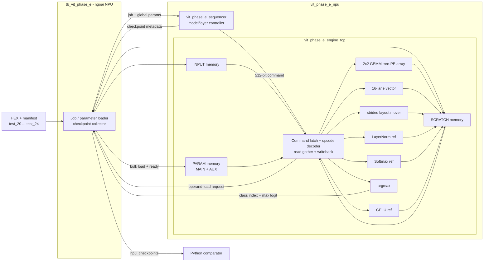

### 3.1 Cây phân cấp module chính xác

```text
tb_vit_phase_e
└── vit_phase_e_npu dut
    ├── vit_phase_e_sequencer u_sequencer
    └── vit_phase_e_engine_top u_engine
        ├── input_memory[]
        ├── parameter_memory[]
        ├── scratch_memory[]
        ├── vit_gemm_tree_array u_gemm
        │   └── 2 hàng x 2 cột
        │       └── 4 x vit_tree_pe_fp32
        ├── vit_vector_engine_fp32 u_vector
        ├── vit_layout_engine u_layout
        ├── vit_layernorm_engine_fp32 u_layernorm
        ├── vit_softmax_engine_fp32 u_softmax
        ├── vit_gelu_engine_fp32 u_gelu
        └── vit_argmax_engine_fp32 u_argmax
```

`vit_q_tree_array` là baseline Q-projection cũ dành cho `test_1`; nó không được
instantiate trong `vit_phase_e_npu`. Phase E sử dụng
`vit_gemm_tree_array`, là engine GEMM runtime-configurable.

### 3.2 Ba tầng điều khiển

| Tầng | Module | Trách nhiệm |
|---|---|---|
| Model control | `vit_phase_e_sequencer` | Chọn E01–E05, lặp layer, phát 20 bước/layer, quản lý checkpoint và lỗi |
| Command execution | `vit_phase_e_engine_top` | Latch descriptor, yêu cầu nạp parameter, chọn đúng engine, chờ hoàn thành, writeback |
| Local engine control | FSM bên trong mỗi engine | Duyệt tile, vector, row, token hoặc phần tử của phép toán đang chạy |

Không có hai engine chạy song song. Mỗi thời điểm chỉ có đúng một descriptor
được thực thi; do đó hiện chưa cần arbiter kết quả thực sự.

## 4. Control plane và các dây nối

### 4.1 Interface ngoài của `vit_phase_e_npu`

| Nhóm | Dây chính | Chiều nhìn từ NPU | Ý nghĩa |
|---|---|---|---|
| Clock/reset | `clk`, `rst` | input | Một clock domain; reset active-high đồng bộ |
| Job | `job_valid`, `job_ready`, `job` | vào/ra | Nhận một E01–E05 job khi sequencer đang IDLE |
| Global parameter | `global_params[255:0]` | input | Base cho patch, CLS, position, final LN và classifier |
| Layer table | `layer_param_request`, `layer_param_index[3:0]` | output | Yêu cầu bảng base của layer hiện tại |
| Layer table | `layer_param_valid`, `layer_param_data[511:0]` | input | Trả về 16 base address cho 2 LN và 6 linear của layer |
| Operand staging | `operand_load_request`, `operand_load_command[511:0]` | output | Yêu cầu host/testbench nạp operand PARAM của lệnh đã latch |
| Operand staging | `operand_load_ready` | input | Báo MAIN/AUX đã sẵn sàng |
| Checkpoint | `checkpoint_valid/ready` và metadata | output/input | Đồng bộ việc dump/checkpoint trước khi vùng nhớ bị ghi đè |
| Status | `busy`, `done`, `error` và error metadata | output | Trạng thái job và vị trí lỗi |
| Debug load | ba cổng write `address/data/enable` | input | Nạp từng word vào INPUT, PARAM hoặc SCRATCH |
| Debug read | `scratch_read_address/data` | input/output | Đọc bất đồng bộ một word scratch |
| Classification | `class_result_valid`, `class_index`, `class_logit` | output | Kết quả argmax; `valid` là pulse một chu kỳ, không có `ready` |

`phase_e_job_t` có 53 bit, gồm phase, first/last layer, tùy chọn class Softmax,
checkpoint enable, job tag và base của patch-A. Job mới chỉ được nhận khi
`job_ready=1`; không có command queue nhiều job.

### 4.2 Bề rộng các đường dữ liệu nội bộ chính

| Đường | Bề rộng mặc định | Nội dung |
|---|---:|---|
| Sequencer → adapter command | 512 bit | Một descriptor đầy đủ |
| GEMM activation bus | `2*16*32 = 1024` bit | Hai A-row chunk |
| GEMM weight bus | `2*16*32 = 1024` bit | Hai B-column chunk |
| GEMM bias bus | `2*32 = 64` bit | Bias cho hai output column |
| GEMM result bus | `2*2*32 = 128` bit | Một C tile 2x2 |
| Vector A/B/result | 512 bit mỗi bus | 16 FP32 word |
| GELU input/result | 512 bit mỗi bus | 16 FP32 word |
| Layout/LN/Softmax/argmax data | 32 bit | Một FP32 word |
| Host/debug address/data | 32/32 bit | Word address + one-word data |

Đây là dây logic trong functional model, chưa phải cấu trúc port/bank của RAM
vật lý.

### 4.3 Kết nối sequencer với execution adapter

```text
u_sequencer                               u_engine
-------------                             --------
command_valid --------------------------> cmd_valid
command[511:0] --------------------------> cmd[511:0]
command_ready <--------------------------- cmd_ready
command_done  <--------------------------- cmd_done
command_error <--------------------------- cmd_error
```

Quy tắc handshake:

- Sequencer giữ nguyên command khi `cmd_valid=1` nhưng `cmd_ready=0`.
- Adapter chỉ assert `cmd_ready` ở trạng thái IDLE.
- Một command đã nhận không được phát lại trong lúc engine còn chạy.
- Khi lỗi, adapter đưa `cmd_done=1` và `cmd_error=1` cùng chu kỳ REPORT.
  `cmd_error` vì vậy là qualifier của completion; sequencer kiểm tra error
  trước done.
- Checkpoint metadata cũng được giữ ổn định cho tới `checkpoint_ready`.

`done` và `class_result_valid` không có ready/backpressure. `done` là trạng
thái hoàn thành ngắn trước khi sequencer về IDLE; `class_index/class_logit` vẫn
được giữ sau pulse `class_result_valid`. Error metadata được giữ cho tới reset
hoặc lúc nhận job mới.

Không có timeout bên trong sequencer cho layer table, operand load, command hay
checkpoint. Testbench có timeout toàn simulation, nhưng product controller sau
này cần watchdog và cơ chế abort/recovery.

### 4.4 Luồng handshake của một lệnh có weight

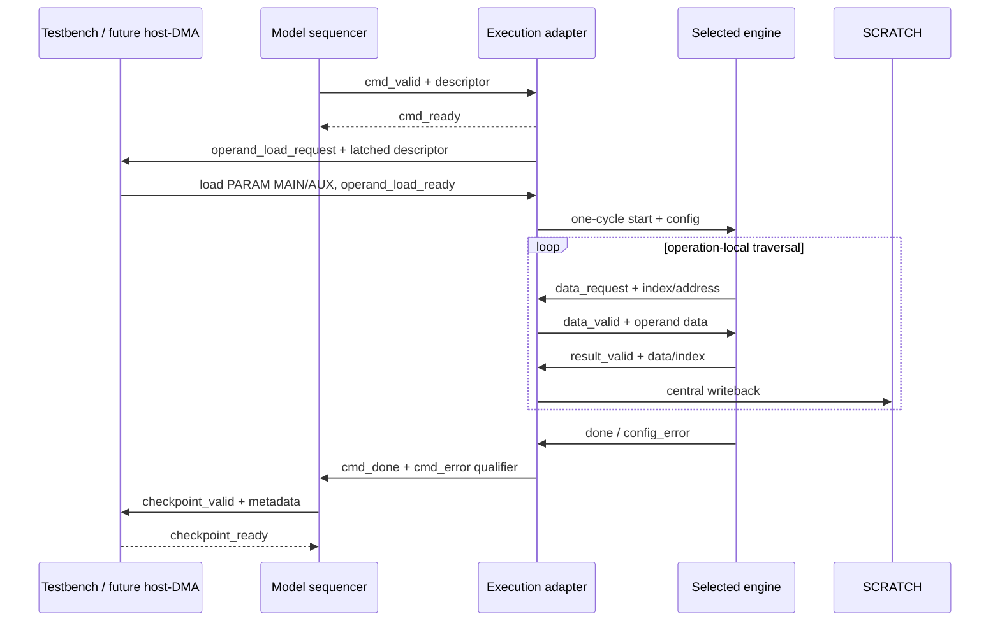

Trong adapter hiện tại, các tín hiệu input-valid cục bộ được nối thẳng bằng
request và mọi result-ready được buộc bằng 1. Điều đó tương đương bộ nhớ
zero-wait-state, luôn nhận output; stall thực sự chỉ tồn tại ở job, layer
parameter, operand load, command và checkpoint interface.

### 4.5 FSM cấp mô hình

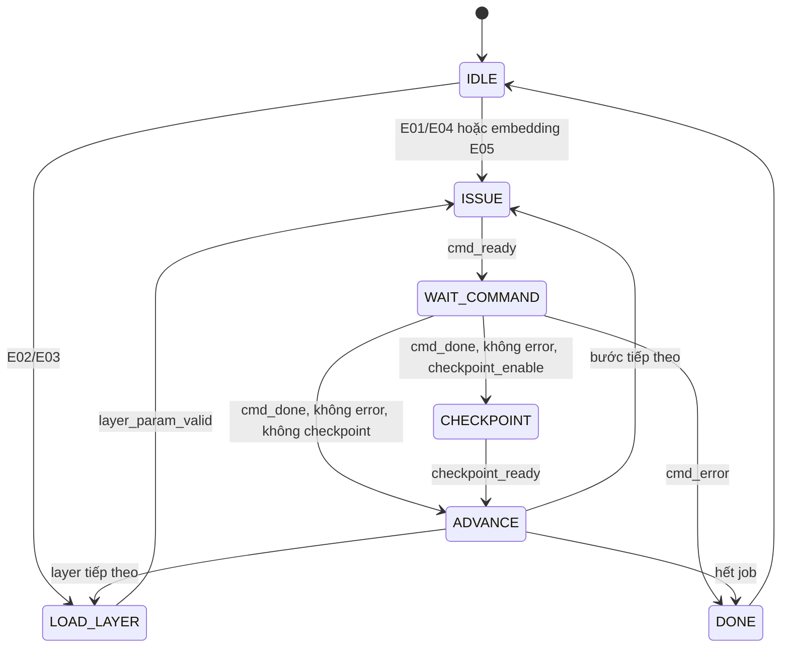

E05 đi theo chuỗi:

```text
IDLE
  -> EMBEDDING: 4 command
  -> LOAD layer 0
  -> ENCODER layer 0: 20 command
  -> ... LOAD/ENCODER layer 11
  -> FINAL: 4 command, hoặc 5 nếu bật class Softmax
  -> DONE
```

### 4.6 FSM cấp execution adapter

```text
IDLE
  ├─ command không dùng PARAM ───────────────> LAUNCH
  └─ command có ít nhất một nguồn PARAM ────> WAIT_PARAMETER
                                                  |
                                      parameter_ready
                                                  v
LAUNCH -> EXECUTE -> REPORT -> IDLE
```

`LAUNCH` tạo pulse start đúng một chu kỳ cho engine được chọn. `EXECUTE` chờ
done của đúng engine theo opcode. `REPORT` trả completion/error cho sequencer.

## 5. Descriptor lệnh 512 bit

Mỗi command có đúng 16 word 32-bit. Địa chỉ và stride đều tính theo FP32 word.

| Word | Trường | Nội dung |
|---:|---|---|
| W0 | header | opcode, subop, flags, tag, context dự phòng |
| W1 | route | tensor ID và memory space của 3 nguồn + đích |
| W2 | `src0_base` | Base nguồn A/dữ liệu chính |
| W3 | `src1_base` | Base nguồn B/weight/gamma/mask |
| W4 | `src2_base` | Base bias/beta/nguồn thứ ba |
| W5 | `dst_base` | Base kết quả |
| W6–W9 | `dim0..dim3` | Kích thước phụ thuộc opcode |
| W10–W14 | `stride0..stride4` | Batch/row/source strides |
| W15 | `immediate` | Scalar, epsilon hoặc C-row stride của GEMM |

### 5.1 Header W0

```text
31          24 23          16 15           8 7        4 3        0
+--------------+--------------+--------------+----------+----------+
| reserved     | tag          | flags        | subop    | opcode   |
+--------------+--------------+--------------+----------+----------+
```

Các flag đang định nghĩa:

| Bit trong flags | Giá trị | Ý nghĩa |
|---:|---:|---|
| 0 | `0x01` | Bias enable |
| 1 | `0x02` | Attention-mask enable |
| 2 | `0x04` | In-place metadata |
| 3 | `0x08` | Checkpoint metadata |

`IN_PLACE` và `CHECKPOINT` hiện là metadata; adapter không tự kiểm tra an toàn
alias hoặc tự dump checkpoint.

### 5.2 Route W1

```text
31        24 23 22 21 20 19 18 17 16 15 12 11 8 7 4 3 0
+-----------+-----+-----+-----+-----+-----+----+---+---+---+
| reserved  | dst | s2  | s1  | s0  | dst tensor IDs ... |
+-----------+-----+-----+-----+-----+---------------------+
```

Mỗi space có 2 bit: `NONE`, `SCRATCH`, `PARAM`, `INPUT`. Tensor ID phục vụ
trace/checkpoint; việc đọc thực tế do space và base quyết định. Writeback hiện
luôn đi vào `scratch_memory`, chưa thực thi `dst_space` tổng quát.

Hai vùng reserved đang được testbench dùng làm context:

```text
header.reserved = {section[1:0], layer[3:0], 2'b00}
route.reserved  = {3'b000, step[4:0]}
```

Đây là cách loader hiện tại chọn đúng file theo embedding/encoder/final,
layer và step. Nó chưa phải địa chỉ DDR hoặc DMA descriptor hoàn chỉnh.
Việc dùng field tên `reserved` tạo hidden coupling giữa sequencer và testbench;
bản production nên đổi thành context/version field chính thức.

Tag chỉ có 8 bit. E05 tối đa 249 command nên `job_tag=0` không wrap, nhưng một
`job_tag` khác zero có thể wrap modulo 256. Tag hiện chỉ dùng trace, không được
dùng làm định danh giao dịch duy nhất trong kiến trúc có nhiều outstanding
command tương lai.

### 5.3 Ý nghĩa dimension theo opcode

| Opcode | Dimension/immediate |
|---|---|
| GEMM | `dim0=batch`, `dim1=M`, `dim2=K`, `dim3=N`; strides mô tả A/B/C; W15 là C row stride |
| VECTOR | `dim0=length`; W15 là scalar |
| LAYOUT | `dim0..2` là ba chiều đích; `stride0..2` là stride nguồn |
| LAYERNORM | `dim0=token_count`, `dim1=hidden_size`; W15 là epsilon |
| SOFTMAX | `dim0=row_count`, `dim1=row_length` |
| GELU | `dim0=flat_length` |
| ARGMAX | `dim0=flat_length` |

Opcode NOP và END tồn tại trong enum nhưng adapter hiện chỉ chấp nhận opcode
GEMM đến ARGMAX, tức giá trị 1–7.

## 6. Datapath bên trong execution adapter

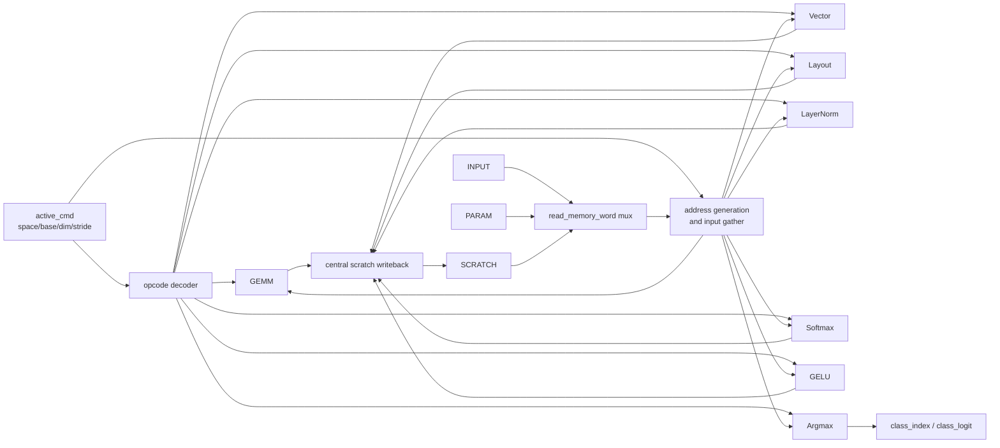

Đường đọc được fan-out về mặt logic tới tất cả engine, nhưng chỉ engine có
start theo opcode mới hoạt động. Đường ghi tập trung dùng chuỗi ưu tiên
GEMM → vector → layout → LayerNorm → Softmax → GELU. Vì chỉ có một engine chạy,
chuỗi ưu tiên này hiện không gây tranh chấp.

Các bề rộng đọc mặc định trong một chu kỳ:

| Engine | Dữ liệu logic được gather |
|---|---|
| GEMM | 32 word A + 32 word B + 2 bias word = tối đa 66 word FP32 |
| Vector | 16 word A + 16 word B |
| GELU | 16 word |
| Layout | 1 word |
| LayerNorm | 1 activation + gamma + beta |
| Softmax | 1 word |
| Argmax | 1 word |

Đây là băng thông của mô hình bộ nhớ tổ hợp, không phải số port SRAM đã được
thiết kế. Một bản vật lý phải dùng banking, replicated read ports, register
file hoặc tile buffers để cung cấp dữ liệu tương đương.

## 7. Khối GEMM và topology PE

### 7.1 Topology chính xác

Mảng mặc định có hai hàng cho hai token/output-row và hai cột cho hai
output-channel. A được broadcast ngang; B được broadcast dọc.

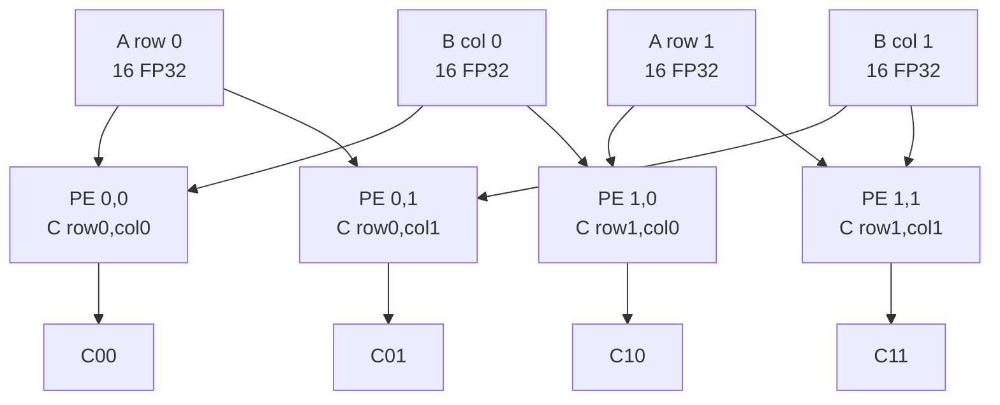

Không có cạnh `PE00 -> PE01` hay `PE00 -> PE10`; do đó không có wavefront,
skew register hoặc neighbor forwarding như systolic array truyền thống.

| Thuộc tính | Mảng hiện tại | Classic systolic array |
|---|---|---|
| Liên kết PE | Broadcast A-row/B-column trực tiếp | Neighbor-to-neighbor |
| Dữ liệu dịch qua array | Không | A ngang, B dọc theo wavefront |
| Fill/drain | Không có wavefront fill/drain | Có fill, steady-state và drain |
| Stationary | Output trong accumulator PE | Tùy dataflow: output/weight/input-stationary |
| Áp lực memory port | Cao ở đầu vào broadcast | Giảm nhờ reuse qua PE, cần boundary FIFO |
| Độ đơn giản bring-up | Cao | Controller/skew phức tạp hơn |

Nếu sau này đổi sang systolic đúng nghĩa, cần bổ sung register liên PE,
skew/fill/drain scheduling, boundary FIFOs và valid wavefront. Việc đó là thay
đổi topology lớn, không chỉ sửa nội dung PE.

Stationary strategy là **output-stationary**:

- mỗi PE giữ accumulator của một phần tử C;
- A/B được đổi sau mỗi K-chunk;
- accumulator chỉ được clear khi bắt đầu output tile mới;
- sau toàn bộ K, bias được cộng tùy chọn rồi tile 2x2 được writeback.

### 7.2 Cấu trúc một tree PE

```text
activation[0..15] ─┐
                   ├─ 16 FP32 multipliers ─ products[0..15]
weight[0..15] ─────┘
                                      |
                         8 adders  : level 1
                         4 adders  : level 2
                         2 adders  : level 3
                         1 adder   : level 4
                                      |
                               dot_partial
                                      |
                         FP32 accumulator adder
                                      |
                         optional final bias add
                                      |
                                   result
```

Một PE có 16 multiplier, 15 tree adder, một accumulator và đường bias. Mảng
2x2 có 64 multiplier, 60 tree adder và bốn accumulator. Nếu đếm phép nhân và
cộng riêng, một K-chunk hợp lệ thực hiện danh nghĩa 64 multiply + 64 add cho
bốn output, nhưng datapath hiện là tổ hợp sâu và chưa pipeline nên con số này
không phải throughput ở Fmax thực tế.

### 7.3 Vì sao chọn `n=16`

| Lane/PE | Multiplier của mảng 2x2 | Tree depth | K-chunk cho K=768 | Nhận xét |
|---:|---:|---:|---:|---|
| 8 | 32 | 3 | 96 | Ít tài nguyên hơn nhưng gấp đôi vòng K |
| **16** | **64** | **4** | **48** | Điểm cân bằng hiện tại; 768 chia hết |
| 32 | 128 | 5 | 24 | Gấp đôi bandwidth và tăng critical path |
| 64 | 256 | 6 | 12 | Quá rộng cho bring-up trước khi có banking/pipeline |

Với P×V, `K=197`, chunk cuối của mọi lựa chọn lũy thừa hai trên có năm lane
hợp lệ. Tail mask hiện tại xử lý đúng trường hợp này. Khuyến nghị giữ `n=16`
cho baseline; ưu tiên pipeline và memory banking trước khi tăng lane hoặc kích
thước mảng.

### 7.4 Parameter hóa mảng

`PE_LANES` có mặt như parameter ở cấp trên nhưng `vit_gemm_tree_array` kiểm tra
và yêu cầu đúng 16. `ARRAY_ROWS` và `ARRAY_COLS` có thể elaboration-time
parameter; cấu hình Phase E mặc định vẫn là 2x2.

### 7.5 FSM và tail handling

```text
IDLE -> CLEAR -> COMPUTE(k=0,16,32,...) -> BIAS -> WRITE -> DONE
                   ^                          |
                   └──── output tile sau ─────┘
```

- M-tail: mask hàng cuối, cần thiết vì `M=197`.
- N-tail: mask cột cuối nếu N lẻ.
- K-tail: mask từng lane **trước multiplier**, cần thiết cho `K=197` của P×V.
- Bias có thể bypass hoàn toàn cho QK và P×V.
- Result tile có valid/ready và giữ ổn định khi bị stall, dù Phase E hiện buộc
  ready bằng 1.

Với không stall, ước lượng chu kỳ GEMM là:

```text
cycles = batch_count
       * ceil(M / ARRAY_ROWS)
       * ceil(N / ARRAY_COLS)
       * (ceil(K / 16) + 3)
```

Ba chu kỳ cộng thêm ứng với CLEAR, BIAS và WRITE.

Ví dụ Q projection:

```text
ceil(197/2) * ceil(768/2) * (ceil(768/16)+3)
= 99 * 384 * 51
= 1,938,816 cycles
```

Với clock testbench 10 ns, con số này tương ứng khoảng `19,388,160 ns`, rất
gần thời gian mô phỏng Q đã quan sát. Đây là simulated time; wall-clock của
ModelSim còn phụ thuộc mạnh vào khối FP32 tổ hợp, waveform và file I/O.

## 8. Các engine ngoài GEMM

| Engine | Chức năng | Mức song song | Cách duyệt | Trạng thái synthesis |
|---|---|---:|---|---|
| Vector | ADD hoặc SCALE_MASK | 16 lane | vector phẳng, tail mask | RTL candidate |
| Layout | Copy nguồn rank-3 strided sang đích contiguous | 1 word | ba counter lồng nhau | RTL candidate, nhưng rất chậm |
| LayerNorm | mean → variance → rsqrt → affine | 1 word | 3 lần đọc mỗi token | Functional reference |
| Softmax | max → exp sum → reciprocal → output | 1 word | 3 lần đọc mỗi row | Functional reference |
| GELU | exact-erf-style approximation | 16 lane | vector phẳng, tail mask | Functional reference |
| Argmax | maximum FP32 hữu hạn + lowest-index tie | 1 word | scan tuần tự | RTL candidate |

### 8.1 Vector engine

Hai mode:

```text
ADD:        y[i] = a[i] + b[i]
SCALE_MASK: y[i] = a[i] * scalar + (mask_enable ? b[i] : 0)
```

Nó được dùng cho position add, hai residual add mỗi layer, attention scale và
mask. Với ViT hiện tại mask mô hình là zero/bypass nên flag mask không bật.

### 8.2 Layout engine

Địa chỉ nguồn:

```text
src = src_base + i0*stride0 + i1*stride1 + i2*stride2
dst = dst_base + linear_output_index
```

Engine này thực hiện copy CLS, copy patch token, split Q/K/V, transpose K,
merge head và select CLS. Nó truyền từng word qua hai trạng thái REQUEST/WRITE,
nên là bottleneck rõ ràng. Trong kiến trúc tối ưu, phần lớn split/transpose/
merge nên được fold vào address generation của producer hoặc consumer thay vì
copy cả tensor.

### 8.3 LayerNorm reference

Cho từng token 768 phần tử:

```text
pass 0: sum -> mean
pass 1: sum((x-mean)^2) -> biased variance
state : inv_std = rsqrt(variance + epsilon)
pass 2: y = ((x-mean)*inv_std)*gamma + beta
```

Source được đọc lại ba lần để tránh buffer cả token. `rsqrt` và chuyển đổi
reciprocal dùng simulator math; cần thay bằng reduction tree + SFU pipeline
trước synthesis.

### 8.4 Softmax reference

Mỗi row chạy ổn định số học:

```text
pass 0: row_max
pass 1: sum(exp(x-row_max))
state : reciprocal_sum
pass 2: exp(x-row_max) * reciprocal_sum
```

Attention có `2364 = 12*197` row, mỗi row dài 197. Class Softmax tùy chọn có
một row dài 1000. Exponential được tính lại ở pass output để không cần buffer
197 số exp; đây là đổi bộ nhớ lấy compute.

### 8.5 GELU reference

Target là:

```text
GELU(x) = 0.5*x*(1 + erf(x/sqrt(2)))
```

Erf dùng xấp xỉ Abramowitz-Stegun trong `real`, sau đó round về FP32. Module
chứng minh traversal và boundary số học, không phải thiết kế SFU đề xuất.

### 8.6 Argmax

Argmax so sánh giá trị FP32 có dấu, xem `+0` và `-0` là bằng nhau, chỉ cập nhật
khi lớn hơn nghiêm ngặt nên tie giữ index thấp nhất. NaN/Inf tạo sticky error.
Kết quả đi ra `class_index/class_logit`, không ghi vào scratch.

## 9. Hệ thống bộ nhớ logic

### 9.1 Ba memory space

| Space | Kích thước mặc định | Nội dung hiện tại | Thực trạng |
|---|---:|---|---|
| INPUT | 150,528 word = 602,112 byte | Prepared patch-A `[196,768]` | Behavioral array |
| PARAM | `0x241000` word = 9,453,568 byte | Một operand chính và một operand phụ của command hiện tại | Behavioral staging array |
| SCRATCH | `0x1E6000` word = 7,962,624 byte | Tất cả activation/intermediate/logits | Behavioral array |

Đây không phải kiến trúc “chỉ có hai buffer input và weight”. Cách gọi đúng ở
thời điểm này là ba không gian nhớ logic, trong đó PARAM có hai cửa sổ staging
MAIN/AUX và SCRATCH có nhiều vùng activation cố định.

Tổng capacity của ba behavioral array là 18,018,304 byte, khoảng 17.18 MiB.
Con số này không bao gồm việc toàn bộ 346 MB weight nằm trên host/disk; PARAM
chỉ giữ một cặp operand hiện hành.

`patch_a_base` tồn tại trong job descriptor, nhưng INPUT mặc định vừa đúng
150,528 word nên base chạy được hiện tại phải là zero. Tensor normalized CHW
`[1,3,224,224]` tình cờ cũng có 150,528 phần tử, nhưng layout hoàn toàn khác;
cùng word count không làm hai input này tương thích.

### 9.2 Scratch memory map

| Region | Base word | End word | Capacity word | Dữ liệu thực dùng | Vai trò |
|---|---:|---:|---:|---:|---|
| `HIDDEN_A` | `0x000000` | `0x024FFF` | 151,552 | 151,296 | Hidden state bền vững, input/output mỗi layer |
| `HIDDEN_B` | `0x025000` | `0x049FFF` | 151,552 | 151,296 | LN1, O output, attention residual, final LN |
| `LINEAR_TMP` | `0x04A000` | `0x06EFFF` | 151,552 | 151,296 | Q/K/V/O temp, K-transpose, merge, FC2, CLS |
| `Q_HEAD` | `0x06F000` | `0x093FFF` | 151,552 | 151,296 | Q heads, sau đó P×V output |
| `K_HEAD` | `0x094000` | `0x0B8FFF` | 151,552 | 151,296 | K heads trước transpose |
| `V_HEAD` | `0x0B9000` | `0x0DDFFF` | 151,552 | 151,296 | V heads |
| `SCORE_PROB` | `0x0DE000` | `0x14FFFF` | 466,944 | 465,708 | raw score → scaled score → probability in-place |
| `FC1` | `0x150000` | `0x1E3FFF` | 606,208 | 605,184 | FC1 output → GELU in-place |
| `LOGITS` | `0x1E4000` | `0x1E4FFF` | 4,096 | 1,000 | Classifier logits được giữ nguyên |
| `CLASS_PROB` | `0x1E5000` | `0x1E5FFF` | 4,096 | 1,000 | Optional class probabilities |

Tổng scratch logic là 1,990,656 word, khoảng 7.59 MiB. Các guard/alignment gap
giúp base dễ đọc và tránh overlap; chúng không chứng minh lượng SRAM vật lý.

### 9.3 Parameter staging map

```text
PARAM word 0x000000 ... 0x23FFFF : MAIN, 2,359,296 word = 9 MiB
PARAM word 0x240000 ... 0x240FFF : AUX,       4,096 word = 16 KiB
```

MAIN vừa đủ cho matrix lớn nhất FC1/FC2 `3072*768`. AUX chứa bias hoặc beta
lớn nhất. Weight không cư trú toàn bộ:

1. Sequencer yêu cầu một `phase_e_layer_params_t` khi vào layer.
2. Trong testbench hiện tại, cả 16 base trong bảng đều trỏ về MAIN/AUX dùng lại.
3. Khi command có nguồn PARAM, adapter dừng ở `WAIT_PARAMETER`.
4. Testbench dùng section/layer/step metadata để `$readmemh` đúng file vào
   MAIN/AUX.
5. `operand_load_ready` cho phép command bắt đầu.
6. Command sau có thể ghi đè staging window sau khi command trước hoàn tất.

E05 cần 12 lần layer-table handshake và 101 lần staging parameter:

```text
3 embedding parameter commands
+ 12 layer * 8 parameterized commands
+ 2 final parameter commands
= 101
```

Handshake hiện chỉ có một bit ready; không trả word count, hash hay lỗi DMA.
Các kiểm tra đó đang nằm ở generator/manifest/testbench.

Lượng parameter được stage theo một full-model E05 đúng bằng toàn bộ tham số
mô hình:

| Scope | Staging request | FP32 word được nạp | Byte traffic |
|---|---:|---:|---:|
| E01 | 3 | 742,656 | 2,970,624 |
| Một encoder layer | 8 | 7,087,872 | 28,351,488 |
| E03 chain 11 layer | 88 | 77,966,592 | 311,866,368 |
| E04 | 2 | 770,536 | 3,082,144 |
| E05 | 101 | 86,567,656 | 346,270,624 |

Vì chưa có prefetch/double buffer, 101 lần load này tuần tự với compute. Bản
vật lý cần overlap DMA của tile tiếp theo với GEMM hiện tại; nếu không, bandwidth
DDR sẽ trở thành phần lớn latency dù compute array được mở rộng.

## 10. Luồng dữ liệu end-to-end

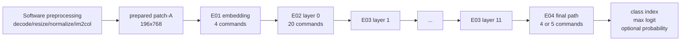

Trong runnable E05, phần `Software preprocessing` nằm ngoài job; job bắt đầu
tại `prepared patch-A` và nối liên tục E01 → 12 layer → E04.

### 10.1 E01 — embedding integration

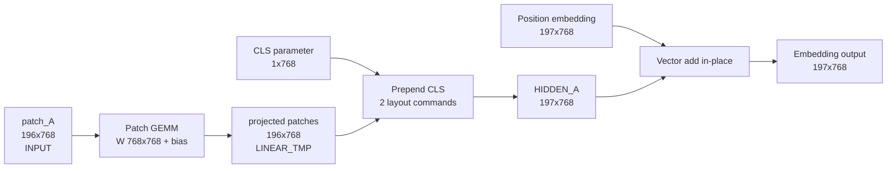

Bốn command:

| # | Engine | Phép toán | Đích |
|---:|---|---|---|
| 1 | GEMM | `patch_A[196,768] * W[768,768] + bias[768]` | `LINEAR_TMP` |
| 2 | Layout | Copy CLS 768 word | đầu `HIDDEN_A` |
| 3 | Layout | Copy 196 projected patch token | `HIDDEN_A + 768` |
| 4 | Vector | Add position `[197,768]` in-place | `HIDDEN_A` |

Patch GEMM đã xuất token-major `[196,768]`; không được thêm flatten/transpose
sau command 1. Embedding dropout có xác suất zero ở eval mode nên là bypass,
không có command thứ năm.

### 10.2 Một encoder layer hoàn chỉnh

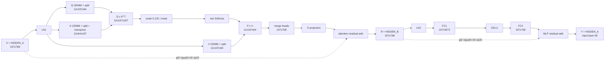

Ba nhánh Q/K/V trong sơ đồ là dependency graph, không phải ba engine chạy
song song. RTL hiện chạy Q projection/split, rồi K projection/split, rồi V
projection/split để tái sử dụng `LINEAR_TMP` và một GEMM engine duy nhất.

### 10.3 Bảng 20 operation và vùng nhớ

| Op | Engine | Nguồn | Đích | Shape đích / ghi chú |
|---:|---|---|---|---|
| 01 | LayerNorm | `HIDDEN_A`, gamma1, beta1 | `HIDDEN_B` | `[197,768]` |
| 02 | GEMM | `HIDDEN_B`, Wq, bq | `LINEAR_TMP` | Q token-major `[197,768]` |
| 03 | Layout | `LINEAR_TMP` | `Q_HEAD` | `[12,197,64]` |
| 04 | GEMM | `HIDDEN_B`, Wk, bk | `LINEAR_TMP` | K token-major |
| 05 | Layout | `LINEAR_TMP` | `K_HEAD` | `[12,197,64]` |
| 06 | GEMM | `HIDDEN_B`, Wv, bv | `LINEAR_TMP` | V token-major |
| 07 | Layout | `LINEAR_TMP` | `V_HEAD` | `[12,197,64]` |
| 08 | Layout | `K_HEAD` | `LINEAR_TMP` | K-transpose `[12,64,197]` |
| 09 | GEMM | `Q_HEAD`, K-transpose | `SCORE_PROB` | raw score `[12,197,197]` |
| 10 | Vector | `SCORE_PROB`, scale/mask | `SCORE_PROB` | scaled in-place |
| 11 | Softmax | `SCORE_PROB` | `SCORE_PROB` | probability in-place |
| 12 | GEMM | probability, `V_HEAD` | `Q_HEAD` | P×V `[12,197,64]`; Q cũ đã hết live |
| 13 | Layout | `Q_HEAD` | `LINEAR_TMP` | merged `[197,768]` |
| 14 | GEMM | merged, Wo, bo | `HIDDEN_B` | O output; LN1 cũ đã hết live |
| 15 | Vector | O output, original `HIDDEN_A` | `HIDDEN_B` | attention residual |
| 16 | LayerNorm | `HIDDEN_B`, gamma2, beta2 | `HIDDEN_A` | LN2; lúc này mới được overwrite X |
| 17 | GEMM | `HIDDEN_A`, W1, b1 | `FC1` | `[197,3072]` |
| 18 | GELU | `FC1` | `FC1` | in-place |
| 19 | GEMM | `FC1`, W2, b2 | `LINEAR_TMP` | `[197,768]` |
| 20 | Vector | `LINEAR_TMP`, attention residual `HIDDEN_B` | `HIDDEN_A` | layer output |

### 10.4 Vòng đời buffer trong một layer

```text
Trước op01:
  HIDDEN_A = X, phải giữ tới op15

Op01..07:
  HIDDEN_B = LN1(X)
  LINEAR_TMP lần lượt chứa Q, K, V rồi được giải phóng sau mỗi split
  Q_HEAD, K_HEAD, V_HEAD giữ ba nhánh attention

Op08..13:
  LINEAR_TMP = K^T rồi merged heads
  SCORE_PROB = raw -> scaled -> probability in-place
  Q_HEAD được tái sử dụng cho P×V sau khi QK đã xong

Op14..15:
  HIDDEN_B bị overwrite bởi O, sau đó trở thành R = O + X
  HIDDEN_A vẫn giữ X cho tới khi residual hoàn thành

Op16..20:
  HIDDEN_A = LN2(R), lúc này X không còn cần
  FC1 = FC1 output -> GELU in-place
  LINEAR_TMP = FC2 output
  HIDDEN_B vẫn giữ R cho MLP residual
  op20 ghi Y = FC2 + R về HIDDEN_A
```

Không cần swap HIDDEN_A/HIDDEN_B giữa layer. Mọi layer bắt đầu và kết thúc ở
HIDDEN_A; đây là invariant quan trọng nhất của chain layer 0→11.

### 10.5 E03 — loop layer 1 đến 11

```text
HIDDEN_A(layer i input)
  -> load parameter table của layer i
  -> chạy 20 operation
  -> HIDDEN_A(layer i output)
  -> i = i + 1, không reload activation
```

Mỗi layer có weight Q/K/V/O, FC1/FC2, sáu bias và bốn vector LN riêng. Không
được dùng gamma/beta layer 0 cho layer khác. Standalone case giúp định vị lỗi;
chained case phát hiện sai layer index, stale accumulator hoặc lifetime buffer.

### 10.6 E04 — final path

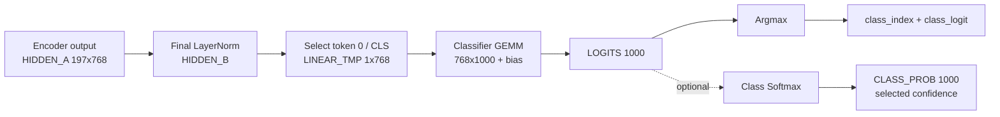

Argmax luôn đọc logits gốc và chạy trước optional class Softmax. Class
Softmax ghi vùng riêng, vì vậy không phá logits. Label string vẫn là nhiệm vụ
phần mềm. “Selected confidence” hiện do checkpoint collector đọc
`CLASS_PROB[class_index]`; nó không phải một descriptor phần cứng thứ sáu.

### 10.7 E05 — command census

| Engine | Số command không class Softmax | Nguồn đếm |
|---|---:|---|
| GEMM | 98 | patch 1 + 12×8 encoder + classifier 1 |
| Vector | 37 | position 1 + 12×3 |
| Layout | 63 | embedding 2 + 12×5 + select CLS 1 |
| LayerNorm | 25 | 12×2 + final 1 |
| Attention Softmax | 12 | 1/layer |
| GELU | 12 | 1/layer |
| Argmax | 1 | final class selection |
| **Tổng** | **248** | |
| Optional class Softmax | **+1** | tổng 249 |

Ba dropout trong mỗi encoder layer và embedding dropout đều là identity khi
inference; chúng không phát command.

Ước lượng theo functional timing model:

| Flow | Zero-stall cycles |
|---|---:|
| E01 embedding | 2,240,736 |
| E02 hoặc một standalone encoder layer | 29,116,580 |
| E03 chain layer 1–11 | 320,282,380 |
| E04 logits / probability | 633,812 / 637,813 |
| E05 logits / probability | 352,273,508 / 352,277,509 |

## 11. Luồng file, testbench và golden

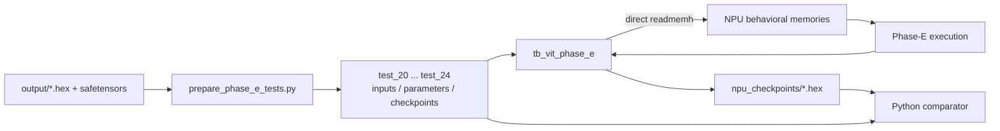

Testbench không parse JSON manifest. Tên file, tensor base và word count của
loader/checkpoint collector được hard-code để khớp contract do generator tạo;
comparator Python mới dùng manifest để kiểm tra kết quả.

Hai mode checkpoint khác nhau về ý nghĩa:

| Mode | Hành vi | Chứng minh được |
|---|---|---|
| `CHECKPOINT_INJECT=1` | Dump output NPU rồi thay đích bằng golden trước command kế | Cô lập lỗi từng operation |
| `CHECKPOINT_INJECT=0` | Không inject, dùng chính output NPU cho toàn chain | Lan truyền sai số và tính đúng end-to-end |

`MAJOR_ONLY=1` chỉ giảm số file được dump/compare; nếu injection đang bật thì
testbench vẫn inject ở mọi operation boundary để giữ khả năng cô lập lỗi.

`PASS functional run complete` trong testbench chỉ chứng minh job hoàn thành,
không có controller error, command count đúng và argmax pulse đúng ở case final.
Nó không thực hiện so sánh số học. Chỉ khi simulator tạo đủ output và Python
comparator pass mới được gọi là numerical PASS.
Integration testbench cũng chưa assert cuối run các count checkpoint,
parameter-load và layer-request; các count lịch điều khiển này được kiểm tra ở
control-only sequencer regression.

Package Phase E:

| Test | Nội dung | Case chạy được |
|---:|---|---:|
| 20 / E01 | Embedding từ prepared patch-A | 1 |
| 21 / E02 | Encoder layer 0 | 1 |
| 22 / E03 | Layer 1..11 riêng và chain 1..11 | 12 |
| 23 / E04 | Final logits/argmax và optional probability | 2 |
| 24 / E05 | Full prepared-patch model, logits/probability | 2 |

Có thêm một manifest E05 từ normalized pixels được đánh dấu blocked, không
được tính là pass.

Audit toàn bộ package hiện tại cho kết quả:

| Chỉ số | Giá trị |
|---|---:|
| Tổng case manifest | 19 |
| Runnable / blocked | 18 / 1 |
| Command nếu chạy mọi runnable case | 970 |
| Checkpoint record | 983 |
| Major checkpoint record | 71 |
| PARAM staging request | 393 |
| Layer-table request | 47 |
| Relative symlink hợp lệ | 1,788 |
| Link hỏng | 0 |
| NPU checkpoint hiện có | 0 |

Số checkpoint record lớn hơn command vì một command có thể có nhiều logical
boundary/alias: patch projection có Step 02/03, position-add có Step 05/06,
argmax có index/max-logit, và class Softmax có probability/confidence.

## 12. Phân chia phần cứng và phần mềm

### 12.1 Đúng với bản hiện tại

| Công việc | Hiện tại do ai làm? |
|---|---|
| JPEG decode, resize, normalization | Python/phần mềm |
| Patch extraction/im2col | Python/phần mềm |
| Transpose weight `[N,K] -> [K,N]` | Script chuẩn bị dữ liệu |
| Load input/weight | Testbench dùng `$readmemh` |
| E01–E05 scheduling | `vit_phase_e_sequencer` |
| GEMM, vector, layout, LN, Softmax, GELU, argmax | Các engine RTL/reference |
| Bộ nhớ activation/parameter | Behavioral arrays trong adapter |
| Checkpoint dump/golden injection | Testbench |
| Numerical compare, label lookup | Python/phần mềm |

### 12.2 Kiến trúc đích cân bằng được đề xuất

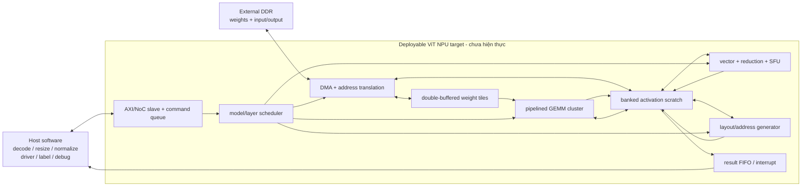

Ranh giới đề xuất:

- Phần mềm giữ JPEG decode, resize, normalization, weight management, driver,
  label lookup và debug.
- NPU giữ activation trong miền phần cứng từ patch/embedding tới logits.
- Weight FP32 khoảng 346 MB nằm ở DDR và được stream/cache theo tile; không nên
  cố đặt toàn bộ vào SRAM on-chip.
- Final class Softmax/top-k có thể ở phần mềm; argmax phần cứng đã đủ để chọn
  class từ logits.

## 13. Hiệu năng và nút thắt hiện tại

### 13.1 Chi phí GEMM

| GEMM | Zero-stall cycles hiện tại |
|---|---:|
| Patch projection | 1,919,232 |
| Một Q/K/V/O projection | 1,938,816 |
| QK cho đủ 12 head | 823,284 |
| P×V cho đủ 12 head | 608,256 |
| FC1 | 7,755,264 |
| FC2 | 7,413,120 |
| Classifier | 25,500 |
| Một encoder layer, tám GEMM | 24,355,188 |
| Toàn E05, chỉ tính GEMM | 294,206,988 |

Manifest ước lượng toàn E05 là 352,273,508 chu kỳ không stall cho logits và
352,277,509 khi bật class Softmax. Với chu kỳ testbench 10 ns, simulated time
xấp xỉ 3.52 giây; wall-clock event simulation có thể rất lâu.

Phân bố một encoder layer theo estimator hiện tại:

| Nhóm | Chu kỳ | Tỷ lệ xấp xỉ |
|---|---:|---:|
| 8 GEMM | 24,355,188 | 83.65% |
| Attention Softmax | 1,865,196 | 6.41% |
| 5 layout copy | 1,512,960 | 5.20% |
| 2 LayerNorm | 1,211,550 | 4.16% |
| GELU | 75,648 | 0.26% |
| Scale | 58,214 | 0.20% |
| 2 residual add | 37,824 | 0.13% |
| **Tổng** | **29,116,580** | **100%** |

GEMM vẫn chiếm phần lớn, nhưng layout/Softmax/LayerNorm cộng lại hơn 15% và tạo
traffic rất lớn. Điều này giải thích vì sao NPU ViT không thể chỉ tối ưu PE mà
bỏ qua data mover và reduction/SFU.

### 13.2 Nút thắt chính

1. **FP32 combinational path sâu**: multiplier, bốn tầng adder tree,
   accumulator add và normalization chưa pipeline/timing close.
2. **Mảng chỉ 2x2**: cần số tile rất lớn cho hidden 768 và FC1 width 3072.
3. **Layout scalar**: mỗi word cần request/write, trong khi mỗi layer có năm
   tensor layout lớn.
4. **LayerNorm/Softmax scalar nhiều pass**: cùng tensor bị đọc lại ba lần.
5. **Không overlap**: parameter load, compute và writeback nối tiếp hoàn toàn.
6. **Không có tile cache thật**: mỗi K-chunk đọc trực tiếp logical memory với
   băng thông tổ hợp rất lớn.
7. **Checkpoint và waveform**: có thể làm thời gian wall-clock tăng mạnh.

## 14. Khoảng cách từ functional model tới NPU triển khai được

| Hạng mục | Hiện tại | Cần cho bản triển khai |
|---|---|---|
| Model scheduler | Có, one-command-at-a-time | Command queue, interrupt, watchdog |
| GEMM | Chức năng FP32, 2x2×16 lane | Pipeline, banking, timing closure, chọn tile size |
| Vector/layout/argmax | RTL candidate | Synthesis, formal/stall tests, throughput tuning |
| LayerNorm | `shortreal/real` reference | Reduction pipeline + rsqrt phần cứng |
| Softmax | `shortreal/real` reference | max/sum tree + exp/reciprocal approximation |
| GELU | `real` erf reference | LUT/PWL/polynomial SFU |
| Scratch | Behavioral array 7.59 MiB | Banked SRAM/BRAM + crossbar |
| Parameter | MAIN/AUX behavioral staging | DDR DMA + double buffer/cache |
| Input front end | Prepared patch-A | Patch extractor/im2col hoặc Conv front end |
| Interface | Debug word ports và hierarchy load | AXI/NoC, descriptor queue, status registers |
| Numerical status | Goldens sẵn sàng; Phase E chưa pass ModelSim | Unit → isolated integration → true-chain pass |
| Precision | FP32 | Giữ FP32 reference, sau đó đánh giá BF16/FP16/INT8 |

### 14.1 Các giới hạn an toàn/chức năng cần biết

- Bộ nhớ không được clear khi reset; testbench phải nạp đúng vùng trước khi đọc.
- Read ngoài range trả QNaN; write ngoài range bị bỏ, chưa có memory-fault port.
- Adapter chưa kiểm tra đầy đủ range, overlap, tensor ID, flag và subop.
- Vector subop không hợp lệ hiện có thể rơi về ADD thay vì bị reject rõ ràng.
- `dst_space` chưa được writeback sử dụng; lịch hiện tại đúng vì mọi đích lưu
  đều là SCRATCH.
- Parameter/input write không có bảo vệ phần cứng chống ghi đồng thời với read;
  correctness dựa vào loader protocol.
- `class_result_valid` không có backpressure.
- Arithmetic package flush subnormal về zero và có reduction order khác
  PyTorch; bit-exact không phải tiêu chí phù hợp.
- Attention mask của model hiện là bypass; directed mask test thuộc Phase D.
- Dropout chỉ đúng theo inference/eval mode.

## 15. Lộ trình kiến trúc đề xuất

Thứ tự này giữ cho mỗi thay đổi có tiêu chí kiểm chứng rõ:

1. **Khóa numerical baseline**: chạy B/C/D và E01→E04 với checkpoint chi tiết;
   sau đó E05 isolated và E05 true-chain.
2. **Thay SFU reference**: chọn kiến trúc rsqrt, exp, reciprocal và GELU;
   characterize sai số từng khối trước khi chạy lại full model.
3. **Pipeline GEMM PE**: chèn register giữa multiplier/tree levels và thiết kế
   valid pipeline; không thay đổi contract descriptor.
4. **Thiết kế memory banking**: xác định số bank/port để cấp 32 A + 32 B word
   logic mỗi K-chunk hoặc giảm bandwidth bằng register/tile reuse.
5. **Thêm DMA và double buffering**: prefetch weight tile kế tiếp trong lúc
   tile hiện tại tính toán; thay `$readmemh` bằng bus transaction.
6. **Loại bỏ layout copy không cần thiết**: ghi Q/K/V trực tiếp theo head,
   đọc K bằng stride transpose và cho O projection đọc merged view.
7. **Thêm patch extractor**: hỗ trợ normalized CHW → patch-A bằng address
   generator nhiều chiều hoặc line-buffer Conv front end.
8. **Đánh giá precision**: chỉ chuyển BF16/FP16/INT8 sau khi FP32 true-chain là
   baseline ổn định.
9. **Synthesis và timing closure**: đo area, BRAM/DSP, Fmax, power; sau đó mới
   quyết định tăng số hàng/cột hay số lane PE.

## 16. Bản đồ file kiến trúc

| File | Vai trò |
|---|---|
| [`vit_phase_e_pkg.sv`](vit_phase_e_pkg.sv) | Shape, address map, opcode và descriptor 512-bit |
| [`vit_phase_e_sequencer.sv`](vit_phase_e_sequencer.sv) | Model/layer sequencer E01–E05 |
| [`vit_phase_e_engine_top.sv`](vit_phase_e_engine_top.sv) | Memory adapter, opcode dispatch, engine wiring và writeback |
| [`vit_phase_e_npu.sv`](vit_phase_e_npu.sv) | Top nối sequencer với adapter |
| [`vit_gemm_tree_array.sv`](vit_gemm_tree_array.sv) | GEMM runtime controller và 2D output tile array |
| [`vit_tree_pe_fp32.sv`](vit_tree_pe_fp32.sv) | Tree PE 16 lane và output-stationary accumulator |
| [`vit_vector_engine_fp32.sv`](vit_vector_engine_fp32.sv) | Add/scale/mask vector |
| [`vit_layout_engine.sv`](vit_layout_engine.sv) | Rank-3 strided data mover |
| [`vit_layernorm_engine_fp32.sv`](vit_layernorm_engine_fp32.sv) | LayerNorm functional reference |
| [`vit_softmax_engine_fp32.sv`](vit_softmax_engine_fp32.sv) | Stable Softmax functional reference |
| [`vit_gelu_engine_fp32.sv`](vit_gelu_engine_fp32.sv) | GELU functional reference |
| [`vit_argmax_engine_fp32.sv`](vit_argmax_engine_fp32.sv) | Streaming class selection |
| [`tb_vit_phase_e.sv`](tb_vit_phase_e.sv) | File-backed integration testbench |
| [`README_PHASE_E_NPU.md`](README_PHASE_E_NPU.md) | Contract và hướng dẫn chạy Phase E |
| [`../PHASE_E_TEST_PACKAGES.md`](../PHASE_E_TEST_PACKAGES.md) | Contract package/golden/checkpoint |
| [`../prepare_phase_e_tests.py`](../prepare_phase_e_tests.py) | Generator và comparator |

## 17. Tóm tắt một câu cho từng block

```text
Host/testbench : đưa job và dữ liệu vào, lấy checkpoint ra.
Sequencer      : quyết định command nào chạy, layer nào đang chạy.
Descriptor     : mang opcode, route, base, shape, stride và immediate.
Engine adapter : nạp parameter, chọn engine, nối memory và commit kết quả.
INPUT          : giữ prepared patch-A.
PARAM          : giữ weight/constant của đúng một command tại một thời điểm.
SCRATCH        : giữ toàn bộ activation và intermediate của model.
GEMM array     : tính tile C 2x2, mỗi PE giảm 16 K-element mỗi step.
Vector engine  : cộng residual/position hoặc scale/mask 16 phần tử/lần.
Layout mover   : đổi layout bằng địa chỉ stride, một word/lần.
LayerNorm      : ba pass mỗi token; reference chưa synthesize.
Softmax        : ba pass mỗi row; reference chưa synthesize.
GELU           : 16 phần tử/lần; reference chưa synthesize.
Argmax         : scan logits và trả class index/max logit.
Comparator     : nơi duy nhất hiện tại kết luận numerical pass/fail.
```

Kiến trúc hiện tại đã có **đường điều khiển và đường dữ liệu logic đầy đủ từ
prepared patch-A tới class**, nhưng vẫn còn ba bước lớn để trở thành NPU thật:
chứng minh numerical true-chain, thay SFU mô phỏng bằng phần cứng, và xây dựng
hệ thống bộ nhớ/bus/DMA có thể synthesis và timing close.
