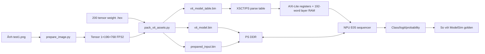
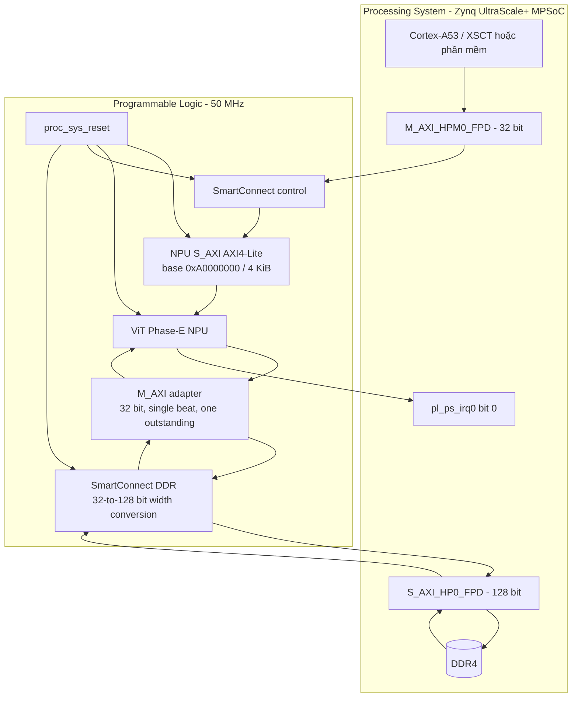
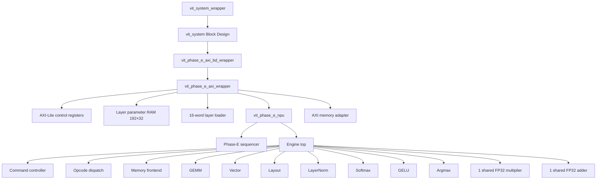
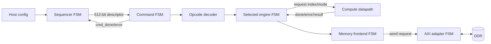
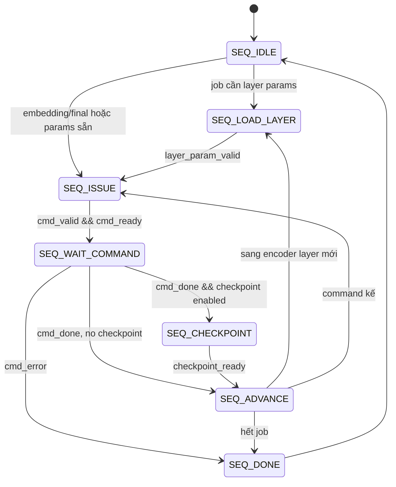
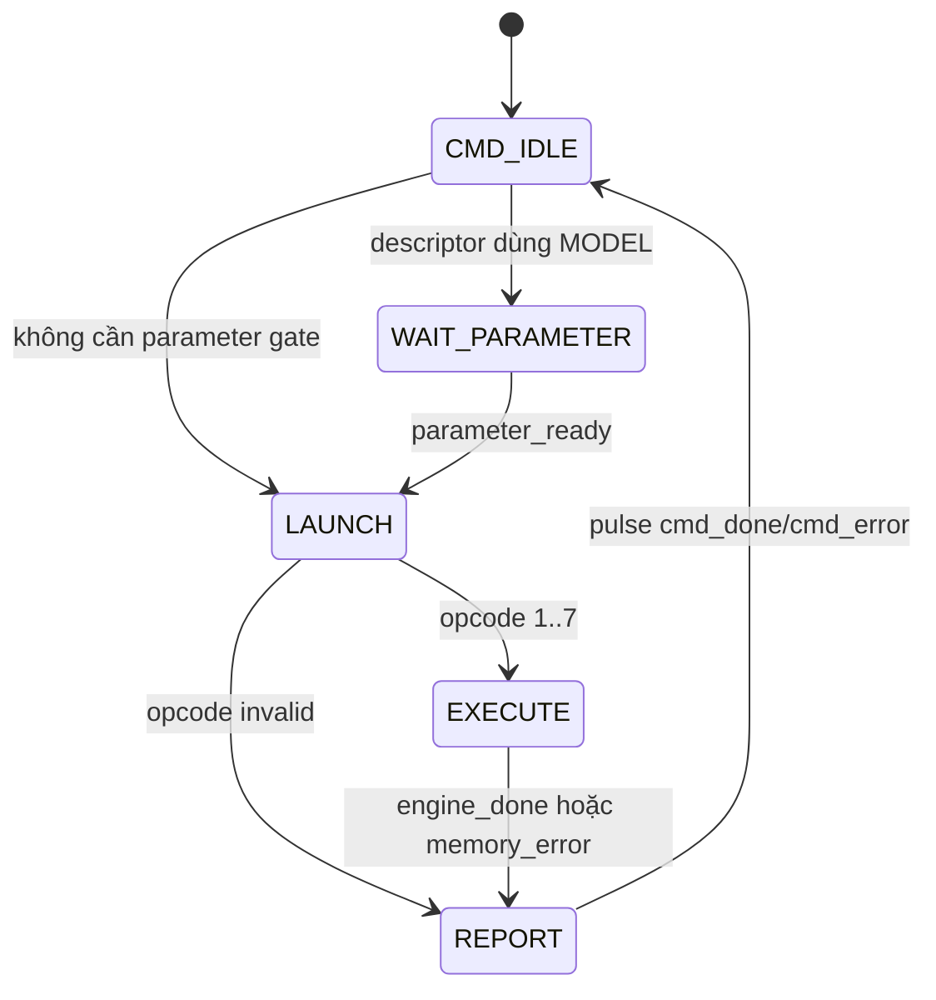
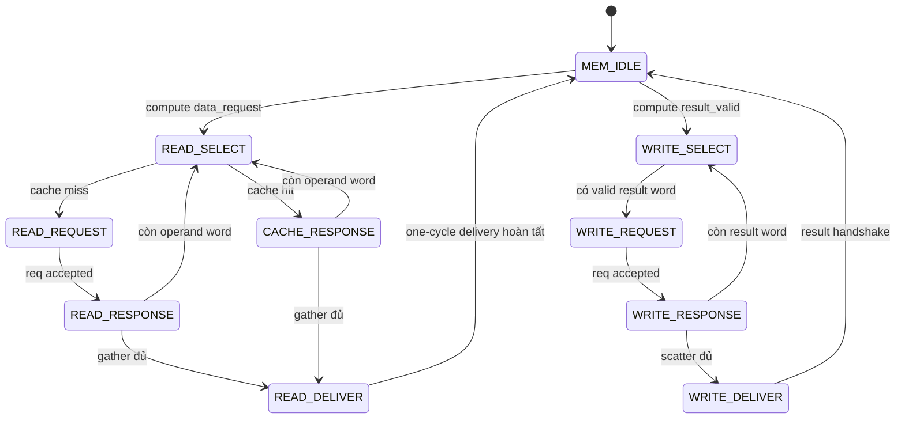
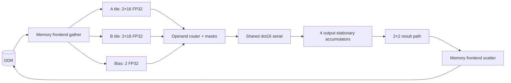
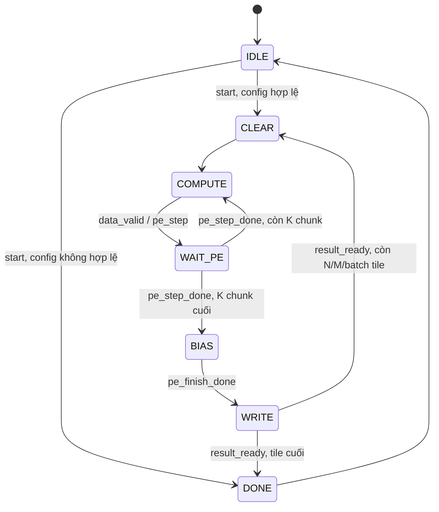

# Báo cáo toàn bộ flow ViT-Base/16-224 từ dữ liệu đến FPGA board

> Ngày lập: 2026-08-03  
> Board: Digilent Genesys ZU-5EV, FPGA marking `xczu5ev-1sfvc784e`  
> Part chuẩn trong Vivado: `xczu5ev-sfvc784-1-e`  
> Tool của baseline cuối: Vivado/Vitis 2022.2  
> Clock PL đã implement: 50 MHz, chu kỳ 20 ns  
> Bitstream đã chạy: `vit_system_wrapper.bit`  
> Phạm vi kết luận: một job cấu hình E05 full-size/12 layer đã tới DONE và khớp top-1 trên một ảnh thật

Cách đọc nhanh:

| Nhu cầu | Mục nên đọc |
|---|---|
| Chỉ cần biết đã PASS gì | 1, 2, 13, 15 |
| Hiểu PS–AXI–PL | 5, 10, 11 |
| Hiểu NPU/controller/FSM | 6, 7, 9 |
| Hiểu PE và đường dữ liệu | 8 |
| Tái tạo model/Vivado/board | 4, 12–15, 19 |
| Đánh giá hiệu năng và hướng đổi RTL/FP16 | 16–18 |

## 1. Kết luận ngắn

Dự án đã đạt hai mốc khác nhau:

1. **FPGA hardware-platform closure: PASS.** Block Design PS–PL–DDR được
   validate trong operator session và elaborated qua full-board synthesis;
   synthesis/route hoàn tất, timing setup/hold đạt ở 50 MHz, DRC/methodology
   không có violation, hierarchy NPU không rỗng, DSP48/DSP58 bằng 0, BIT/XSA
   hợp lệ. IRQ đã nối structural vào PS; software ISR chưa được test.
2. **Một job ViT-Base/Patch16-224 cấu hình E05 full-size trên board: PASS
   trong phạm vi single-image top-1 smoke.** Theo transcript XSCT tương tác,
   job tới DONE, trả class 879; logit/probability nằm trong criterion so sánh
   lấy từ E04, không có error và logit register khớp giá trị trong DDR scratch.
   Vì chưa có command counter/ILA, kết quả không trực tiếp đếm từng command.

Kết quả cuối:

| Hạng mục | Board | Golden | Kết luận |
|---|---:|---:|---|
| `STATUS` | `0x00000015` | IDLE + DONE + IRQ | PASS, không có bit ERROR |
| `IRQ_STATUS` | `0x00000001` | DONE event | PL sticky IRQ asserted; PS ISR chưa test |
| `ERROR_CODE` | `0x00000000` | 0 | PASS |
| `ERROR_INFO` | `0x00000000` | 0 | PASS |
| Class index | `879` (`0x36F`) | `879` | Exact match |
| Max logit | `0x414887B9` = 12.5331354141 | `0x414887B7` = 12.5331335068 | Sai số `1.9073486e-6`, trong E04 criterion |
| Class probability | `0x3F65FFE6` = 0.8984359503 | `0x3F65FFEA` = 0.8984361887 | Sai số `2.3841858e-7`, trong E04 criterion |
| Thời gian inference | **97.225 phút** = 5,833.5 giây | — | Operator-reported, START → poll thấy DONE |

Ở clock danh định 50 MHz, wall time trên tương đương:

```text
5,833.5 s × 50,000,000 clock/s = 291,675,000,000 clock
```

Đây là **291,675,000,000 clock (291.675 tỷ) quy đổi theo wall time**, không
phải số cycle được đọc trực tiếp từ phần cứng. Register map hiện chưa có cycle
counter; thời điểm phát hiện DONE còn phụ thuộc chu kỳ polling của XSCT.

Kết quả này chưa đồng nghĩa sản phẩm đã hoàn thiện. Chưa có bare-metal driver
tự động, BOOT.BIN đúng cho FSBL Genesys, multi-image regression, soak test,
đối chiếu đủ 1.000 logits/probabilities trên board, hay performance counter.

Sau khi board và bộ Xilinx tool được tháo khỏi máy, repository đã được bổ
sung một lớp tái lập offline: evidence tái dựng có checksum, script XSCT
fail-closed, BIF/build recipe cho Genesys, comparator 1.000 phần tử và một
bundle RTL revision có performance counter. Các phần này không thay đổi
bitstream baseline và chưa được dùng để mở rộng kết luận board ở trên.

## 2. Quy ước bằng chứng và source of truth

### 2.1 Frozen board baseline

Baseline tạo ra bitstream đã chạy board là thư mục
[`vivado_server_307/`](../vivado_server_307/), không phải trực tiếp bộ
[`rtl/`](../rtl/) và script Vivado ở root.

Nguồn chuẩn của baseline:

- [`BUNDLE_INFO.json`](../vivado_server_307/BUNDLE_INFO.json): version tool,
  part, board, clock, số file RTL và top.
- [`MANIFEST.sha256`](../vivado_server_307/MANIFEST.sha256): checksum input
  của bundle; kiểm tra hiện tại PASS.
- [`filelists/full_axi.f`](../vivado_server_307/filelists/full_axi.f): closure
  production gồm 65 source theo đúng compile order.
- [`create_vit_system_bd.tcl`](../vivado_server_307/scripts/vivado/create_vit_system_bd.tcl):
  topology PS–AXI–PL, reset, IRQ, address map và clock 50 MHz.

Các sai khác quan trọng giữa root và bundle có ảnh hưởng đến việc tái tạo
board gồm (danh sách này **không exhaustive**):

- Hai wrapper trong root vẫn ghi metadata clock `FREQ_HZ=100000000`; hai bản
  tương ứng trong bundle ghi `50000000`.
- Script Block Design ở root là flow 100 MHz cũ; bản trong bundle đặt 50 MHz,
  sửa polarity reset active-low, khóa số fabric reset/IRQ và bật high DDR
  address.
- `vit_project_common.tcl` trong bundle sửa cách chọn generated
  `vit_system_wrapper.v`; OOC no-DSP script dùng constraint 20 ns và bundle có
  thêm `standalone_axi_50mhz.xdc`.
- Hierarchical-utilization report script và một AXI memory testbench cũng có
  revision khác với root.

Vì vậy không được trộn ngẫu nhiên root RTL/script với frozen bundle khi muốn
tái tạo đúng bitstream này. Báo cáo chỉ ghi nhận sai khác, không sửa source.

### 2.2 Artifact identity

| Artifact | SHA-256 |
|---|---|
| Final BIT | `b00045528da35eeccea1af272857248fc33fc5f2a87d6215496d135f80d0a97c` |
| Final XSA | `42976c53ba1c5b1abac194dc47470c604e115f80e9d7c6e9f8677ea481f29529` |
| Post-route DCP | `922ffb0ca5504a54724a2e7e7176d558301524fbfb290d5620d36e36b4eb3969` |
| Post-synth DCP | `d7eaaa3f9cd800544257b379797341338a36cfdfaa2f5bdaf93890e2bbc7b453` |
| Genesys FSBL ELF | `d1b0653d8c1e782d123b8b599bb288dd4d08fd413d48f28cf7649ecc2d178792` |
| Local PMUFW ELF candidate | `8b7dec2bfbc9716da69e6933ce8c2d67006fa82459b5dace113032bbac73c828` |

BIT trong thư mục run, BIT trong `artifacts/`, và BIT nằm bên trong XSA có
cùng SHA-256. XSA là ZIP hợp lệ, chứa một BIT và ba HWH entry.

PMUFW hash trên thuộc
`build/vitis/vit_local_2022_2_workspace/vit_system_wrapper/zynqmp_pmufw/pmufw.elf`
(bit-identical với bản `export/.../boot/pmufw.elf`). Transcript cuối không còn
đường dẫn/hash của lệnh `dow` PMUFW, nên đây là local expected artifact, chưa
phải runtime identity được chứng minh bằng durable log. FSBL mạnh hơn vì
transcript còn exact đường dẫn `vit_gzu_fsbl.elf` đã download.

### 2.3 Giới hạn provenance hiện tại

Các report full-board hiện có đủ để audit synth/route/timing/DRC/DSP/XSA.
Tuy nhiên thư mục hiện tại không còn `server_logs`, OOC report/DCP, atomic
`RUN_STATUS.txt` và `OUTPUT_SHA256SUMS` của một lần `run_all.sh` hoàn chỉnh.
Do đó:

- Năm XSim smoke và OOC synthesis được ghi là **historical/operator-reported
  PASS**, phù hợp với flow đã chạy trước đó, nhưng không independently
  auditable từ file log hiện còn.
- Full-board synth/route/timing/DRC/DSP/BIT/XSA là **directly auditable PASS**
  từ artifact local hiện tại.
- Kết quả inference cuối là **operator-pasted XSCT excerpts**. Repository nay
  có bộ evidence bền vững tại
  [`evidence/board/2026-08-03/`](../evidence/board/2026-08-03/), nhưng file
  transcript trong đó được ghi rõ là reconstructed, không phải raw/live
  terminal tee. START tuyệt đối là timestamp suy ra; PMUFW runtime identity
  cũng chưa được transcript gốc xác nhận.

## 3. Toàn bộ flow end-to-end



Theo thời gian, flow đã đi qua các mốc:

1. Chuẩn bị ảnh, processor và 200 parameter tensor.
2. Chạy behavioral full model để tạo golden.
3. Xây production synthesizable RTL, internal ISA, AXI wrapper và regression.
4. Chạy compact production E05, E01/E04 model-real và các probe E02/E03.
5. Đóng gói frozen Vivado bundle.
6. Tạo/validate `vit_system.bd` trong operator session; full-board synth và
   implementation 50 MHz.
7. Sinh BIT; sửa bước export để tạo XSA chứa BIT.
8. Program PL qua JTAG.
9. Tạo Vitis platform; phát hiện FSBL mặc định không init được DDR Genesys.
10. Build lại FSBL bằng Digilent `genesys-zu-22.1`.
11. Init PMU/PS/DDR, kiểm DDR và IP ID.
12. Nạp model, input và model table vào DDR; zero scratch.
13. Lập trình base/size, 8 global parameter, 192 layer parameter và E05 job.
14. Phát START, chờ DONE 97.225 phút, đọc và so kết quả.

## 4. Dữ liệu vào và model package

### 4.1 Ảnh đã chạy

Ảnh nguồn là [`inputs/test1.png`](../inputs/test1.png). File có đuôi `.png`
nhưng nội dung thực là RIFF/WebP; decoder vẫn đọc đúng ảnh 500×359. Nội dung
là một chiếc ô, phù hợp với class 879 trả về.

[`preprocessing/prepare_image.py`](../preprocessing/prepare_image.py) thực hiện:

1. decode và chuyển RGB;
2. resize/normalize theo processor đã khóa;
3. tạo tensor `[1,3,224,224]`;
4. patchify `16×16`, stride 16;
5. đổi layout thành `[1,196,768]`;
6. ghi raw IEEE-754 binary32.

Thứ tự dữ liệu trong input:

```text
patch_y → patch_x → channel → kernel_y → kernel_x
```

NPU không nhận ảnh raster RGB nguyên bản. NPU nhận 196 patch, mỗi patch 768
FP32 word; patch embedding vẫn được tính trong PL.

### 4.2 Package v1

| File | Nội dung | Kích thước | CRC32 | SHA-256 |
|---|---|---:|---|---|
| `vit_model.bin` | 200 tensor model, có padding | 346.270.656 B | `E79BE4BE` | `b573df09083b643150b2bdda990aec9f79ea8e51ded41980422f1534ffc8800e` |
| `vit_model_table.bin` | Header + 200 entry | 12.928 B | `F16E1311` | `6af25a98b2dfca525f8320bdd422cae31f3441dd407fa6cd507f02ef344b6380` |
| `prepared_input.bin` | `[1,196,768]` FP32 | 602.112 B | `A22E4176` | `3e13bd9bf60b07eb967a0c67aff1087954a316a403f70d220a6713cf8999ec54` |

[`verification_report.json`](../build/model_package/v1/verification_report.json)
ghi 17 check PASS, 0 failed, đúng 200 parameter và không có mismatch.

Lưu ý reproducibility: `preprocessing/requirements.txt` hiện chỉ liệt kê tên
package, chưa pin version. Environment đã tạo artifact này được quan sát tại
thời điểm viết báo cáo là Python 3.12.3, NumPy 2.5.1, Pillow 12.3.0, Torch
2.13.0, Transformers 5.14.1 và Torchvision 0.28.0. Các hash frozen ở bảng
trên là chuẩn kiểm tra bit-exact; cần tạo lockfile/container trước khi tuyên
bố có thể tái sinh bit-exact trên máy mới.

Input có 150.528 word:

```text
first word = 0x3EDEDEDF
last word  = 0x3F800000
```

Runtime contract nằm tại
[`vit_runtime_config.json`](../build/model_package/v1/vit_runtime_config.json):

- model: 86.567.664 word, `0x0528EAF0`;
- input: 150.528 word, `0x00024C00`;
- scratch: 1.990.656 word, `0x001E6000`;
- 8 global parameter offset;
- 12 layer × 16 offset = 192 layer parameter;
- E05 job `0x00001D85`;
- expected 249 command/checkpoint, trong đó 101 command dùng parameter.

## 5. Kiến trúc PS + AXI + PL đã implement



Vai trò từng đường:

- **Control plane:** A53 dùng `M_AXI_HPM0_FPD` ghi/đọc AXI4-Lite register của
  NPU.
- **Data plane:** NPU dùng master `M_AXI` đi qua SmartConnect vào
  `S_AXI_HP0_FPD` để đọc MODEL/INPUT và đọc-ghi SCRATCH trong DDR.
- **Interrupt:** done/error sticky đi qua `pl_ps_irq0[0]`; lần chạy đã thấy PL
  sticky IRQ asserted nhưng chưa chạy ISR/GIC test ở A53.
- **Clock/reset:** toàn bộ AXI và compute PL dùng `pl_clk0` 50 MHz; reset được
  đồng bộ qua `proc_sys_reset`.

AXI chỉ vận chuyển transaction. AXI không biết GEMM, layer hay filename.
Sequencer/controller tạo logical address; AXI adapter duy nhất đổi word offset
thành physical byte address.

```text
physical_byte_address = region_base + (word_offset << 2)
```

### 5.1 50 MHz không phải Fmax đã đo

50 MHz là clock đã cấu hình, constrain và close timing. Chưa có frequency
sweep để tìm tần số lỗi đầu tiên, nên gọi chính xác là **implemented operating
clock**, không phải measured maximum Fmax. WNS dương cho thấy còn slack ở
constraint 20 ns, nhưng không đủ để tuyên bố một Fmax cao hơn.

## 6. Cây kiến trúc NPU production



Trách nhiệm:

- `vit_phase_e_axi_wrapper`: ABI host, snapshot config khi START, sticky
  status/IRQ, layer RAM, nối NPU và AXI adapter.
- `vit_phase_e_sequencer`: biến E01–E05 job thành chuỗi descriptor 512 bit.
- `vit_phase_e_command_controller`: giữ một descriptor và quản lý vòng đời
  load parameter → launch → execute → report.
- `vit_phase_e_engine_dispatch`: decoder/mux tổ hợp theo opcode; không có FSM.
- `vit_phase_e_memory_frontend`: gather operand, cache nhỏ, giao compute và
  scatter kết quả.
- Compute engine: thực hiện GEMM, vector add/scale, layout, LayerNorm,
  Softmax, GELU và Argmax.
- `vit_phase_e_axi_mem_adapter`: range/alignment/access check và transaction
  AXI4 đến DDR.

Production engine dùng chung đúng một FP32 multiplier và một FP32 adder giữa
nhiều compute engine. Đây là lựa chọn area-first/DSP=0, đổi lại latency rất
lớn.

## 7. Controller, datapath và câu hỏi “controller có phải chỉ là FSM?”

Controller thường **được triển khai bằng FSM**, nhưng controller không đồng
nghĩa với đúng một FSM. Trong thiết kế này, control path còn gồm:

- state registers;
- layer/step/tag/tile/lane counters;
- descriptor register và config snapshot;
- opcode decoder/dispatch;
- handshake `valid/ready` và backpressure;
- sticky status/error/IRQ;
- address/range validator;
- arbitration cho arithmetic dùng chung.

Datapath là phần giữ và biến đổi dữ liệu:

- DDR path, operand buffer/cache và tensor router;
- FP32 multiplier/adder/comparator/reciprocal helpers;
- accumulator bank;
- các register trung gian của LayerNorm/Softmax/GELU;
- result path và scratch write data.

Ranh giới controller–datapath:



### 7.1 Moore, Mealy hay mixed?

- **Moore:** output control phụ thuộc state/register đã chốt.
- **Mealy:** output control phụ thuộc cả state và input hiện tại.
- **Mixed:** phần lớn output theo state, nhưng một số handshake/qualifier
  dùng input hiện tại.

Thiết kế tổng thể là **hybrid, nghiêng Moore**. Không nên gắn một nhãn duy
nhất cho toàn NPU.

| Khối | State chính | Phân loại thực dụng |
|---|---|---|
| Model sequencer | `IDLE, LOAD_LAYER, ISSUE, WAIT_COMMAND, CHECKPOINT, ADVANCE, DONE` | Moore |
| Command controller | `IDLE, WAIT_PARAMETER, LAUNCH, EXECUTE, REPORT` | Mixed, Moore-dominant |
| Layer loader | `LOAD_IDLE, LOAD_RUN, LOAD_RESPONSE, LOAD_WAIT_RELEASE` | Moore |
| Memory frontend | 10 state read/cache/write/deliver | Mixed |
| AXI memory adapter | `IDLE, READ_ADDRESS, READ_DATA, WRITE_ISSUE, WRITE_RESPONSE, LOCAL_RESPONSE` | Moore-style protocol FSM |
| GEMM controller | `IDLE, CLEAR, COMPUTE, WAIT_PE, BIAS, WRITE, DONE` | Mixed |
| PE scheduler | `IDLE, START_DOT, WAIT_DOT` | Mixed |
| Serial dot16 | `IDLE, MULTIPLY, REDUCE_1/2/3/ROOT, DONE` | Moore |
| Accumulator bank | `IDLE, BIAS, HOLD` | Mixed |
| Vector | `IDLE, LOAD, MULTIPLY, ADD, WRITE, DONE` | Moore |
| Layout | `IDLE, VALIDATE, REQUEST, WRITE, DONE` | Mixed |
| LayerNorm | 27 state theo pass/stage | Moore-dominant |
| Softmax | 24 state theo 3 pass | Moore-dominant |
| GELU wrapper/core | 6 state / 26 state | Moore-dominant |
| Argmax | `IDLE, SCAN, RESULT, DONE` | Moore |

AXI-Lite register bank không dùng một enum FSM duy nhất. Nó giữ các flag
`awaddr_hold_valid`, `wdata_hold_valid`, `s_axi_bvalid`, `s_axi_rvalid` để
cho phép AW và W đến độc lập đúng chuẩn AXI4-Lite.

### 7.2 FSM cấp cao





Tên `WAIT_PARAMETER`/`operand_load_request` có thể gây hiểu nhầm: nó **không
có nghĩa A53 phải stream weight vào PL trong lúc mỗi command chạy**. Ở wrapper
production, `operand_load_ready` được nối hằng `1`; weight đã được nạp trước
vào vùng MODEL trong DDR và memory frontend tự đọc qua cổng AXI master. Gate
này hiện chỉ giữ đúng lifecycle/handshake nội bộ của command controller.



## 8. Kiến trúc PE và cách dữ liệu vào/ra

### 8.1 “Systolic array hiện tại là bao nhiêu?”

Các parameter production là:

```text
ARRAY_ROWS = 2
ARRAY_COLS = 2
PE_LANES   = 16
```

Nhưng cách gọi “systolic array 2×2” dễ gây hiểu nhầm. Production hiện tại
**không phải một mesh bốn MAC PE vật lý chạy song song và chuyền dữ liệu
PE-to-PE theo mỗi clock**. Nó là:

- logical output tile 2×2;
- bốn accumulator output-stationary;
- một dot16 serial dùng chung cho cả bốn tọa độ;
- một multiplier FP32 và một adder FP32 dùng chung ở cấp engine;
- scheduler quét `(r0,c0) → (r0,c1) → (r1,c0) → (r1,c1)`.

Tên chính xác hơn là **time-multiplexed logical 2×2 output-stationary PE
array**.

### 8.2 Dữ liệu được đưa vào PE

Với một GEMM tile và từng K-chunk:

1. Memory frontend gather tối đa 2 hàng A × 16 lane = 32 FP32 word.
2. Gather tối đa 2 cột B × 16 lane = 32 FP32 word.
3. Bias candidate được gather ở K-chunk cuối nếu bật bias; A-panel và bias có
   cache nhỏ.
4. Operand router tạo `lane_valid`, `token_valid`, `output_valid` để che tail
   khi M/N/K không chia hết.
5. PE array latch operand của **mỗi K-chunk** rồi quét một hàng A và một cột B
   cho dot16; accumulator mới là phần được giữ xuyên suốt các K-chunk.



### 8.3 Tính toán trong PE

FSM GEMM điều phối vòng lặp batch/M/N/K như sau:



Các output `data_request`, `result_valid`, `pe_clear`, `pe_finish` chủ yếu
được giải mã theo state; riêng `pe_step = COMPUTE && data_valid` phụ thuộc cả
input hiện tại. Đây là lý do GEMM controller được phân loại **mixed**, không
phải Moore thuần.

Mỗi dot 16 phần tử:

1. 16 phép nhân được replay tuần tự qua một multiplier.
2. 16 product được giảm theo cây cân bằng `8 → 4 → 2 → 1`, nhưng các phép
   cộng cũng replay qua một adder dùng chung.
3. Partial sum được cộng vào accumulator tương ứng.
4. Lặp theo các K chunk 16 lane.
5. Sau K chunk cuối, bias được cộng tuần tự.

Partial sum của C ở lại accumulator qua các K chunk, nên dataflow logic là
**output-stationary**. A-row và B-column được reuse trong tile, nhưng reuse
không biến thành bốn dot song song vì arithmetic đã time-multiplex.

### 8.4 Kết quả được lấy ra

Khi một tile hoàn tất, result path phát:

- `result_token_base`, `result_output_base`, `result_batch_index`;
- mask hàng/cột hợp lệ;
- tối đa bốn FP32 result word.

Memory frontend dùng write router tạo logical SCRATCH address, phát từng
single-beat AXI write và chỉ báo `result_ready` sau response cuối. Không có
output stream trực tiếp ra pin; kết quả cuối nằm trong DDR scratch và hai
register `CLASS_INDEX/CLASS_LOGIT`.

## 9. ViT dataflow và internal ISA

### 9.1 Kích thước model

| Thuộc tính | Giá trị |
|---|---:|
| Input image | 224×224 RGB |
| Patch | 16×16 |
| Patch count | 196 |
| Token count gồm CLS | 197 |
| Hidden size | 768 |
| Attention head | 12 |
| Head size | 64 |
| MLP intermediate | 3.072 |
| Encoder layer | 12 |
| Class | 1.000 |
| Arithmetic | custom FP32 RTL, DSP=0 |

### 9.2 Phase E01–E05

| Phase | Ý nghĩa |
|---|---|
| E01 | Patch embedding + CLS + position |
| E02 | Encoder layer 0 |
| E03 | Encoder range do `first_layer..last_layer` chọn |
| E04 | Final LayerNorm + CLS select + classifier + Argmax + optional Softmax |
| E05 | E01 + đủ 12 encoder layer + E04 |

Job đã chạy là E05:

```text
JOB_CONFIG = 0x00001D85
phase = 5
first_layer = 0
last_layer = 11
class_softmax_enable = 1
checkpoint_enable = 1
job_tag = 0
patch_a_base = 0
```

Trong E05, sequencer luôn chạy layer `0..E05_ENCODER_LAYERS-1` (production
default là 12 layer). Field `first_layer/last_layer` chỉ điều khiển phase E03;
giá trị `0..11` được readback ở trên không phải lý do E05 chạy đủ 12 layer.

Số command kỳ vọng:

```text
embedding       4
encoder         12 × 20 = 240
final + softmax 5
total           249
```

Board chưa có command counter expose qua register, vì vậy 249 là số lệnh do
ISA/sequencer quy định cho config này, không phải counter đã đọc từ board.

### 9.3 ISA ở đây nghĩa là gì?

Có hai contract khác nhau:

1. **Host ABI:** AXI-Lite register map + model-package layout mà A53/XSCT sử
   dụng.
2. **Internal command ISA:** descriptor 512 bit do sequencer tự tạo và gửi
   cho engine. PS không ghi từng descriptor vào FIFO.

Opcode internal:

| Value | Opcode | Chức năng |
|---:|---|---|
| 0 | NOP | Định nghĩa trong package, không được command controller execute |
| 1 | GEMM | Batched matrix multiply + optional bias |
| 2 | VECTOR | Add hoặc scale/mask |
| 3 | LAYOUT | Copy/reorder rank-3 |
| 4 | LAYERNORM | Layer normalization |
| 5 | SOFTMAX | Row-wise softmax |
| 6 | GELU | GELU activation |
| 7 | ARGMAX | Top-1 class |
| 8 | END | Được định nghĩa/reserved nhưng production sequencer không phát; command controller sẽ reject |

Subop:

| Value | Subop |
|---:|---|
| 0 | NONE |
| 1 | VECTOR_ADD |
| 2 | VECTOR_SCALE_MASK |
| 3 | LAYOUT_COPY |

Memory space:

| Value | Space | Quyền của NPU |
|---:|---|---|
| 0 | NONE | Không truy cập |
| 1 | SCRATCH | Read/write |
| 2 | PARAM/MODEL | Read-only |
| 3 | INPUT | Read-only |

Flags:

| Bit | Flag |
|---:|---|
| 0 | bias enable |
| 1 | mask enable |
| 2 | in-place |
| 3 | checkpoint |
| 4 | GEMM cache-safe |

### 9.4 Descriptor 16 word

| Word | Nội dung |
|---:|---|
| W0 | `[3:0] opcode`, `[7:4] subop`, `[15:8] flags`, `[23:16] tag`, `[31:24] reserved/context` |
| W1 | 4 tensor ID + 4 memory space + `[31:24]` reserved/context |
| W2 | `src0_base` word offset |
| W3 | `src1_base` word offset |
| W4 | `src2_base` word offset |
| W5 | `dst_base` word offset |
| W6..W9 | `dim0..dim3` |
| W10..W14 | `stride0..stride4` |
| W15 | immediate hoặc C-row-stride |

Hai field mang tên `reserved` hiện được sequencer dùng để chèn execution
context (`section/current_layer` và `current_step`); chúng không tham gia
address/arithmetic và không được giả định luôn bằng 0. Tensor ID cũng là
metadata; memory space và base/stride mới quyết định truy cập thực tế.

Ý nghĩa theo opcode:

- GEMM: `dim0=batch`, `dim1=M`, `dim2=K`, `dim3=N`; W10–W14 là A/B/C
  stride; W15 là C row stride.
- VECTOR: `dim0=length`, W15 là scalar.
- LAYOUT: `dim0..2`, source stride ở W10..W12.
- LAYERNORM: `dim0=token_count`, `dim1=hidden_size`, W15 là epsilon.
- SOFTMAX: `dim0=row_count`, `dim1=row_length`.
- GELU/ARGMAX: `dim0=flat_length`.

### 9.5 Hai mươi bước của mỗi encoder layer

```text
LN1
Q GEMM → Q split
K GEMM → K split
V GEMM → V split
K transpose
Q × K^T
scale (ISA hỗ trợ mask, nhưng E05 hiện không bật additive/causal mask)
Softmax
probability × V
head merge
output projection
attention residual add
LN2
FC1
GELU
FC2
MLP residual add
```

Model dùng GELU, không dùng ReLU.

## 10. Register map phía host

Địa chỉ vật lý là `0xA0000000 + offset`.

| Offset | Register | Access/ý nghĩa |
|---:|---|---|
| `0x000` | IP_ID | RO, `0x5649544E` = `VITN` |
| `0x004` | IP_VERSION | RO, `0x00010000` |
| `0x008` | CONTROL | WO pulse: START/reset/abort/clear-error |
| `0x00C` | STATUS | RO |
| `0x010` | IRQ_ENABLE | RW |
| `0x014` | IRQ_STATUS | RW1C |
| `0x018` | ERROR_CODE | RO |
| `0x01C` | ERROR_INFO | RO |
| `0x020/024` | MODEL_BASE LO/HI | RW |
| `0x028/02C` | INPUT_BASE LO/HI | RW |
| `0x030/034` | SCRATCH_BASE LO/HI | RW |
| `0x038` | MODEL_WORDS | RW |
| `0x03C` | INPUT_WORDS | RW |
| `0x040` | SCRATCH_WORDS | RW |
| `0x044` | EXECUTION_MODE | RW/readback; hiện chưa đổi datapath |
| `0x080..09C` | GLOBAL_PARAM[0..7] | RW |
| `0x0A0` | JOB_CONFIG | RW |
| `0x0A4` | JOB_PATCH_A_BASE | RW |
| `0x180` | CLASS_INDEX | RO |
| `0x184` | CLASS_LOGIT | RO |
| `0x400..6FC` | LAYER_PARAM[12][16] | RW khi IDLE |

CONTROL bit:

- bit 0 START;
- bit 1 SOFT_RESET, chỉ hợp lệ khi idle;
- bit 2 ABORT, hiện trả explicit unsupported error;
- bit 3 CLEAR_ERROR.

STATUS bit:

- bit 0 IDLE;
- bit 1 BUSY;
- bit 2 DONE sticky;
- bit 3 ERROR sticky;
- bit 4 IRQ output;
- bit 5 operand-load wait.

`IRQ_STATUS` là RW1C: ghi 1 để clear bit tương ứng. Event mới thắng một clear
cùng clock nên không làm mất interrupt.

`IRQ_ENABLE/IRQ_STATUS` dùng bit 0 cho DONE và bit 1 cho ERROR. NPU error code:
`0` none, `1` bad phase, `2` bad layer, `3` command error. Wrapper còn có
`0x80000001` cho START bị từ chối khi busy và `0x80000002` cho ABORT chưa hỗ
trợ. Với lỗi sequencer, `ERROR_INFO` đóng gói section `[12:11]`, layer
`[10:7]` và step `[6:2]`.

## 11. DDR map của lần chạy board

| Vùng | Base | Size | End inclusive |
|---|---:|---:|---:|
| MODEL | `0x10000000` | `0x14A3ABC0` B | `0x24A3ABBF` |
| INPUT | `0x24B00000` | `0x00093000` B | `0x24B92FFF` |
| Model-table staging | `0x25000000` | `0x00003280` B | `0x2500327F` |
| SCRATCH | `0x27000000` | `0x00798000` B | `0x27797FFF` |
| CONTROL | `0xA0000000` | `0x00001000` B | `0xA0000FFF` |

MODEL, INPUT, model-table staging và SCRATCH không overlap, đều nằm trong DDR
low dưới 2 GiB. CONTROL tại `0xA0000000` là PL AXI-Lite MMIO aperture, không
phải vùng DDR.

Model table staging không phải memory space thứ tư của RTL. XSCT/host đọc
table tại `0x25000000`, lấy offset rồi ghi 192 word vào layer RAM qua
AXI-Lite. RTL NPU chỉ có MODEL, INPUT và SCRATCH space.

Trong quá trình bring-up, input từng được nạp thử thêm tại `0x26000000`; bản
canonical cuối dùng `INPUT_BASE=0x24B00000`. Một zero-word test sớm tại
`0x24C00000` không phải scratch allocation cuối. Không dùng các địa chỉ thử
này làm runtime map.

### 11.1 Cấu hình thực tế

```text
MODEL_BASE_LO    0x10000000
MODEL_BASE_HI    0x00000000
INPUT_BASE_LO    0x24B00000
INPUT_BASE_HI    0x00000000
SCRATCH_BASE_LO  0x27000000
SCRATCH_BASE_HI  0x00000000
MODEL_WORDS      0x0528EAF0
INPUT_WORDS      0x00024C00
SCRATCH_WORDS    0x001E6000
EXECUTION_MODE   0x00000000
```

Tám global parameter offset:

```text
0x00000000  patch_weight
0x00090000  patch_bias
0x00090300  cls_token
0x00090600  position
0x000B5500  final_ln_gamma
0x000B5800  final_ln_beta
0x000B5B00  classifier_weight
0x00171300  classifier_bias
```

192 layer word đã được program từ model table và readback với:

```text
Layer table verification: mismatches=0
```

### 11.2 Scratch map

Các base dưới đây là FP32 word offset tương đối với `SCRATCH_BASE`:

| Tensor | Base word | Word count |
|---|---:|---:|
| HIDDEN_A | `0x000000` | 151.296 |
| HIDDEN_B | `0x025000` | 151.296 |
| LINEAR_TMP | `0x04A000` | 151.296 |
| Q_HEAD | `0x06F000` | 151.296 |
| K_HEAD | `0x094000` | 151.296 |
| V_HEAD | `0x0B9000` | 151.296 |
| SCORE_PROB | `0x0DE000` | 465.708 |
| FC1 | `0x150000` | 605.184 |
| LOGITS | `0x1E4000` | 1.000 |
| CLASS_PROB | `0x1E5000` | 1.000 |

Với class 879:

```text
logit address      = 0x27000000 + (0x1E4000 << 2) + 879*4
                   = 0x27790DBC
probability address= 0x27000000 + (0x1E5000 << 2) + 879*4
                   = 0x27794DBC
```

## 12. Bằng chứng simulation trước board

### 12.1 Behavioral golden

Behavioral full model đã chạy đủ model/input thật và tạo
[`results/prediction.txt`](../results/prediction.txt):

```text
class_index=879
max_logit=12.533133507
confidence=0.898436189
```

Behavioral engine là golden, không thuộc production synthesis closure.
Behavioral PASS không tự chứng minh production RTL.

### 12.2 Production RTL evidence

Manifest audit:
[`vit_rtl_evidence_manifest.md`](../build/evidence/vit_rtl_evidence_manifest.md).

| Test | Kết quả | Ý nghĩa |
|---|---|---|
| Full regression A4 | 27 RUN, 98 PASS marker | Regression tổng hợp source identity cuối |
| Compact E05 logical | 704.045 cycle, 249 command | Đủ sequencer và 7 compute block ở shape nhỏ |
| Compact E05 AXI | 725.741 cycle, 249 command | Qua production AXI wrapper + DDR model |
| E01 real AXI | 658.889.397 cycle, 4 command | Đủ 151.296 embedding word, tolerance PASS |
| E04 real AXI | 16.401.733 cycle, 5 command | Class 879, logit `0x414887B9`, tolerance PASS |
| E02 layer 0 | Authoritative 100k-cycle probe | Protocol/address/traffic prefix PASS; không comparator cuối |
| E03 layer 1 | Authoritative 100k-cycle probe | Protocol/address prefix PASS; không comparator cuối |
| E02 full cũ | 7.636.573.461 cycle | Numerical PASS nhưng thiếu final receipt, supplemental |

Trước board, khoảng trống lớn nhất là chưa có một production full-size E05
liên tục. Lần board hiện tại cho thấy job cấu hình full-size E05 đã tới DONE
và khớp single-image top-1; không có counter để chứng minh trực tiếp từng
command, và test chưa thay thế full intermediate tensor comparison.

### 12.3 XSim mô phỏng được gì?

XSim có sẵn trong Vivado 2022.2 và đã được dùng cho AXI/memory/engine smoke.
Production compact E05 giữ đúng NPU wrapper, AXI-Lite và M_AXI protocol nhưng
thay PS/DDR thật bằng BFM/model.

XSim không hoàn toàn giống board:

- không chạy đúng electrical DDR4 và Digilent FSBL;
- không thay thế post-route timing;
- PS có thể được mô hình hóa bằng VIP/BFM, không phải A53 thực;
- full-real E05 có thể mô phỏng về nguyên tắc nhưng cực chậm với scalar RTL.

Do đó simulation và board test bổ sung cho nhau, không thay thế nhau.

## 13. Vivado implementation 2022.2

Generated project snapshot cuối (tiện để mở lại, nhưng không thay thế frozen
bundle/script source-of-truth):

[`ViT_googlebase.xpr`](../vivado_server_307/VIT_googlebase_rtl/ViT_googlebase/ViT_googlebase.xpr)

Top:

```text
OOC top   = vit_phase_e_axi_bd_wrapper
Board top = vit_system_wrapper
```

### 13.1 Post-route sign-off

| Metric | Kết quả |
|---|---:|
| Clock period | 20 ns |
| Operating clock | 50 MHz |
| Setup WNS | `+0.227 ns` |
| Setup TNS | `0 ns` |
| Hold WHS | `+0.011 ns` |
| Hold THS | `0 ns` |
| Fully routed nets | 36.798 / 36.798 |
| Routing errors | 0 |
| DRC violations | 0 |
| Methodology violations | 0 |
| Black boxes | 0 |
| No-clock endpoints | 0 |
| Unconstrained internal endpoints | 0 |
| DSP48/DSP58 | 0 |

Timing report ghi all timing constraints met. Worst setup path có requirement
20 ns và data path delay khoảng 19,337 ns.

### 13.2 Utilization

| Resource | Used | Available | Utilization |
|---|---:|---:|---:|
| CLB LUT | 24.722 | 117.120 | 21,11% |
| LUT as logic | 24.331 | 117.120 | 20,77% |
| LUT as memory | 391 | 57.600 | 0,68% |
| CLB registers | 21.495 | 234.240 | 9,18% |
| CARRY8 | 937 | 14.640 | 6,40% |
| BRAM tile | 13 | 144 | 9,03% |
| URAM | 0 | 64 | 0% |
| DSP | 0 | 1.248 | 0% |

Hierarchy NPU riêng dùng khoảng 20.983 LUT, 16.833 FF, 12 BRAM và 0 DSP;
do đó hierarchy là non-vacuous.

### 13.3 Warning phải ghi trung thực

Không được viết “0 warning/0 critical warning toàn flow”. Log có:

- hai **loại** Critical Warning (`foreach` và `unset` không được hỗ trợ), xuất
  hiện trong cả synth và implementation do
  [`no_dsp.xdc`](../vivado_server_307/scripts/vivado/no_dsp.xdc);
- một vectorless power warning;
- một số warning về port generated IP không dùng.

Kết quả post-synth và post-route vẫn đo trực tiếp DSP primitive bằng 0, nên
no-DSP result là PASS. Tuy nhiên constraint script nên được sửa ở revision
tương lai rồi rerun; báo cáo hiện tại không che giấu warning đó.

### 13.4 BIT và XSA

`write_bitstream` hoàn tất thành công. Lần export XSA đầu tiên báo không lấy
được BIT từ implementation run dù BIT đã tồn tại. Flow export hiện tại sau đó
tạo được XSA hợp lệ; report nội dung:

```text
bit_entries 1
  vit_system_wrapper.bit
hwh_entries 3
  vit_system_smartconnect_control_0.hwh
  vit_system.hwh
  vit_system_smartconnect_ddr_0.hwh
```

XSA không phải file để “nạp trực tiếp vào FPGA”. BIT program PL; XSA mô tả
hardware cho Vitis và chứa BIT/HWH để tạo platform/software artifacts.

## 14. Vitis, FSBL và bring-up DDR

### 14.1 Program PL

BIT canonical đã dùng (bit-identical với bản trong `.runs`):

[`vit_system_wrapper.bit`](../vivado_server_307/VIT_googlebase_rtl/artifacts/vit_system_wrapper.bit)

Vivado Hardware Manager báo:

```text
Device xczu5 is programmed with a design that has no supported debug core(s)
```

Đây không phải lỗi. Thiết kế không instantiate ILA/VIO; điều khiển qua
PS/AXI-Lite và XSCT.

Không có SW/button board nào được nối vào NPU top. Không cần bấm `BTNU/L/R/C/D`
hay `SW[3:0]` để chạy inference. `PROG` hoặc reset có thể làm mất program/state
và không được bấm trong lúc inference.

### 14.2 Vì sao FSBL mặc định không chạy DDR?

FSBL Vitis mặc định download và chạy đến `XFsbl_Loop`, nhưng DDR access bị
blocked. Các giá trị chẩn đoán ban đầu:

```text
FFD80060 = 3FFFFFFF
FFD80044 = 00000001
FD070004 = 00000000
DDR controller is not initialized
```

PC đứng ở `XFsbl_Loop` tự nó không chứng minh fail; FSBL bình thường cũng vào
exit loop. Bằng chứng fail là DDR register và memory access.

Genesys ZU dùng dynamic DDR configuration riêng. BSP đã define
`XPS_BOARD_GZU_5EV`, nhưng stock FSBL source không chứa đầy đủ nhánh Digilent.
Giải pháp đúng là dùng:

- repository [`digilent_embeddedsw_genesys_zu_22_1`](../third_party/digilent_embeddedsw_genesys_zu_22_1/);
- branch `genesys-zu-22.1`;
- commit `b218adf07bb98e57d8941b16cbe0eb3dadd0b1b2`;
- cùng XSA cuối;
- output `vit_gzu_fsbl.elf`.

### 14.3 DDR PASS với Genesys FSBL

Theo transcript tương tác, sau flow
`PMUFW → BIT → vit_gzu_fsbl.elf`, giá trị là:

```text
FFD80060 = 00000000
FFD80044 = 00000003
FD070004 = 00000001

write/read 0x01000000 = 0x11111111
write/read 0x01004000 = 0x22222222
```

DDR đã init và read/write PASS. Sau đó PL register aperture đọc được:

```text
0xA0000000 = 0x5649544E
0xA0000004 = 0x00010000
```

### 14.4 Lưu ý về XSCT

Lần test dùng JTAG `dow -data` và `mrd/mwr -force`. Đây là phương pháp
bring-up, không phải runtime sản phẩm:

- nạp 330 MiB model qua JTAG mất khoảng 28 phút;
- `force-mem-accesses` là công cụ debug;
- không có cache-coherency API, timeout/watchdog và autonomous boot;
- target index có thể thay đổi giữa mỗi lần connect.

Project `vit_gzu_fsbl` đã có ELF đúng, nhưng chưa có BOOT.BIN hoàn chỉnh tương
ứng cho flow autonomous. BOOT.BIN hiện thấy trong `vit_dynamic_fsbl_system`
thuộc FSBL mặc định và không được dùng làm bằng chứng Genesys DDR PASS.
Recipe hash-gated mới nằm tại [`tools/board/`](../tools/board/); do máy hiện
không còn `bootgen`, binary Genesys mới vẫn chưa được tạo hoặc board-validate.

## 15. Trình tự inference board đã thực hiện

Phần này được tái dựng từ các đoạn XSCT operator đã paste trong phiên
bring-up. Bản lưu bền vững và metadata mức bằng chứng nằm tại
[`XSCT_FINAL_RECONSTRUCTED.log`](../evidence/board/2026-08-03/XSCT_FINAL_RECONSTRUCTED.log)
và
[`BOARD_RUN_METADATA.json`](../evidence/board/2026-08-03/BOARD_RUN_METADATA.json).
Không được gọi bản này là raw/live transcript.

1. Kết nối JTAG/reset và chạy PMUFW.
2. Program final BIT.
3. Download/chạy Genesys `vit_gzu_fsbl.elf`.
4. Kiểm DDR read/write.
5. Kiểm `IP_ID/IP_VERSION`.
6. Nạp `vit_model.bin` tại `0x10000000`.
7. Nạp `prepared_input.bin` tại `0x24B00000`.
8. Nạp `vit_model_table.bin` tại `0x25000000`.
9. Kiểm model first word `0x3C0096DB` và padding zero.
10. Kiểm input first/last word `0x3EDEDEDF/0x3F800000`.
11. Zero toàn bộ scratch `0x27000000..0x27797FFF`.
12. Ghi và readback base/size register.
13. Ghi 8 global offsets.
14. Parse 192 layer offset từ table, ghi vào `0xA0000400..0xA00006FC`.
15. Readback 192 word; `mismatches=0`.
16. Clear IRQ cũ, enable DONE/ERROR IRQ.
17. Ghi `JOB_CONFIG=0x00001D85`, `PATCH_A_BASE=0`.
18. Ghi CONTROL.START.
19. Poll status đến `INFERENCE DONE`.
20. Đọc status/error/class/logit và hai scratch output.
21. So với golden.

Các readback model/input ở đây là smoke word đầu/cuối/padding, không phải CRC
hoặc full readback toàn 330 MiB DDR. Hash ở mục 4 xác định file host đã dùng;
chưa có bằng chứng hash toàn nội dung sau khi download vào DDR.

Kết quả register/DDR cuối:

```text
STATUS                  0xA000000C = 0x00000015
IRQ_STATUS              0xA0000014 = 0x00000001
ERROR_CODE              0xA0000018 = 0x00000000
ERROR_INFO              0xA000001C = 0x00000000
CLASS_INDEX             0xA0000180 = 0x0000036F
CLASS_LOGIT             0xA0000184 = 0x414887B9
SCRATCH_LOGIT[879]      0x27790DBC = 0x414887B9
SCRATCH_PROBABILITY[879]0x27794DBC = 0x3F65FFE6
```

Register logit khớp bit-for-bit với scratch logit. Điều này xác nhận Argmax
sideband và dữ liệu classifier ghi vào DDR nhất quán.

### 15.1 Đánh giá numerical result

Các E04 production tolerance dưới đây được dùng làm **comparison criterion**
cho kết quả board; chúng chưa phải E05-board acceptance spec được predeclare:

```text
logit:      absolute <= 1e-4 và raw-word delta <= 8
probability:absolute <= 1e-5
```

Board:

```text
logit raw delta       = +2 word
logit absolute error  = 1.9073486328125e-6
probability raw delta = -4 word
prob absolute error   = 2.384185791015625e-7
```

Cả hai nằm trong E04 comparison criterion. Board logit `0x414887B9` còn khớp
chính xác kết quả production RTL E04 real-AXI trước đó.

Arithmetic FP32 ở đây là RTL tự viết để đạt contract của model, có các phép
xấp xỉ cho exp/reciprocal/rsqrt/GELU và không được tuyên bố là implementation
IEEE-754 đầy đủ cho mọi special case. Vì vậy đánh giá hiện tại dùng class
exact + E04 comparison tolerance, không yêu cầu mọi output bit-exact với
behavioral golden.

### 15.2 Hiệu năng quan sát

```text
latency/image  = 97.225 min = 5,833.5 s
throughput     ≈ 0.000171424 image/s
               ≈ 0.617 image/hour
               ≈ 14.81 image/day nếu chạy liên tục và bỏ qua thời gian nạp
```

Đây là operator-reported wall time từ START đến lần polling phát hiện DONE,
sau khi dữ liệu/config đã sẵn sàng; không gộp 28 phút JTAG load model. Nếu
polling theo khoảng 10 giây, timestamp DONE có thể trễ nhỏ hơn một polling
interval.

## 16. Vì sao inference hiện rất chậm?

Nguyên nhân chính là kiến trúc correctness-first:

- M_AXI data width chỉ 32 bit;
- `ARLEN/AWLEN=0`, một FP32 word mỗi transaction;
- chỉ một outstanding transaction;
- không có wide burst, weight tile cache lớn hoặc ping-pong prefetch;
- logical tile 2×2 nhưng chỉ có một shared serial dot16;
- GEMM/Vector/LayerNorm/Softmax/GELU chia sẻ một multiplier và một adder;
- FP32 arithmetic tự viết bằng fabric logic, DSP=0.

[`estimate_gemm_memory_traffic.py`](../tools/estimate_gemm_memory_traffic.py)
ước lượng GEMM sau A-panel/bias cache vẫn cần khoảng 8.850.561.016 read word,
tương đương 32,97 GiB logical traffic. Đây là mô hình theo schedule, không
phải AXI counter đo trên board. Hạ giới phi thực tế một word/clock ở 50 MHz
chỉ khoảng 177 giây; thực tế mỗi word cần AXI address/data/response,
gather/scatter và compute serial, nên 5,833.5 giây là hợp lý với kiến trúc
hiện tại.

### 16.1 So với cách nhìn dataflow của Kwon/MAESTRO

Tham khảo paper người dùng cung cấp:
*Understanding Reuse, Performance, and Hardware Cost of DNN Dataflows: A
Data-Centric Approach Using MAESTRO*.

Trích dẫn: H. Kwon, P. Chatarasi, M. Pellauer, A. Parashar, V. Sarkar và
T. Krishna, MICRO-52, 2019, DOI
[`10.1145/3352460.3358252`](https://doi.org/10.1145/3352460.3358252). File
`[2020] Kwon.pdf` là bản arXiv v6 ngày 11-05-2020 của công trình này.

Theo taxonomy của paper:

- partial sum của thiết kế này có temporal reuse tốt trong accumulator, nên
  có tính output-stationary;
- A-row và B-column có reuse trong logical tile/cache;
- spatial multicast/reduction rất hạn chế vì bốn tọa độ PE dùng chung một
  arithmetic datapath theo thời gian;
- data movement từ DDR còn chi phối vì scalar single-beat và B weight bị đọc
  lại nhiều lần.

Điểm mạnh hiện tại:

- dataflow dễ kiểm soát và deterministic; serial dot16 bit-exact với
  `vit_fp32_reduce16` có cùng các điểm rounding (không hàm ý toàn inference
  bit-exact với behavioral golden);
- diện tích thấp, DSP=0, timing 50 MHz đã close;
- tail masking, range check và backpressure rõ ràng;
- job cấu hình full E05 đã tới DONE và khớp top-1 cho một ảnh trên board.

Điểm yếu:

- `2×2` chủ yếu là logical storage/reuse, không khai thác bốn MAC song song;
- 32-bit single-beat làm phí HP0 128-bit và DDR bandwidth;
- thiếu B/weight tile reuse ở on-chip memory;
- không overlap load–compute–store;
- throughput chưa thực dụng.

Ưu tiên tối ưu đúng theo góc nhìn dataflow là giảm data movement trước:

1. B/weight tile cache;
2. AXI 128 bit + burst;
3. nhiều outstanding + FIFO;
4. ping-pong prefetch và overlap;
5. sau đó mới tăng số dot/PE song song.

## 17. Nếu RTL bên trong thay đổi sau khi đã bọc AXI

Không phải mọi thay đổi RTL đều cần viết lại AXI.

| Loại thay đổi | Có sửa AXI wrapper? | Việc phải chạy lại |
|---|---|---|
| Sửa FSM/arithmetic nội bộ, giữ nguyên port/ABI | Thường không | Regression, synth, impl, BIT; export XSA mới để khóa artifact |
| Đổi ARRAY_ROWS/COLS hoặc pipeline nhưng cùng interface | Không nhất thiết | Numerical regression, timing/utilization, BIT/XSA |
| Đổi register map/JOB_CONFIG/status | Có | Wrapper/control, driver/XSCT, docs, simulation, BIT/XSA |
| Đổi M_AXI width, burst, ID/outstanding | Có | Adapter, shim/BD/SmartConnect, simulation, full Vivado, XSA |
| Thêm IRQ/debug/counter | Có phần control/BD | Driver và address map phải cập nhật |
| Chỉ đổi testbench | Không | Không cần bitstream nếu production source không đổi |

Vivado project không tự hiểu rằng một bitstream cũ đại diện source mới. Mọi
thay đổi reachable trong hardware phải rerun synthesis và implementation.
Nếu interface không đổi, không phải “code lại AXI từ đầu”, nhưng vẫn phải
rebuild và revalidate.

## 18. Nếu đổi từ FP32 xuống FP16

Đây là thay đổi lớn, không phải chỉ sửa một parameter `32 → 16`.

Các phần bị ảnh hưởng:

- toàn bộ arithmetic leaf: add, multiply, compare, exp, reciprocal, rsqrt,
  GELU và conversion;
- accumulator policy: FP16 accumulate hay FP32 accumulate;
- PE lane packing, vector width và result layout;
- memory frontend slot width, cache organization và AXI packing;
- model/input/scratch package, address unit và alignment;
- 200 weight tensor phải convert/repack;
- golden/tolerance và accuracy qualification;
- register/descriptor nếu word address không còn là 32-bit FP word;
- synthesis/timing/DSP policy.

Cách ít rủi ro hơn là tạo format/ABI version mới và chọn **FP16 multiply với
FP32 accumulate**, sau đó requalify toàn model. Không nên âm thầm tái dùng
model-package v1 vì v1 định nghĩa word là IEEE binary32.

FP16 có thể giảm khoảng một nửa dung lượng tensor và tăng số element mỗi AXI
beat, nhưng chỉ đem lại hiệu năng nếu data path/cache/AXI cũng được thiết kế
lại để khai thác packing đó.

## 19. Phân loại file từ pre-simulation đến board

Không file nào bị xóa hoặc di chuyển khi lập báo cáo này. “Lọc” ở đây là xác
định nguồn canonical, generated evidence và file lịch sử.

### 19.1 Nguồn bắt buộc phải giữ

| Giai đoạn | Nguồn cần giữ |
|---|---|
| Input/preprocess | `inputs/test1.png`, toàn bộ `preprocessing/`, processor config và requirements |
| Weight | đúng 200 file canonical trong `parameters/` |
| Package tools | `tools/pack_vit_assets.py`, `verify_vit_assets.py`, `generate_vit_runtime_config.py`, `vit_model_schema.py` |
| Behavioral golden | `run_modelsim.do`, `vit_phase_e_pure_sv.f`, `sim/full/`, `sim/reference/`, baseline manifest |
| Production RTL | **`vivado_server_307/rtl/`** cho frozen board baseline |
| Compile closure | `vivado_server_307/filelists/full_axi.f` và các test filelist liên quan |
| Production tests | `vivado_server_307/sim/axi/`, `sim/end_to_end/`, runners và `scripts/checks/` ở development tree |
| Vivado automation | `vivado_server_307/scripts/server/`, `scripts/vivado/`, `run/` |
| Board definition | `vivado_server_307/third_party/digilent_board_files/` |
| Genesys FSBL source | `third_party/digilent_embeddedsw_genesys_zu_22_1/` tại branch/commit đã khóa |
| Tool environment | `tools/xilinx_2022_2_env.sh`, Vivado/Vitis 2022.2; cần pin Python dependencies |
| Contract docs | model package format, architecture và báo cáo này |

### 19.2 Generated nhưng nên lưu làm evidence/reuse

- `preprocessed/embedding_input_patch_A_f32.hex`;
- `preprocessed/preprocess_manifest.json` và ảnh resize;
- toàn bộ `build/model_package/v1/`;
- golden `results/` cần cho comparator;
- `build/test_logs/` cùng receipt;
- `build/evidence/vit_rtl_evidence_manifest.{md,json}`;
- post-synth/post-route reports và DCP;
- generated `.xpr/.srcs/.runs` snapshot cùng run log/journal còn lại;
- final BIT/XSA theo hash ở mục 2;
- `vit_gzu_fsbl.elf`, PMUFW, Vitis `platform.tcl`, project/recipe và FSBL build
  log.

### 19.3 Generated cache có thể tái tạo

Chỉ nên dọn sau khi đã có release/archive và script tái tạo:

- `.Xil/`, `xsim.dir/`, `vsim.wlf`;
- `build/modelsim*`;
- Vivado `.cache/`, `.gen/`, `.hw/`, `.sim/`;
- phần lớn `.runs/` **chỉ sau khi** đã archive cả run log/journal, DCP,
  report, BIT/XSA và checksum;
- Vitis `.metadata/`, object `.o/.d` và các bản BIT/XSA duplicate.

Hiện chưa nên xóa toàn bộ Vitis workspace vì flow build `vit_gzu_fsbl` đúng
chưa được đóng thành một script độc lập hoàn chỉnh.

### 19.4 Optional/lịch sử, không dùng làm final baseline

- `legacy/`, `experimental/`;
- các project P3/P4/GEMM local cũ;
- `vit_dynamic_fsbl` vì FSBL mặc định không init đúng DDR Genesys;
- `build/board_bringup/e04_real_*` là các attempt DDR thất bại;
- `VIT_MODELSIM_STANDALONE_DETAILED_REPORT.md` là behavioral history;
- các checkpoint doc cũ nói “BD/Vivado chưa hoàn tất” đã lỗi thời;
- archive `vivado_server_307_Hunggui_*` không phải frozen final source nếu
  không đối chiếu lại manifest/hash.

### 19.5 Release tree đề xuất — chưa phải tree hiện có

Để `MANIFEST.sha256` và `run/00_verify_bundle.sh` còn ý nghĩa, nên archive
nguyên vẹn frozen bundle thay vì chỉ copy một vài subdirectory của nó:

```text
release_vit_gzu5ev_fp32_v1/
├── workspace_snapshot/                     # giữ nguyên relative layout
│   ├── vivado_server_307/                   # nguyên bundle + manifest/metadata
│   ├── inputs/test1.png
│   ├── preprocessing/
│   ├── preprocessed/                        # frozen HEX + manifest + summary
│   ├── parameters/
│   ├── tools/
│   ├── run_modelsim.do
│   ├── vit_phase_e_pure_sv.f
│   ├── sim/{full,reference}/
│   ├── baseline/
│   ├── results/
│   └── third_party/digilent_embeddedsw_genesys_zu_22_1/
├── model_package/
│   └── v1/{vit_model.bin,vit_model_table.bin,prepared_input.bin,
│           vit_runtime_config.json,hash_manifest.json,verification_report.json}
├── hardware/
│   ├── vit_system_wrapper.bit
│   ├── vit_system_wrapper.xsa
│   ├── board_post_synth.dcp
│   ├── board_post_route.dcp
│   └── reports/
├── software/
│   ├── pmufw.elf
│   ├── vit_gzu_fsbl.elf
│   └── vit_gzu_fsbl_recipe/{platform.tcl,project_metadata,build.log}
├── evidence/
│   ├── simulation_logs_and_receipts/
│   └── board/2026-08-03/
│       ├── XSCT_FINAL_RECONSTRUCTED.log
│       ├── BOARD_RUN_METADATA.json
│       └── SHA256SUMS
└── docs/
    └── VIT_FULL_FLOW_BOARD_REPORT.md
```

### 19.6 Các entry point hiện đã có — partial reproduction

Các lệnh dưới đây tái tạo phần preprocess/package/Vivado đã được script hóa;
chúng **chưa** tạo thành một lệnh full flow tới board. Mặc định các tool
preprocess/package ghi vào artifact path hiện tại, nên chạy trên working copy
hoặc chỉ định output/manifest/output-dir riêng nếu muốn giữ nguyên evidence.

```bash
cd /home/qh/Downloads/vit_modelsim_standalone

# Ảnh -> tensor patch FP32
.venv/bin/python preprocessing/prepare_image.py \
  --image inputs/test1.png

# 200 parameter + input -> package board
.venv/bin/python tools/pack_vit_assets.py
.venv/bin/python tools/verify_vit_assets.py
.venv/bin/python tools/generate_vit_runtime_config.py
.venv/bin/python tools/generate_vit_runtime_config.py --check-only
```

Full frozen Vivado flow:

```bash
cd /home/qh/Downloads/vit_modelsim_standalone
source tools/xilinx_2022_2_env.sh
cd vivado_server_307
run/00_verify_bundle.sh
VIT_VIVADO_JOBS=1 VIT_VIVADO_THREADS=1 VIT_XSIM_THREADS=1 \
  run/run_all.sh
```

`tools/xilinx_2022_2_env.sh` đang khóa đúng tool version nhưng hard-code đường
dẫn cài đặt trên máy hiện tại; máy khác phải sửa đường dẫn Vivado/Vitis 2022.2
trước khi source.

`run_all.sh` mặc định dọn generated project/report/artifact cũ trong bundle
trước khi chạy. Chỉ chạy trên một working copy đã backup các artifact cần
giữ. Để debug từng gate, dùng thứ tự script trong
[`README_SERVER.md`](../vivado_server_307/README_SERVER.md); không bỏ synth
hoặc implementation nếu mục tiêu là tạo bitstream mới.

Preprocess, behavioral ModelSim, Vivado và build Genesys FSBL vẫn chưa được
gộp thành một lệnh release duy nhất. Riêng chuỗi board
`PMUFW → BIT → FSBL → load/config/start/poll/dump/compare` đã được tự động hóa
tại [`tools/board/run_vit_board.sh`](../tools/board/run_vit_board.sh), nhưng
chỉ mới qua kiểm tra offline vì máy không còn XSCT/hw_server và board đang
vắng mặt.

## 20. Thứ tự đọc file để hiểu kiến trúc

Đọc theo top-down sau sẽ dễ hơn đọc 65 file theo alphabet:

1. [`vit_phase_e_pkg.sv`](../vivado_server_307/rtl/pkg/vit_phase_e_pkg.sv) —
   model constants, ISA, descriptor, tensor/memory ID.
2. [`vit_phase_e_axi_bd_wrapper.v`](../vivado_server_307/rtl/top/vit_phase_e_axi_bd_wrapper.v) —
   shim vào Block Design.
3. [`vit_phase_e_axi_wrapper.sv`](../vivado_server_307/rtl/axi/vit_phase_e_axi_wrapper.sv) —
   host ABI, snapshot, status, NPU/AXI wiring.
4. [`vit_phase_e_npu.sv`](../vivado_server_307/rtl/core/vit_phase_e_npu.sv) —
   sequencer + engine.
5. [`vit_phase_e_sequencer.sv`](../vivado_server_307/rtl/control/vit_phase_e_sequencer.sv) —
   full E01–E05 command schedule.
6. [`vit_phase_e_command_controller.sv`](../vivado_server_307/rtl/core/vit_phase_e_command_controller.sv) —
   lifecycle một command.
7. [`vit_phase_e_engine_dispatch.sv`](../vivado_server_307/rtl/core/vit_phase_e_engine_dispatch.sv) —
   opcode mux.
8. [`vit_phase_e_engine_top.sv`](../vivado_server_307/rtl/core/vit_phase_e_engine_top.sv) —
   compute engines và shared arithmetic.
9. [`vit_phase_e_memory_frontend.sv`](../vivado_server_307/rtl/core/vit_phase_e_memory_frontend.sv) —
   gather/cache/scatter.
10. [`vit_phase_e_axi_mem_adapter.sv`](../vivado_server_307/rtl/axi/memory/vit_phase_e_axi_mem_adapter.sv) —
    logical-to-physical mapping và AXI protocol.
11. [`vit_gemm_tree_array.sv`](../vivado_server_307/rtl/blocks/gemm/vit_gemm_tree_array.sv) —
    GEMM hierarchy.
12. [`vit_gemm_controller.sv`](../vivado_server_307/rtl/blocks/gemm/vit_gemm_controller.sv) —
    batch/M/N/K tiling.
13. [`vit_gemm_pe_array.sv`](../vivado_server_307/rtl/blocks/gemm/vit_gemm_pe_array.sv) —
    logical 2×2 scheduler.
14. [`vit_gemm_dot16_serial.sv`](../vivado_server_307/rtl/blocks/gemm/vit_gemm_dot16_serial.sv) —
    serial multiply/reduction.
15. Các engine vector/layout/LayerNorm/Softmax/GELU/Argmax.
16. [`create_vit_system_bd.tcl`](../vivado_server_307/scripts/vivado/create_vit_system_bd.tcl) —
    PS–PL topology thật.
17. [`VIT_MODEL_PACKAGE_FORMAT_V1.md`](VIT_MODEL_PACKAGE_FORMAT_V1.md) —
    host/model ABI.

Lưu ý: không dùng `vit_gemm_pe.sv` hay `vit_tree_pe_fp32.sv` để mô tả
production PE hiện tại. Chúng được compile cho compatibility/test nhưng không
nằm trên reachable production hierarchy.

## 21. Những việc còn thiếu sau mốc này

Trạng thái sau lượt đóng gói offline ngày 2026-08-03:

| Hạng mục | Trạng thái hiện tại | Gate còn thiếu |
|---|---|---|
| Transcript + timestamp + hash | **Hoàn tất dạng reconstructed evidence** | Lần chạy sau mới tạo được raw/live tee và timestamp trực tiếp |
| XSCT `PMUFW → BIT → GZU FSBL → load/config/start` | **Script hoàn tất, offline-check PASS** | Cần XSCT/hw_server 2022.2 và board để execute |
| Genesys BOOT.BIN | **BIF + hash-gated build recipe hoàn tất** | Máy không còn `bootgen`; chưa tạo/SD-boot validate binary mới |
| Cycle/command/read/write/stall counter | **RTL revision + local regression hoàn tất** | Cần Vivado synth/route/timing/DSP=0, tạo BIT mới và đo board |
| So 1.000 logits + 1.000 probabilities | **Dumper/comparator + offline tests hoàn tất** | Không có historical board dump; cần chạy lại board |
| Repeatability/reset/error/multi-image | Chưa thực hiện | Cần board và runtime ổn định |
| Tối ưu memory/compute | Chưa thực hiện | Làm sau khi có counter đo thật |

Entry point và giải thích mức bằng chứng nằm tại
[`tools/board/README.md`](../tools/board/README.md). Frozen
[`vivado_server_307/`](../vivado_server_307/) vẫn là source của bitstream đã
PASS board; counter nằm riêng trong `vivado_server_307_perf_v1` và không được
gắn kết quả board cũ cho tới khi qua lại toàn bộ Vivado gate.

Register ABI của revision counter là append-only, `IP_VERSION=0x00010001`:

| Offset | Read-only value |
|---:|---|
| `0x048` | Capability `0x0001001F` |
| `0x04C` | Bit 0 RUNNING, bit 1 SNAPSHOT_VALID |
| `0x050/054` | Job cycles LO/HI |
| `0x058/05C` | Accepted internal commands LO/HI |
| `0x060/064` | AXI read-address handshakes LO/HI |
| `0x068/06C` | AXI write-address handshakes LO/HI |
| `0x070/074` | AXI request-backpressure cycles LO/HI |

Accepted START clear counter; cạnh `npu_done` publish nguyên tử toàn bộ snapshot
64 bit và snapshot đứng yên tới START/reset kế tiếp. “Stall” ở đây là OR của
`ARVALID&&!ARREADY`, `AWVALID&&!AWREADY` và `WVALID&&!WREADY`, không phải tổng
response latency. Local compact E05 của revision đo `724.633` job cycle,
`249` command, `57.819` read, `10.646` write và `21.279` request-stall cycle.

Nếu mục tiêu hiện tại chỉ là “nạp board và chạy được một ảnh đúng”, mục tiêu
đó đã đạt. Nếu mục tiêu là accelerator sử dụng thực tế, latency 97.225 phút
cho thấy optimization là giai đoạn bắt buộc tiếp theo.

## 22. Thuật ngữ ngắn

| Thuật ngữ | Nghĩa trong dự án |
|---|---|
| PS | Processing System: A53, DDR controller, AXI ports |
| PL | Programmable Logic: RTL accelerator |
| AXI4-Lite | Bus control/register đơn giản |
| AXI4 | Bus data có address/data/response channel |
| MMIO | Đọc/ghi register bằng địa chỉ memory |
| FSM | Máy trạng thái điều khiển theo clock |
| Handshake | Giao dịch chỉ xảy ra khi `valid && ready` |
| Backpressure | Bên nhận hạ `ready`, bên gửi phải giữ dữ liệu ổn định |
| Descriptor | Microcommand 512 bit mô tả một operation |
| Sequencer | Khối tạo chuỗi descriptor cho toàn model |
| Dispatch | Decode opcode để chọn compute engine |
| PE | Processing Element/logical output coordinate trong GEMM |
| Lane | Một phần tử trong nhóm 16 operand |
| Output-stationary | Partial sum output nằm tại accumulator qua K chunks |
| Time-multiplex | Một arithmetic datapath được nhiều PE/engine dùng lần lượt |
| OOC synthesis | Synth riêng module top ngoài board system |
| Non-vacuous | Hierarchy có logic/tài nguyên thật, không bị optimize rỗng |
| Bitstream | File cấu hình PL |
| XSA | Hardware platform archive cho Vitis, chứa HWH và có thể chứa BIT |
| PMUFW | Firmware cho Platform Management Unit |
| FSBL | First Stage Boot Loader, init PS/DDR và handoff |
| Golden | Kết quả tham chiếu behavioral/software |
| RW1C | Ghi 1 để clear sticky bit |

## 23. Kết luận cuối

Frozen baseline `vivado_server_307` đã tạo một hệ thống ZynqMP hoàn chỉnh ở
50 MHz, trong đó A53 điều khiển NPU qua AXI4-Lite và NPU đọc/ghi DDR qua HP0.
Production NPU là một tập nhiều FSM phối hợp với datapath FP32 dùng chung;
GEMM là logical 2×2 output-stationary, time-multiplexed, không phải systolic
mesh bốn MAC song song.

Sau khi thay FSBL mặc định bằng Digilent Genesys FSBL đúng board, DDR và PL
đều hoạt động. Theo các đoạn XSCT operator đã paste và evidence tái dựng có
checksum, một job cấu hình E05
full-size với model 200 tensor và input chiếc ô đã tới DONE sau 97.225 phút,
trả class 879; status/error sạch, logit/probability nằm trong E04 comparison
criterion và register/DDR nhất quán. Đây là bằng chứng end-to-end top-1 mạnh
cho một ảnh, nhưng không phải phép đếm trực tiếp đủ 249 command/từng layer.
Những tuyên bố rộng hơn về full-tensor accuracy, nhiều ảnh, PS ISR, Fmax cực
đại, runtime tự động và throughput sản phẩm vẫn cần các gate tiếp theo.
